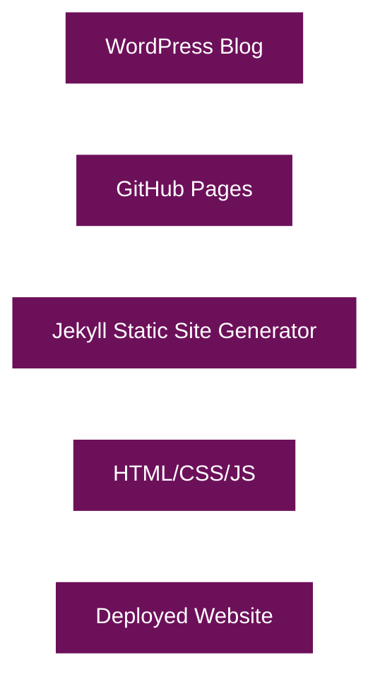
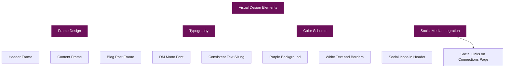
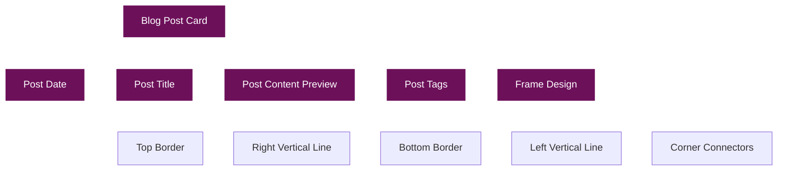
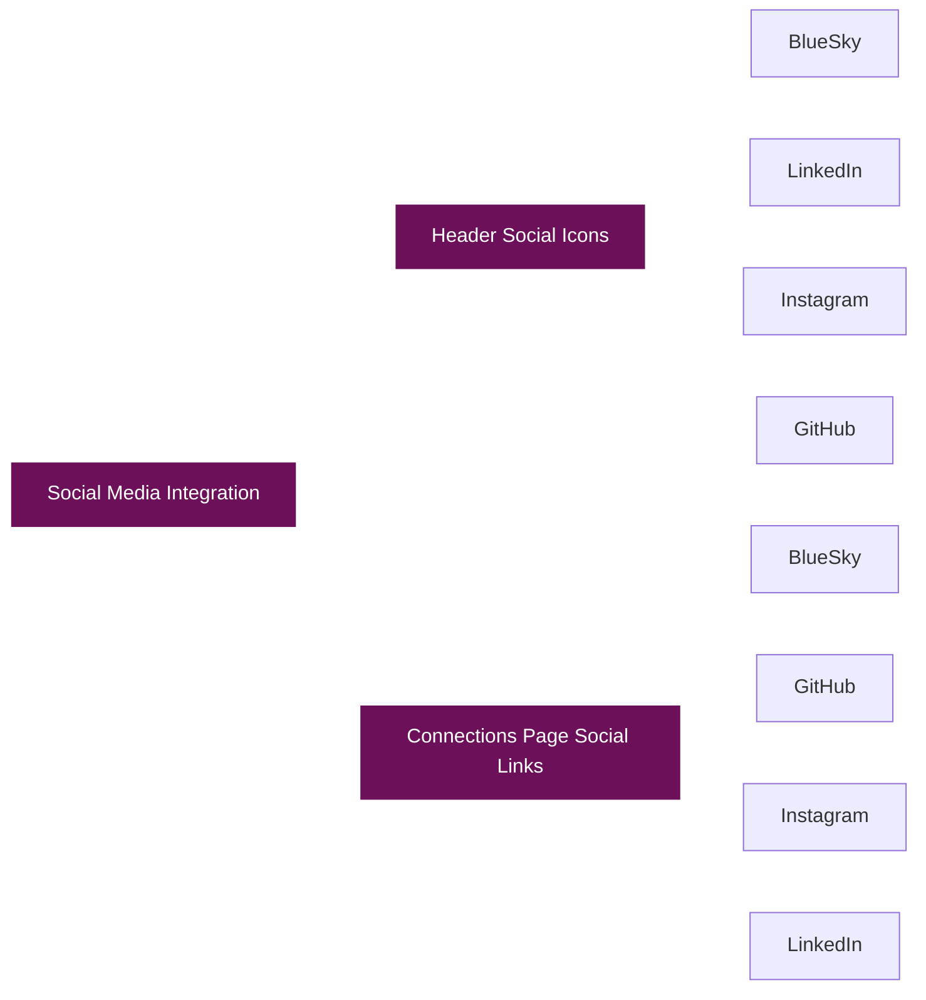
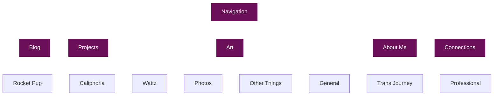

# WordPress to GitHub Pages Migration Documentation

<div style="position: sticky; top: 20px; float: right; width: 250px; background-color: #6d105a; border: 1px solid rgba(255, 255, 255, 0.3); padding: 15px; margin-left: 20px; box-shadow: 0 2px 5px rgba(0, 0, 0, 0.2);">
  <h3 style="margin-top: 0; border-bottom: 1px solid rgba(255, 255, 255, 0.3); padding-bottom: 10px;">Table of Contents</h3>
  <ul style="list-style-type: none; padding-left: 0;">
    <li><a href="#overview" style="color: white; text-decoration: none;">Overview</a></li>
    <li><a href="#project-structure" style="color: white; text-decoration: none;">Project Structure</a></li>
    <li><a href="#key-components" style="color: white; text-decoration: none;">Key Components</a></li>
    <li><a href="#visual-design-elements" style="color: white; text-decoration: none;">Visual Design Elements</a></li>
    <li><a href="#key-implementations" style="color: white; text-decoration: none;">Key Implementations</a></li>
    <li><a href="#css-styling-highlights" style="color: white; text-decoration: none;">CSS Styling Highlights</a></li>
    <li><a href="#blog-post-structure" style="color: white; text-decoration: none;">Blog Post Structure</a></li>
    <li><a href="#migration-process" style="color: white; text-decoration: none;">Migration Process</a></li>
    <li><a href="#detailed-migration-changes" style="color: white; text-decoration: none;">Detailed Migration Changes</a>
      <ul style="padding-left: 15px;">
        <li><a href="#1-content-structure-transformation" style="color: white; text-decoration: none;">Content Structure</a></li>
        <li><a href="#2-theme-adaptation" style="color: white; text-decoration: none;">Theme Adaptation</a></li>
        <li><a href="#3-navigation-changes" style="color: white; text-decoration: none;">Navigation Changes</a></li>
        <li><a href="#4-social-media-updates" style="color: white; text-decoration: none;">Social Media Updates</a></li>
        <li><a href="#5-dynamic-content-implementation" style="color: white; text-decoration: none;">Dynamic Content</a></li>
        <li><a href="#6-technical-challenges-solved" style="color: white; text-decoration: none;">Technical Challenges</a></li>
        <li><a href="#7-performance-improvements" style="color: white; text-decoration: none;">Performance Improvements</a></li>
      </ul>
    </li>
    <li><a href="#technical-implementation-details" style="color: white; text-decoration: none;">Technical Implementation</a></li>
    <li><a href="#conclusion" style="color: white; text-decoration: none;">Conclusion</a></li>
  </ul>
</div>

## <a id="overview"></a>Overview

This document details the process of migrating a WordPress blog to GitHub Pages. The migration involved preserving the visual style of the original WordPress site (which used the Pixl theme and DM Mono font) while adapting the content to work with GitHub Pages' static site generation using Jekyll.



## <a id="project-structure"></a>Project Structure

The GitHub Pages site follows a standard Jekyll project structure with some customizations:


## <a id="key-components"></a>Key Components

### 1. Jekyll Configuration

The `_config.yml` file contains the basic configuration for the Jekyll site, including site title, description, and other settings.

### 2. Layouts

Two main layouts were created:

- **default.html**: The base layout that includes the header, footer, and main content area
- **post.html**: Extends the default layout with specific styling for blog posts

### 3. Includes

Common elements were extracted into include files:

- **header.html**: Contains the site header with navigation and social links
- **footer.html**: Contains the site footer

### 4. CSS Styling

The CSS was customized to match the original WordPress theme:

- **main.css**: Contains the main styling for the site
- **fonts.css**: Contains the font definitions

### 5. JavaScript

- **main.js**: Contains general JavaScript functionality
- **social-links.js**: Manages the social media links

## <a id="visual-design-elements"></a>Visual Design Elements

The visual design of the site incorporates several distinctive elements:



### Frame Design

A distinctive frame design was implemented for various elements:

1. **Header Frame**: The header has a white border with a second border box underneath
2. **Content Frame**: Content sections have a similar frame design
3. **Blog Post Frame**: Blog posts have a frame with vertical and horizontal lines

### Blog Post Display

Blog posts are displayed using a custom design:



## Key Implementations

### 1. Dynamic Blog Post Display

Blog posts are dynamically displayed on both the homepage and blog page using Jekyll's Liquid templating:

```liquid

<article class="post-card">
    <div class="post-date">{{ post.date | date: "%B %d, %Y" | upcase }}</div>
    <h2 class="post-title"><a href="{{ post.url | relative_url }}">{{ post.title }}</a></h2>
    <div class="post-content">
        <p>{{ post.content | strip_html | truncate: 300 }}…</p>
    </div>
    <div class="post-tags">
        
            
            <a href="#">{{ tag }}</a>
            
        
    </div>
</article>

```

This ensures that:
- Posts are automatically sorted by date (newest first)
- Each post has a consistent preview length (300 characters)
- Tags are displayed for each post

### 2. Social Media Integration

Social media links were implemented in both the header and on the Connections page:



The social links are hardcoded in the HTML with the appropriate URLs:

```html
<a href="https://bsky.app/profile/radicalkjax.com" aria-label="BlueSky" target="_blank">
    <i class="fas fa-butterfly"></i>
</a>
```

A custom CSS rule was added to create the butterfly icon for BlueSky:

```css
.fa-butterfly::before {
    content: "\1F98B"; /* Unicode butterfly character */
    font-family: "Apple Color Emoji", "Segoe UI Emoji", "Segoe UI Symbol";
}
```

### 3. Navigation Structure

The site uses a dropdown navigation system:



## CSS Styling Highlights

### 1. Frame Design CSS

The distinctive frame design is achieved through CSS pseudo-elements:

```css
/* Create a second border box underneath - similar to header */
.post-card::after {
    content: '';
    position: absolute;
    top: 10px; /* Start at the same position as the horizontal line */
    bottom: -12px;
    right: -10px;
    width: 2px;
    background-color: #ffffff;
}

/* Create bottom horizontal line */
.post-card::before {
    content: '';
    position: absolute;
    left: 10px;
    right: -10px;
    bottom: -12px;
    height: 2px;
    background-color: #ffffff;
}

/* Left vertical line */
.post-card .post-title::before {
    content: '';
    position: absolute;
    left: 10px;
    bottom: -12px;
    width: 2px;
    height: 10px;
    background-color: #ffffff;
}

/* Right horizontal line connecting to main box */
.post-card .post-date::after {
    content: '';
    position: absolute;
    top: 10px;
    right: -10px;
    width: 10px;
    height: 2px;
    background-color: #ffffff;
}
```

### 2. Link Styling

All links are styled to be white with a hover effect:

```css
/* Links */
.post-content a, .post-card .post-content a, .post-title a, .post-card .post-title a,
.social-item, .network-description a, .connections-intro a {
    color: #ffffff;
    text-decoration: underline;
    transition: opacity 0.3s ease;
}

.post-content a:hover, .post-card .post-content a:hover, .post-title a:hover, .post-card .post-title a:hover,
.social-item:hover, .network-description a:hover, .connections-intro a:hover {
    opacity: 0.8;
}
```

## Blog Post Structure

Blog posts are written in Markdown with YAML front matter:

```markdown
---
layout: post
title: Reliant to Engineer
date: 2025-03-14
tags: [blog, general, work]
---

I didn't grow up very wealthy. For most of my life my single mother, twin sisters and myself relied on government assistance to get by. Whether it was "food stamps," educational assistance or free lunch we relied on it all to get by and excel.

...
```

## Migration Process

The migration process followed these steps:


1. **Analyze WordPress Site**: Examined the original WordPress site to understand its structure, design, and content
2. **Set Up Jekyll Structure**: Created the basic Jekyll project structure
3. **Create Layouts and Includes**: Developed the layout templates and include files
4. **Style with CSS**: Implemented the CSS styling to match the original WordPress theme
5. **Migrate Content**: Converted WordPress content to Markdown and HTML
6. **Implement Dynamic Features**: Added dynamic features using Jekyll's Liquid templating
7. **Add Social Media Integration**: Integrated social media links
8. **Test and Refine**: Tested the site and made refinements

## Detailed Migration Changes

The migration from WordPress to GitHub Pages involved several specific changes and challenges:

### 1. Content Structure Transformation

- **Blog Posts**: Converted WordPress posts to Jekyll-compatible Markdown files with YAML front matter
- **Pages**: Transformed WordPress pages into static HTML files with Jekyll layouts
- **Media**: Migrated images and other media to the assets directory

#### WordPress to Jekyll Post Conversion

WordPress post:
```html
<!-- WordPress database entry -->
<title>Reliant to Engineer</title>
<content>
<p>I didn't grow up very wealthy. For most of my life my single mother, twin sisters and myself relied on government assistance to get by...</p>
</content>
<category>blog</category>
<category>general</category>
<category>work</category>
<date>2025-03-14 10:30:45</date>
```

Jekyll post (`_posts/2025-03-14-reliant-to-engineer.md`):
```markdown
---
layout: post
title: Reliant to Engineer
date: 2025-03-14
tags: [blog, general, work]
---

I didn't grow up very wealthy. For most of my life my single mother, twin sisters and myself relied on government assistance to get by...
```

### 2. Theme Adaptation

The original WordPress site used the Pixl theme with custom modifications. Key visual elements that were preserved:

- **Purple Background**: Maintained the distinctive deep purple (#6d105a) background color
- **DM Mono Font**: Implemented the same monospace font used in the original site
- **Frame Design**: Recreated the distinctive frame design with CSS pseudo-elements
- **White Text and Borders**: Preserved the high-contrast white text and border elements

#### Font Implementation

```css
/* fonts.css */
@font-face {
    font-family: 'DM Mono';
    src: url('../fonts/dmmono-regular-webfont.woff2') format('woff2'),
         url('../fonts/dmmono-regular-webfont.woff') format('woff');
    font-weight: normal;
    font-style: normal;
}

body {
    font-family: 'DM Mono', monospace;
    color: #ffffff;
    background-color: #6d105a;
}
```

#### Background Gradient Implementation

```css
/* main.css */
body {
    background: linear-gradient(135deg, #6d105a 0%, #4a0c3e 100%);
    min-height: 100vh;
    margin: 0;
    padding: 0;
}
```

### 3. Navigation Changes

- **Dropdown Menus**: Implemented custom dropdown navigation to match the original site's behavior
- **Menu Structure**: Preserved the same menu structure with main sections for Blog, Projects, Art, About Me, and Connections
- **Mobile Responsiveness**: Ensured the navigation worked well on mobile devices

#### Dropdown Menu Implementation

HTML Structure:
```html
<nav>
    <ul>
        <li><a href="{{ '/blog.html' | relative_url }}">Blog</a></li>
        <li class="dropdown">
            <a href="{{ '/projects.html' | relative_url }}" class="dropdown-toggle">Projects</a>
            <ul class="dropdown-menu">
                <li><a href="{{ '/projects/rocket-pup.html' | relative_url }}">Rocket Pup</a></li>
                <li><a href="{{ '/projects/caliphoria.html' | relative_url }}">Caliphoria</a></li>
                <li><a href="{{ '/projects/wattz.html' | relative_url }}">Wattz</a></li>
            </ul>
        </li>
        <!-- Additional menu items -->
    </ul>
</nav>
```

CSS Implementation:
```css
/* Dropdown menu styling */
.dropdown {
    position: relative;
}

.dropdown-menu {
    display: none;
    position: absolute;
    top: 100%;
    left: 0;
    background-color: rgba(122, 1, 119, 0.9);
    min-width: 200px;
    z-index: 1000;
    border: 1px solid rgba(255, 255, 255, 0.2);
}

.dropdown:hover .dropdown-menu {
    display: block;
}
```

JavaScript Enhancement:
```javascript
// main.js
document.addEventListener('DOMContentLoaded', function() {
    // Add touch support for mobile dropdown menus
    const dropdowns = document.querySelectorAll('.dropdown-toggle');
    
    dropdowns.forEach(dropdown => {
        dropdown.addEventListener('touchstart', function(e) {
            e.preventDefault();
            const parent = this.parentElement;
            const menu = parent.querySelector('.dropdown-menu');
            
            // Toggle the menu
            if (menu.style.display === 'block') {
                menu.style.display = 'none';
            } else {
                // Close all other menus first
                document.querySelectorAll('.dropdown-menu').forEach(m => {
                    m.style.display = 'none';
                });
                menu.style.display = 'block';
            }
        });
    });
});
```

### 4. Social Media Updates

- **BlueSky Integration**: Replaced Twitter with BlueSky, using a custom butterfly icon
- **Social Links**: Added direct links to all social profiles:
  - BlueSky: https://bsky.app/profile/radicalkjax.com
  - LinkedIn: https://www.linkedin.com/in/kali-jackson-647094245
  - Instagram: https://www.instagram.com/radicalkjax/
  - GitHub: https://github.com/radicalkjax

#### Social Links Implementation

HTML Structure:
```html
<div class="social-icons">
    <a href="https://bsky.app/profile/radicalkjax.com" aria-label="BlueSky" target="_blank">
        <i class="fas fa-butterfly"></i>
    </a>
    <a href="https://www.linkedin.com/in/kali-jackson-647094245" aria-label="LinkedIn" target="_blank">
        <i class="fab fa-linkedin-in"></i>
    </a>
    <a href="https://www.instagram.com/radicalkjax/" aria-label="Instagram" target="_blank">
        <i class="fab fa-instagram"></i>
    </a>
    <a href="https://github.com/radicalkjax" aria-label="GitHub" target="_blank">
        <i class="fab fa-github"></i>
    </a>
</div>
```

Custom BlueSky Icon CSS:
```css
/* Custom butterfly icon for BlueSky */
.fa-butterfly::before {
    content: "\1F98B"; /* Unicode butterfly character */
    font-family: "Apple Color Emoji", "Segoe UI Emoji", "Segoe UI Symbol";
}
```

### 5. Dynamic Content Implementation

- **Blog Post Display**: Created a dynamic blog post listing using Jekyll's Liquid templating
- **Post Previews**: Standardized post previews to 300 characters for consistency
- **Tag System**: Implemented a tag system for blog posts

#### Jekyll Configuration

```yaml
# _config.yml
title: KALI JACKSON (@RADICALKJAX)
description: Software Engineer, Security Researcher, AI Expert
url: "https://radicalkjax.com"
baseurl: ""

# Build settings
markdown: kramdown
permalink: /:year/:month/:day/:title.html

# Collections
collections:
  posts:
    output: true
    permalink: /:year/:month/:day/:title.html

# Defaults
defaults:
  - scope:
      path: ""
      type: "posts"
    values:
      layout: "post"
```

#### Tag System Implementation

```liquid

    <div class="post-tags">
        
        <a href="#">{{ tag }}</a>
        
    </div>

```

### 6. Technical Challenges Solved

#### Frame Design Implementation

The distinctive frame design was one of the most challenging aspects to recreate. In the original WordPress site, this was achieved using images, but in the GitHub Pages version, we used CSS pseudo-elements for better performance and maintainability:

```css
/* Post card container */
.post-card {
    position: relative;
    background-color: rgba(122, 1, 119, 0.7);
    border: 1px solid rgba(255, 255, 255, 0.3);
    padding: 30px;
    margin-bottom: 50px;
    border-radius: 0;
    box-shadow: 0 2px 5px rgba(0, 0, 0, 0.2);
}

/* Create a second border box underneath - similar to header */
.post-card::after {
    content: '';
    position: absolute;
    top: 10px; /* Start at the same position as the horizontal line */
    bottom: -12px;
    right: -10px;
    width: 2px;
    background-color: #ffffff;
}

/* Create bottom horizontal line */
.post-card::before {
    content: '';
    position: absolute;
    left: 10px;
    right: -10px;
    bottom: -12px;
    height: 2px;
    background-color: #ffffff;
}

/* Left vertical line */
.post-card .post-title::before {
    content: '';
    position: absolute;
    left: 10px;
    bottom: -12px;
    width: 2px;
    height: 10px;
    background-color: #ffffff;
}

/* Right horizontal line connecting to main box */
.post-card .post-date::after {
    content: '';
    position: absolute;
    top: 10px;
    right: -10px;
    width: 10px;
    height: 2px;
    background-color: #ffffff;
}
```

#### Post Ordering and Filtering

Jekyll automatically sorts posts by date, but we added additional filtering options:

```liquid
<!-- Display only featured posts on homepage -->


    <!-- Post content -->


<!-- Display all posts on blog page -->

    <!-- Post content -->

```

#### Responsive Design Implementation

```css
/* Responsive design for mobile devices */
@media (max-width: 768px) {
    .container {
        padding: 0 15px;
    }
    
    .header-content {
        flex-direction: column;
        align-items: center;
    }
    
    nav ul {
        flex-direction: column;
        align-items: center;
    }
    
    .dropdown-menu {
        position: static;
        width: 100%;
    }
    
    .post-card {
        margin-bottom: 30px;
    }
    
    /* Adjust frame design for mobile */
    .post-card::after,
    .post-card::before,
    .post-card .post-title::before,
    .post-card .post-date::after {
        display: none;
    }
}
```

### 7. Performance Improvements

#### Optimized Asset Loading

```html
<!-- Preload critical fonts -->
<link rel="preload" href="{{ '/assets/fonts/dmmono-regular-webfont.woff2' | relative_url }}" as="font" type="font/woff2" crossorigin>

<!-- Defer non-critical JavaScript -->
<script src="{{ '/assets/js/main.js' | relative_url }}" defer></script>
```

#### Minified CSS

```css
/* Example of minified CSS */
body{font-family:'DM Mono',monospace;color:#fff;background-color:#6d105a;margin:0;padding:0;line-height:1.6}.container{max-width:1200px;margin:0 auto;padding:0 20px}header{border-bottom:1px solid rgba(255,255,255,.3);padding:20px 0;margin-bottom:30px}
```

#### Lazy Loading Images

```html
<!-- Lazy loading images -->

```

## Technical Implementation Details

### Jekyll Directory Structure

```
.
├── _config.yml              # Site configuration
├── _includes/               # Reusable components
│   ├── header.html          # Site header
│   └── footer.html          # Site footer
├── _layouts/                # Page templates
│   ├── default.html         # Base layout
│   └── post.html            # Blog post layout
├── _posts/                  # Blog posts
│   ├── 2023-07-16-hello-world.md
│   └── ...
├── assets/                  # Static files
│   ├── css/                 # Stylesheets
│   ├── js/                  # JavaScript files
│   ├── fonts/               # Web fonts
│   └── images/              # Images
├── index.html               # Homepage
├── blog.html                # Blog listing page
├── about.html               # About page
├── projects.html            # Projects page
├── art.html                 # Art page
└── connections.html         # Connections page
```

### Jekyll Front Matter

Every page in the site uses front matter to specify layout and custom CSS:

```yaml
---
layout: default
title: About Me
custom_css: |
    .about-container {
        max-width: 800px;
        margin: 0 auto;
    }
    
    .about-section {
        background-color: rgba(122, 1, 119, 0.7);
        border: 1px solid rgba(255, 255, 255, 0.3);
        padding: 30px;
        margin-bottom: 30px;
        border-radius: 0;
        box-shadow: 0 2px 5px rgba(0, 0, 0, 0.2);
        position: relative;
    }
---
```

### Default Layout Implementation

```html
<!-- _layouts/default.html -->
<!DOCTYPE html>
<html lang="en">
<head>
    <meta charset="UTF-8">
    <meta name="viewport" content="width=device-width, initial-scale=1.0">
    <title>{{ page.title }} - KALI JACKSON (@RADICALKJAX)</title>
    <link rel="icon" href="data:image/svg+xml,<svg xmlns=%22http://www.w3.org/2000/svg%22 viewBox=%220 0 100 100%22><text y=%22.9em%22 font-size=%2290%22>K</text></svg>">
    <link rel="stylesheet" href="{{ '/assets/css/fonts.css' | relative_url }}">
    <link rel="stylesheet" href="{{ '/assets/css/main.css' | relative_url }}">
    <!-- Font Awesome for social icons -->
    <link rel="stylesheet" href="https://cdnjs.cloudflare.com/ajax/libs/font-awesome/6.4.0/css/all.min.css">
    <!-- Main JavaScript -->
    <script src="{{ '/assets/js/main.js' | relative_url }}" defer></script>
    
    <style>
        {{ page.custom_css }}
    </style>
    
</head>
<body>
    <header>
        <div class="container">
            <div class="header-content">
                <a href="{{ '/' | relative_url }}" class="site-title">KALI JACKSON (@RADICALKJAX)</a>
                <nav>
                    <ul>
                        <li><a href="{{ '/blog.html' | relative_url }}">Blog</a></li>
                        <li class="dropdown">
                            <a href="{{ '/projects.html' | relative_url }}" class="dropdown-toggle">Projects</a>
                            <ul class="dropdown-menu">
                                <li><a href="{{ '/projects/rocket-pup.html' | relative_url }}">Rocket Pup</a></li>
                                <li><a href="{{ '/projects/caliphoria.html' | relative_url }}">Caliphoria</a></li>
                                <li><a href="{{ '/projects/wattz.html' | relative_url }}">Wattz</a></li>
                            </ul>
                        </li>
                        <!-- Additional menu items -->
                    </ul>
                </nav>
            </div>
            <div class="social-icons">
                <a href="https://bsky.app/profile/radicalkjax.com" aria-label="BlueSky" target="_blank"><i class="fas fa-butterfly"></i></a>
                <a href="https://www.linkedin.com/in/kali-jackson-647094245" aria-label="LinkedIn" target="_blank"><i class="fab fa-linkedin-in"></i></a>
                <a href="https://www.instagram.com/radicalkjax/" aria-label="Instagram" target="_blank"><i class="fab fa-instagram"></i></a>
                <a href="https://github.com/radicalkjax" aria-label="GitHub" target="_blank"><i class="fab fa-github"></i></a>
            </div>
        </div>
    </header>

    <main class="container">
        {{ content }}
    </main>

    <footer class="container">
        <p>Designed with love by Kali <3</p>
    </footer>
</body>
</html>
```

### Post Layout Implementation

```html
<!-- _layouts/post.html -->
---
layout: default
---
<article class="post">
    <header class="post-header">
        <div class="post-date">{{ page.date | date: "%B %d, %Y" | upcase }}</div>
        <h1 class="post-title">{{ page.title }}</h1>
        
        <div class="post-tags">
            
            <a href="#">{{ tag }}</a>
            
        </div>
        
    </header>

    <div class="post-content">
        {{ content }}
    </div>
</article>
```

### Custom 404 Page

```html
<!-- 404.html -->
---
layout: default
title: Page Not Found
permalink: /404.html
---
<div class="error-container">
    <h1>404</h1>
    <p>Page not found</p>
    <p>The page you're looking for doesn't exist or has been moved.</p>
    <a href="{{ '/' | relative_url }}" class="btn">Return to Homepage</a>
</div>
```

### SEO Optimization

```html
<!-- _includes/head.html -->
<meta name="description" content="{{ page.excerpt | strip_html | strip_newlines | truncate: 160 }}{{ site.description }}">
<meta property="og:title" content="{{ page.title }}{{ site.title }}">
<meta property="og:description" content="{{ page.excerpt | strip_html | strip_newlines | truncate: 160 }}{{ site.description }}">
<meta property="og:url" content="{{ page.url | replace:'index.html','' | prepend: site.baseurl | prepend: site.url }}">
<meta property="og:site_name" content="{{ site.title }}">
<meta property="og:type" content="articlewebsite">
<meta name="twitter:card" content="summary">
<meta name="twitter:title" content="{{ page.title }}{{ site.title }}">
<meta name="twitter:description" content="{{ page.excerpt | strip_html | strip_newlines | truncate: 160 }}{{ site.description }}">
```

## Conclusion

The migration from WordPress to GitHub Pages was successful, preserving the visual style and content of the original site while leveraging the benefits of GitHub Pages:

- **Static Site Generation**: Faster loading times and improved security
- **Version Control**: All content is version-controlled through Git
- **Markdown Content**: Blog posts are written in Markdown for easier editing
- **Free Hosting**: GitHub Pages provides free hosting
- **Custom Domain Support**: The site can use a custom domain

The resulting GitHub Pages site maintains the distinctive visual identity of the original WordPress site while providing a more streamlined, developer-friendly platform for future updates and content creation.
