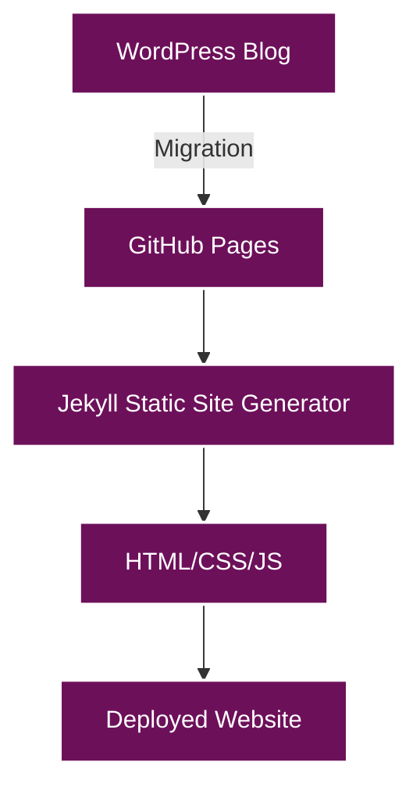
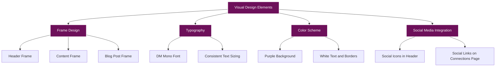
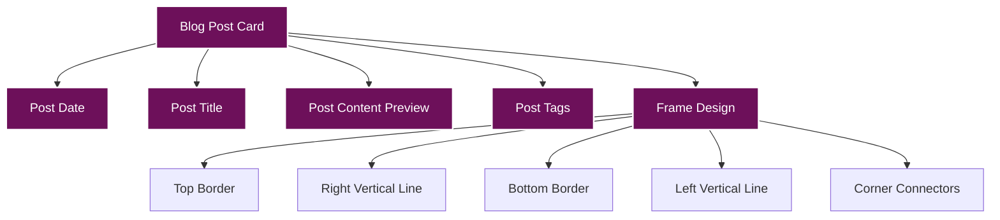
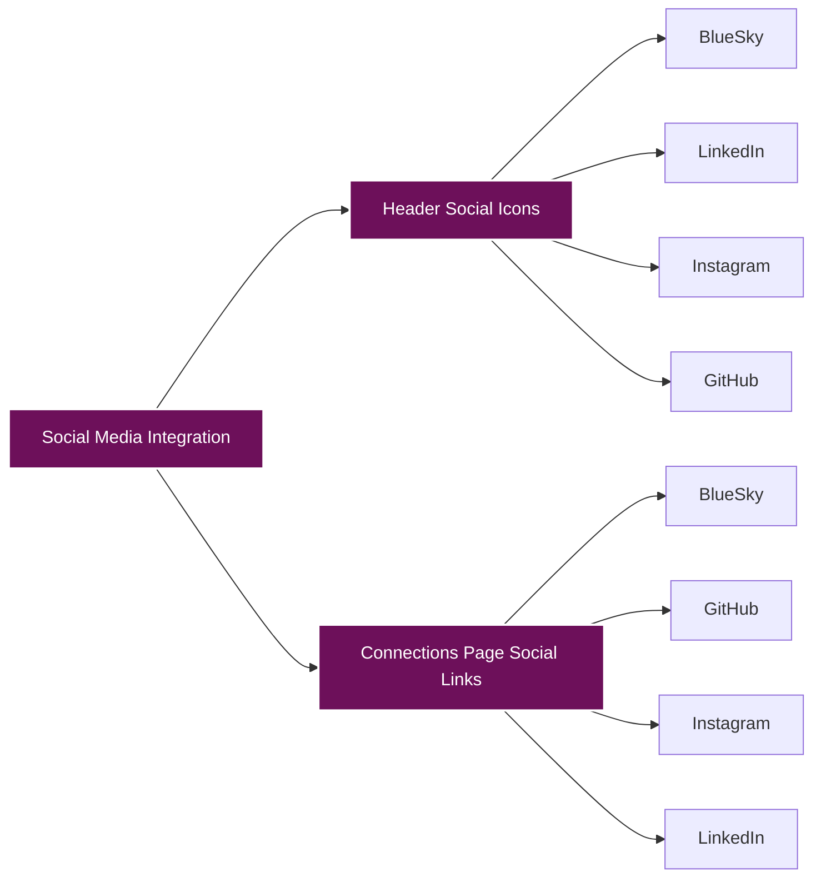
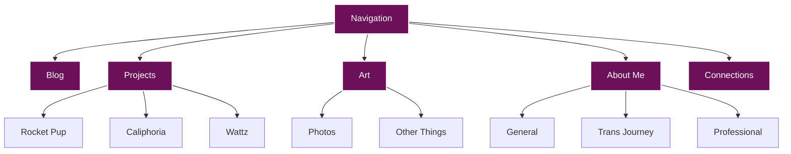
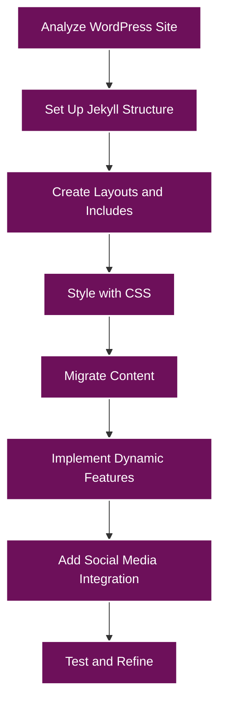

# WordPress to GitHub Pages Migration Documentation

## Overview

This document details the process of migrating a WordPress blog to GitHub Pages. The migration involved preserving the visual style of the original WordPress site (which used the Pixl theme and DM Mono font) while adapting the content to work with GitHub Pages' static site generation using Jekyll.



## Project Structure

The GitHub Pages site follows a standard Jekyll project structure with some customizations:

```mermaid
graph TD
    A[Root Directory] --> B[_config.yml]
    A --> C[_includes/]
    A --> D[_layouts/]
    A --> E[_posts/]
    A --> F[assets/]
    A --> G[HTML Pages]
    
    C --> C1[header.html]
    C --> C2[footer.html]
    
    D --> D1[default.html]
    D --> D2[post.html]
    
    E --> E1[Blog Post Markdown Files]
    
    F --> F1[css/]
    F --> F2[js/]
    F --> F3[fonts/]
    F --> F4[images/]
    
    G --> G1[index.html]
    G --> G2[blog.html]
    G --> G3[about.html]
    G --> G4[connections.html]
    G --> G5[projects.html]
    G --> G6[art.html]
    
    style A fill:#6d105a,stroke:#fff,stroke-width:2px,color:#fff
    style B fill:#6d105a,stroke:#fff,stroke-width:2px,color:#fff
    style C fill:#6d105a,stroke:#fff,stroke-width:2px,color:#fff
    style D fill:#6d105a,stroke:#fff,stroke-width:2px,color:#fff
    style E fill:#6d105a,stroke:#fff,stroke-width:2px,color:#fff
    style F fill:#6d105a,stroke:#fff,stroke-width:2px,color:#fff
    style G fill:#6d105a,stroke:#fff,stroke-width:2px,color:#fff
```



## Key Components

### 1. Jekyll Configuration

The `_config.yml` file contains the basic configuration for the Jekyll site, including site title, description, and other settings.

### 2. Layouts

Two main layouts were created:

- **default.html**: The base layout that includes the header, footer, and main content area
- **post.html**: Extends the default layout with specific styling for blog posts

### 3. Includes

Common elements were extracted into include files:

- **header.html**: Contains the site header with navigation and social links
- **footer.html**: Contains the site footer

### 4. CSS Styling

The CSS was customized to match the original WordPress theme:

- **main.css**: Contains the main styling for the site
- **fonts.css**: Contains the font definitions

### 5. JavaScript

- **main.js**: Contains general JavaScript functionality
- **social-links.js**: Manages the social media links

## Visual Design Elements

The visual design of the site incorporates several distinctive elements:



### Frame Design

A distinctive frame design was implemented for various elements:

1. **Header Frame**: The header has a white border with a second border box underneath
2. **Content Frame**: Content sections have a similar frame design
3. **Blog Post Frame**: Blog posts have a frame with vertical and horizontal lines

### Blog Post Display

Blog posts are displayed using a custom design:



## Key Implementations

### 1. Dynamic Blog Post Display

Blog posts are dynamically displayed on both the homepage and blog page using Jekyll's Liquid templating:

```liquid

<article class="post-card">
    <div class="post-date">{{ post.date | date: "%B %d, %Y" | upcase }}</div>
    <h2 class="post-title"><a href="{{ post.url | relative_url }}">{{ post.title }}</a></h2>
    <div class="post-content">
        <p>{{ post.content | strip_html | truncate: 300 }}…</p>
    </div>
    <div class="post-tags">
        
            
            <a href="#">{{ tag }}</a>
            
        
    </div>
</article>

```

This ensures that:
- Posts are automatically sorted by date (newest first)
- Each post has a consistent preview length (300 characters)
- Tags are displayed for each post

### 2. Social Media Integration

Social media links were implemented in both the header and on the Connections page:



The social links are hardcoded in the HTML with the appropriate URLs:

```html
<a href="https://bsky.app/profile/radicalkjax.com" aria-label="BlueSky" target="_blank">
    <i class="fas fa-butterfly"></i>
</a>
```

A custom CSS rule was added to create the butterfly icon for BlueSky:

```css
.fa-butterfly::before {
    content: "\1F98B"; /* Unicode butterfly character */
    font-family: "Apple Color Emoji", "Segoe UI Emoji", "Segoe UI Symbol";
}
```

### 3. Navigation Structure

The site uses a dropdown navigation system:



## CSS Styling Highlights

### 1. Frame Design CSS

The distinctive frame design is achieved through CSS pseudo-elements:

```css
/* Create a second border box underneath - similar to header */
.post-card::after {
    content: '';
    position: absolute;
    top: 10px; /* Start at the same position as the horizontal line */
    bottom: -12px;
    right: -10px;
    width: 2px;
    background-color: #ffffff;
}

/* Create bottom horizontal line */
.post-card::before {
    content: '';
    position: absolute;
    left: 10px;
    right: -10px;
    bottom: -12px;
    height: 2px;
    background-color: #ffffff;
}

/* Left vertical line */
.post-card .post-title::before {
    content: '';
    position: absolute;
    left: 10px;
    bottom: -12px;
    width: 2px;
    height: 10px;
    background-color: #ffffff;
}

/* Right horizontal line connecting to main box */
.post-card .post-date::after {
    content: '';
    position: absolute;
    top: 10px;
    right: -10px;
    width: 10px;
    height: 2px;
    background-color: #ffffff;
}
```

### 2. Link Styling

All links are styled to be white with a hover effect:

```css
/* Links */
.post-content a, .post-card .post-content a, .post-title a, .post-card .post-title a,
.social-item, .network-description a, .connections-intro a {
    color: #ffffff;
    text-decoration: underline;
    transition: opacity 0.3s ease;
}

.post-content a:hover, .post-card .post-content a:hover, .post-title a:hover, .post-card .post-title a:hover,
.social-item:hover, .network-description a:hover, .connections-intro a:hover {
    opacity: 0.8;
}
```

## Blog Post Structure

Blog posts are written in Markdown with YAML front matter:

```markdown
---
layout: post
title: Reliant to Engineer
date: 2025-03-14
tags: [blog, general, work]
---

I didn't grow up very wealthy. For most of my life my single mother, twin sisters and myself relied on government assistance to get by. Whether it was "food stamps," educational assistance or free lunch we relied on it all to get by and excel.

...
```

## Migration Process

The migration process followed these steps:



1. **Analyze WordPress Site**: Examined the original WordPress site to understand its structure, design, and content
2. **Set Up Jekyll Structure**: Created the basic Jekyll project structure
3. **Create Layouts and Includes**: Developed the layout templates and include files
4. **Style with CSS**: Implemented the CSS styling to match the original WordPress theme
5. **Migrate Content**: Converted WordPress content to Markdown and HTML
6. **Implement Dynamic Features**: Added dynamic features using Jekyll's Liquid templating
7. **Add Social Media Integration**: Integrated social media links
8. **Test and Refine**: Tested the site and made refinements

## Conclusion

The migration from WordPress to GitHub Pages was successful, preserving the visual style and content of the original site while leveraging the benefits of GitHub Pages:

- **Static Site Generation**: Faster loading times and improved security
- **Version Control**: All content is version-controlled through Git
- **Markdown Content**: Blog posts are written in Markdown for easier editing
- **Free Hosting**: GitHub Pages provides free hosting
- **Custom Domain Support**: The site can use a custom domain

The resulting GitHub Pages site maintains the distinctive visual identity of the original WordPress site while providing a more streamlined, developer-friendly platform for future updates and content creation.
