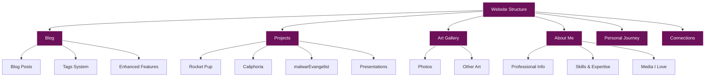
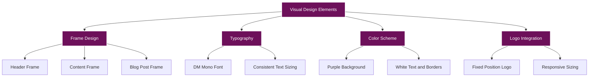

# Kali Jackson's Personal Website

[](https://github.com/radicalkjax/blog/actions/workflows/ci.yml)
[](https://pagespeed.web.dev/)
[](https://www.w3.org/WAI/WCAG21/quickref/)
[](https://securityheaders.com)
[](https://opensource.org/licenses/MIT)
[](https://jekyllrb.com/)
[](https://developer.mozilla.org/en-US/docs/Web/JavaScript)
[](https://developer.mozilla.org/en-US/docs/Web/CSS)
[](https://web.dev/progressive-web-apps/)

This repository contains the source code for Kali Jackson's personal website, hosted on GitHub Pages.

## Overview

This website serves as a personal blog and portfolio for Kali Jackson (@radicalkjax), showcasing:

- Blog posts on various topics
- Projects in software engineering, security research, and AI
- Art gallery with photo collections
- About me information with personal journey details
- Connection methods and social media links



## 🛠️ Tech Stack

### Core Technologies
- **Framework**: Jekyll 4.3+ (Static Site Generator)
- **Languages**: HTML5, CSS3 (with modern features), JavaScript ES6+
- **Templating**: Liquid
- **Hosting**: GitHub Pages with CDN

### Modern Web Features
- **Web Components**: Custom elements for reusable UI components
- **CSS Features**: Container Queries, Logical Properties, CSS Layers, Custom Properties
- **JavaScript**: ES Modules, Async/Await, Web Workers, Service Workers
- **PWA**: Offline support, installable, background sync
- **Performance**: Critical CSS inlining, lazy loading, resource hints
- **Accessibility**: WCAG 2.1 AA compliant, ARIA labels, keyboard navigation
- **Security**: CSP headers, XSS protection, secure dependencies

### Internationalization
- **Languages**: 8 languages (EN, ES, FR, JA, ZH, AR, DE, PT)
- **RTL Support**: Full bidirectional text support
- **SEO**: Hreflang tags, structured data, sitemap

### Development Tools
- **CI/CD**: GitHub Actions for automated testing and deployment
- **Testing**: Jest, Playwright, Lighthouse CI, Pa11y
- **Code Quality**: ESLint, Prettier, Stylelint
- **Security**: Trivy, npm audit, bundle audit
- **Documentation**: Mermaid diagrams, JSDoc comments

## Local Development

To run this Jekyll site locally:

1. Clone the repository:
   ```bash
   git clone https://github.com/radicalkjax/radicalkjax.github.io.git
   ```

2. Navigate to the project directory:
   ```bash
   cd radicalkjax.github.io
   ```

3. Install Jekyll and dependencies:
   ```bash
   gem install jekyll bundler
   bundle install
   ```

4. Run the Jekyll server:
   ```bash
   bundle exec jekyll serve
   ```

5. Visit `http://localhost:4000` in your browser to view the site

## Deployment

This site is automatically deployed to GitHub Pages when changes are pushed to the main branch.


### Custom Domain Setup

To use a custom domain with this GitHub Pages site:

1. Update the CNAME file with your domain
2. Configure your domain's DNS settings:
   - Add an A record pointing to GitHub Pages IP addresses:
     ```
     185.199.108.153
     185.199.109.153
     185.199.110.153
     185.199.111.153
     ```
   - Add a CNAME record for www subdomain pointing to your GitHub Pages URL

## Structure

```
.
├── _config.yml              # Jekyll configuration
├── _config/                 # Deployment configurations
│   ├── nginx.conf.example   # Nginx configuration
│   ├── vercel.json         # Vercel deployment config
│   └── _headers            # Security headers
├── _data/                   # Data files for Jekyll
├── _feeds/                  # Alternative feed formats
│   ├── atom.xml            # Atom feed
│   └── feed.json           # JSON feed
├── _i18n/                   # Internationalization files
├── _includes/               # Reusable components
│   ├── header.html         # Site header with navigation
│   ├── footer.html         # Site footer
│   └── somafm-player.html  # SomaFM radio player
├── _layouts/                # Page templates
│   ├── default.html        # Base layout
│   └── post.html           # Blog post layout
├── _posts/                  # Blog posts (Markdown)
├── _sass/                   # SCSS source files
├── _tests/                  # Test scripts
│   ├── validate-w3c.js     # W3C validation
│   └── test-security-headers.js # Security testing
├── about/                   # About section pages
│   └── trans-journey.html  # Personal Journey page
├── art/                     # Art gallery pages
│   ├── photos.html         # Photo gallery
│   └── other-things.html   # Other artwork
├── assets/                  # Static assets
│   ├── css/                # Compiled stylesheets
│   ├── fonts/              # Web fonts
│   ├── images/             # Images and icons
│   ├── js/                 # JavaScript files
│   └── post_resources/     # Blog post resources
├── docs/                    # Documentation
│   └── REPO_ORGANIZATION.md # Repository structure guide
├── pages/                   # Static pages with permalinks
│   ├── about.html          # About Me page
│   ├── art.html            # Art gallery overview
│   ├── blog.html           # Blog listing page
│   ├── connections.html    # Contact information
│   ├── projects.html       # Projects overview
│   └── subscribe.html      # Feed subscription page
├── projects/                # Individual project pages
│   ├── caliphoria.html     # Caliphoria project
│   ├── presentations.html  # Presentations
│   ├── rocket-pup.html     # Rocket Pup project
│   └── malwarEvangelist.html          # malwarEvangelist project
├── index.html              # Homepage
├── feed.xml                # Main RSS feed
├── manifest.json           # PWA manifest
├── offline.html            # Offline page for PWA
├── service-worker.js       # PWA service worker
├── robots.txt              # SEO robots file
├── sitemap.xml             # XML sitemap
└── README.md               # This file
```

### Key Components

- **Jekyll Configuration**: `_config.yml` contains site settings
- **Layouts**: Templates for different page types
- **Includes**: Reusable components like header and navigation
- **Posts**: Blog content in Markdown format
- **Assets**: CSS, JavaScript, fonts, and images
- **Static Pages**: Main site pages in HTML with Liquid templating

## Recent Updates

### About Page Redesign

The About Me page has been completely redesigned with:

- **Combined Content**: Merged personal and professional information into a single comprehensive page
- **Navigator Sidebar**: 
  - Floating navigation sidebar to jump between sections
  - Displays "Navigator" as the header
  - Shows "Summary" for the intro section
  - Highlights currently visible section
  - Mobile responsive with hamburger menu
- **Interactive Components**: 
  - Collapsible "Expanded Experience" section for detailed work history
  - Interactive "Media I Love" section with collapsible category boxes
  - Collapsible "Open Source Projects" section displaying GitHub repositories
- **Enhanced Layout**:
  - Skills grid system for organized technical skills display
  - Professional experience with resume-style formatting
  - Community leadership section highlighting DC916 involvement
  - Dynamic GitHub repository display with organization support
- **Improved Navigation**: 
  - About Me is now a standalone navigation item
  - Personal Journey (formerly Trans Journey) is a separate top-level navigation item

### GitHub Repository Integration

The About page now features dynamic GitHub repository integration:

- **Automatic Repository Fetching**: Pulls public repositories from both personal (@radicalkjax) and organization (@goldenapplestudios) accounts
- **Smart Display**: 
  - Filters out forked repositories to show only original work
  - Sorts by stars (popularity) then by most recently updated
  - Shows programming language with color-coded indicators
  - Displays repository statistics (stars, forks, open issues)
- **Organization Support**: Clearly labels repositories from organizations you contribute to
- **Lazy Loading**: Repositories are only fetched when the user expands the section, improving page load performance
- **Responsive Grid**: Repository cards adapt to different screen sizes

### Enhanced Blog Post Features

The blog system now includes three powerful features for improved reading experience and content management:

#### Table of Contents (TOC)
- **Automatic TOC Generation**: Creates a floating navigation sidebar from H2, H3, and H4 headings
- **Smart Visibility**: Only appears when there are 2+ headings in a post
- **Scroll Highlighting**: Highlights the currently visible section as you read
- **Smooth Navigation**: Click any TOC link for smooth scrolling to that section
- **Mobile Responsive**: Collapsible TOC with hamburger menu (☰) on mobile devices
- **Fixed Positioning**: Stays visible on the right side while scrolling

#### Key Terms System
- **Automatic Term Detection**: Highlights technical terms with dotted purple underlines
- **Interactive Storage**: Click any highlighted term to save it to your personal collection
- **Persistent Storage**: Terms are saved locally and persist across sessions
- **Quick Research**: Click stored term bubbles to search Google/Wikipedia
- **Custom Terms**: Add your own terms via the manual input field
- **Easy Management**: Remove terms with the × button
- **Extensive Dictionary**: Pre-configured with cybersecurity, AI, and malware terms

#### Print to PDF
- **Floating Print Button**: Convenient printer emoji (🖨️) button in the bottom-right corner
- **Optimized Print Styles**: 
  - Hides navigation elements (TOC, header, footer)
  - Converts to print-friendly black and white
  - Shows URLs after links for reference
  - Handles code blocks, tables, and images properly
  - Preserves Mermaid diagrams and mathematical equations
  - Prevents awkward page breaks
- **Smart Loading**: Waits for all images to load before printing
- **Mobile Friendly**: Responsive positioning on all devices

### Responsive Mobile View Enhancements

The site now features improved responsive behavior for mobile devices:

- Automatic switching to mobile view when the logo would enter the header box
- Automatic switching to mobile view when the site title would touch the navigation
- Improved dropdown menu functionality on mobile devices
- Increased z-index values for mobile navigation elements to ensure proper layering
- Added text wrapping for menu items to prevent text from being cut off
- Made dropdown menus scrollable with max-height and overflow properties
- Ensured social icons have proper margins at all screen sizes

### Mermaid Diagram Styling

The site now includes comprehensive styling for mermaid diagrams in blog posts:

- Custom styling for nodes, edges, labels, and clusters
- Ensured diagrams are readable with the dark theme by setting appropriate colors
- Added proper margins and padding for diagram containers
- Implemented text alignment and overflow handling for better readability
- Added styling for IEEE format code blocks with centered alignment

### Logo Integration

The site now features a custom logo positioned in the top-left corner:

- Implemented using fixed positioning for consistent placement
- Responsive design adjusts size and position on mobile devices
- Uses PNG format with transparency for seamless integration
- Optimized for performance and cross-browser compatibility
- Automatically triggers mobile view when viewport size would cause logo to overlap with header

### Comprehensive Documentation

This repository now includes a comprehensive documentation system in the `docs/` directory:

- **Architecture Documentation**: Detailed information about the site's structure and technical stack
- **Components Documentation**: In-depth explanations of each component and its functionality
- **Development Guide**: Instructions for local development, content creation, and testing
- **Deployment Guide**: Step-by-step deployment process and custom domain setup
- **Customization Guide**: How to customize the site's appearance and functionality

The main documentation index is available at [docs/README.md](docs/README.md), featuring:

- Detailed technical documentation with code examples
- Visual diagrams using Mermaid
- Step-by-step guides for common tasks
- Technical reference for all site components
- Customization options and best practices

Additionally, the original migration documentation is still available in `MIGRATION_DOCUMENTATION.md`.

## Design Features



### Key Visual Elements

1. **Distinctive Frame Design**: Custom CSS pseudo-elements create a unique frame around content
2. **Typography**: DM Mono font provides a consistent, readable experience
3. **Color Scheme**: Deep purple background (#6d105a) with white text and borders
4. **Logo**: Custom logo positioned in the top-left corner
5. **Responsive Design**: Adapts to different screen sizes while maintaining visual identity

## License

This project is licensed under the MIT License - see the LICENSE file for details.

## Credits

- Design inspired by the Pixl WordPress theme
- Font: DM Mono
- Icons: Font Awesome
- Static Site Generator: Jekyll
- Diagrams: Mermaid

## Contact

For any questions or feedback, please reach out through the connections page on the website or via social media.
