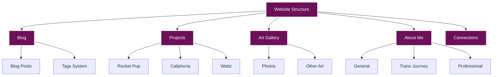
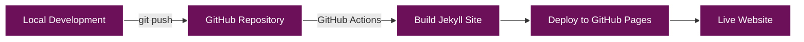
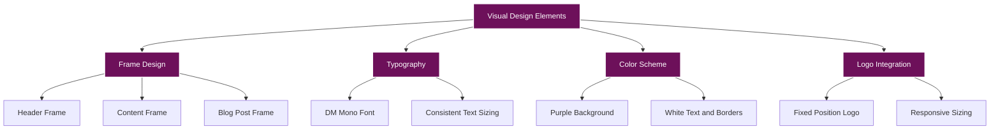

# Kali Jackson's Personal Website

This repository contains the source code for Kali Jackson's personal website, hosted on GitHub Pages.

## Overview

This website serves as a personal blog and portfolio for Kali Jackson (@radicalkjax), showcasing:

- Blog posts on various topics
- Projects in software engineering, security research, and AI
- Art gallery with photo collections
- About me information with personal journey details
- Connection methods and social media links



## Technologies Used

- Jekyll static site generator
- HTML5 and CSS3
- JavaScript for interactive elements
- Liquid templating language
- Font Awesome for icons
- GitHub Pages for hosting
- Mermaid for documentation diagrams

## Local Development

To run this Jekyll site locally:

1. Clone the repository:
   ```bash
   git clone https://github.com/radicalkjax/radicalkjax.github.io.git
   ```

2. Navigate to the project directory:
   ```bash
   cd radicalkjax.github.io
   ```

3. Install Jekyll and dependencies:
   ```bash
   gem install jekyll bundler
   bundle install
   ```

4. Run the Jekyll server:
   ```bash
   bundle exec jekyll serve
   ```

5. Visit `http://localhost:4000` in your browser to view the site

## Deployment

This site is automatically deployed to GitHub Pages when changes are pushed to the main branch.



### Custom Domain Setup

To use a custom domain with this GitHub Pages site:

1. Update the CNAME file with your domain
2. Configure your domain's DNS settings:
   - Add an A record pointing to GitHub Pages IP addresses:
     ```
     185.199.108.153
     185.199.109.153
     185.199.110.153
     185.199.111.153
     ```
   - Add a CNAME record for www subdomain pointing to your GitHub Pages URL

## Structure

```
.
├── _config.yml              # Jekyll configuration
├── _includes/               # Reusable components
│   ├── header.html          # Site header with navigation
│   └── footer.html          # Site footer
├── _layouts/                # Page templates
│   ├── default.html         # Base layout
│   └── post.html            # Blog post layout
├── _posts/                  # Blog posts (Markdown)
│   ├── 2023-07-16-hello-world.md
│   └── ...
├── assets/                  # Static assets
│   ├── css/                 # Stylesheets
│   │   ├── main.css         # Main styling
│   │   └── fonts.css        # Font definitions
│   ├── js/                  # JavaScript files
│   │   ├── main.js          # Main functionality
│   │   └── social-links.js  # Social media integration
│   ├── fonts/               # Web fonts
│   └── images/              # Images and media
│       ├── logo/            # Site logo
│       └── photos/          # Photo galleries
├── index.html               # Homepage
├── blog.html                # Blog listing page
├── projects.html            # Projects overview
├── projects/                # Individual project pages
├── art.html                 # Art gallery overview
├── art/                     # Individual art pages
├── about.html               # About me overview
├── about/                   # Individual about pages
├── connections.html         # Contact information
├── MIGRATION_DOCUMENTATION.md # Detailed migration documentation
└── README.md                # This file
```

### Key Components

- **Jekyll Configuration**: `_config.yml` contains site settings
- **Layouts**: Templates for different page types
- **Includes**: Reusable components like header and navigation
- **Posts**: Blog content in Markdown format
- **Assets**: CSS, JavaScript, fonts, and images
- **Static Pages**: Main site pages in HTML with Liquid templating

## Recent Updates

### Responsive Mobile View Enhancements

The site now features improved responsive behavior for mobile devices:

- Automatic switching to mobile view when the logo would enter the header box
- Automatic switching to mobile view when the site title would touch the navigation
- Improved dropdown menu functionality on mobile devices
- Increased z-index values for mobile navigation elements to ensure proper layering
- Added text wrapping for menu items to prevent text from being cut off
- Made dropdown menus scrollable with max-height and overflow properties
- Ensured social icons have proper margins at all screen sizes

### Mermaid Diagram Styling

The site now includes comprehensive styling for mermaid diagrams in blog posts:

- Custom styling for nodes, edges, labels, and clusters
- Ensured diagrams are readable with the dark theme by setting appropriate colors
- Added proper margins and padding for diagram containers
- Implemented text alignment and overflow handling for better readability
- Added styling for IEEE format code blocks with centered alignment

### Logo Integration

The site now features a custom logo positioned in the top-left corner:

- Implemented using fixed positioning for consistent placement
- Responsive design adjusts size and position on mobile devices
- Uses PNG format with transparency for seamless integration
- Optimized for performance and cross-browser compatibility
- Automatically triggers mobile view when viewport size would cause logo to overlap with header

### Comprehensive Documentation

This repository now includes a comprehensive documentation system in the `docs/` directory:

- **Architecture Documentation**: Detailed information about the site's structure and technical stack
- **Components Documentation**: In-depth explanations of each component and its functionality
- **Development Guide**: Instructions for local development, content creation, and testing
- **Deployment Guide**: Step-by-step deployment process and custom domain setup
- **Customization Guide**: How to customize the site's appearance and functionality

The main documentation index is available at [docs/README.md](docs/README.md), featuring:

- Detailed technical documentation with code examples
- Visual diagrams using Mermaid
- Step-by-step guides for common tasks
- Technical reference for all site components
- Customization options and best practices

Additionally, the original migration documentation is still available in `MIGRATION_DOCUMENTATION.md`.

## Design Features



### Key Visual Elements

1. **Distinctive Frame Design**: Custom CSS pseudo-elements create a unique frame around content
2. **Typography**: DM Mono font provides a consistent, readable experience
3. **Color Scheme**: Deep purple background (#6d105a) with white text and borders
4. **Logo**: Custom logo positioned in the top-left corner
5. **Responsive Design**: Adapts to different screen sizes while maintaining visual identity

## License

This project is licensed under the MIT License - see the LICENSE file for details.

## Credits

- Design inspired by the Pixl WordPress theme
- Font: DM Mono
- Icons: Font Awesome
- Static Site Generator: Jekyll
- Diagrams: Mermaid

## Contact

For any questions or feedback, please reach out through the connections page on the website or via social media.
