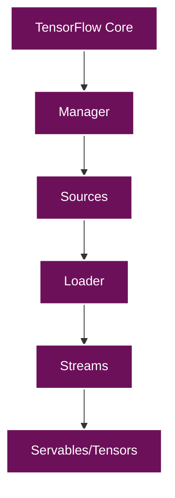
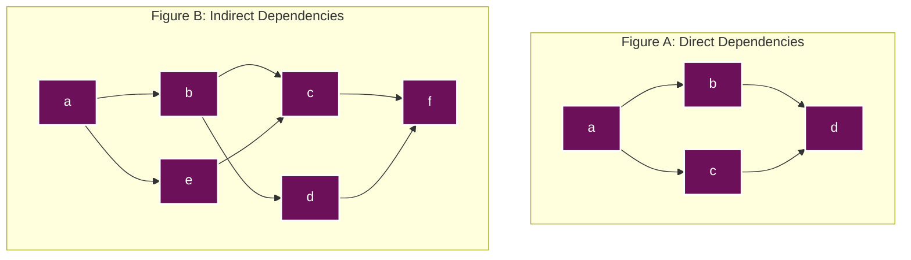
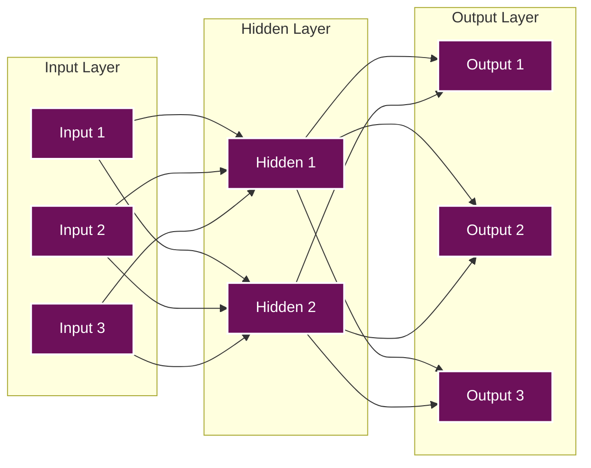

<div style="text-align: center; margin-bottom: 20px;">
<p style="font-size: 9pt; color: rgba(255, 255, 255, 0.7); margin-bottom: 5px;">Research conducted in 2019</p>
<h1 style="font-size: 24pt; margin-bottom: 10px;">CREATING TENSORFLOW PROGRAMS WITH PYTHON</h1>
<p style="font-size: 11pt;">Kali Jackson</p>
</div>

<div style="font-style: italic; margin-left: 30px; margin-right: 30px; margin-bottom: 30px;">
<p><strong>Abstract</strong>—This paper covers how to create TensorFlow programs using Python 3. TensorFlow is an open source framework "created, maintained, and used internally by Google" to create neural networks [7]. TensorFlow will be compared to another framework NumPy, which is used for neural networks and mathematical computations, to show why TensorFlow is more efficient than NumPy at creating more stable and efficient deep learning systems. For now, we will be moving to an introduction of neural networks so that we can clearly see how TensorFlow and NumPy are applicable to computing neural networks.</p>
</div>

## I. INTRODUCTION

As stated before, TensorFlow is a framework created by, developed, and maintained by Google [7]. TensorFlow is used to create neural networks for all sorts of applications like natural language detection, road traffic auto-pilot, and image sorting. An example of a TensorFlow program would be the natural language interpreter used in Google's Pixel phone when coupled with the Pixel Buds [8]. This natural language interpreter can translate from one language to another through audio in real-time. The focus will be on how TensorFlow is the best tool for the job in writing programs to handle the computations in the aforementioned applications, not necessarily why the applications themselves are important. 

NumPy is an open-source project developed for scientific computing which contains many useful tools, but for the purpose of neural networks the most useful are NumPy's N-dimensional array object and basic linear algebra functions [4]. The reasons why the N-dimensional array object and linear algebra functions are the most valuable assets to developing a neural network with NumPy will be explained later in this paper. First, what needs to be explained is how neural networks work in order to give a clear understanding into what TensorFlow programs are computing. There will be a breakdown on what tensors are, how they are made, and the different kinds of tensors and their applications.

## II. TENSORFLOW AND NEURAL NETWORK ARCHITECTURE

### A. Introduction to the TensorFlow and Neural Network Architecture

Neural networks are made of quite a few different components. We're going try and work through all the concepts of what makes up a neural network by using the architecture of TensorFlow in the most linear fashion possible. One piece of a neural network are servables, these are the objects used for computation. In our case with TensorFlow, tensors are the servables. Servables can be as large as a table or as small as a single model. A single model contains one algorithm or more plus their edge weights, or weight for the neural network [1]. Servables will have different versions of themselves as new data is added in or removed from the model or table. Having different versions of servables allows the neural network to determine what version, or versions, create the best dataset for the neural network that's possible. The different versions of servables are then collected into one stream for easy access to that model of data [1].

Neural networks also contain Loaders which are used for loading and unloading servables from the neural network. Loaders are also used for adding algorithm and data backends [1]. As previously stated, we may want to add or remove certain versions or a servable because it may either help the neural network become more robust at performing the task the network was designed for. Loaders pull servables from the sources table, an object that keeps track of servable streams and prepares the streams for the loader [1]. Sources can have multiple versions just like the servables can. There is a manager for sources to do a similar job as streams do for servables.

The manager maintains and tracks all versions of the sources and will attempt to fulfill any sources request but may deny depending on the circumstance [1]. For instance, if a source is attempting to unload but there is a newer version already loading, the manager may force the querying source to perform its work until that source can be replaced by the newer source [1]. The servables, streams, loader, sources, and manager are all nested within the TensorFlow core which acts as the foundational application coding interface, API for short, for TensorFlow as demonstrated in Fig. 1.



<p style="text-align: center; font-style: italic;">Fig. 1. Example of the TensorFlow Framework Core [7]</p>

Beyond all of the aforementioned framework of TensorFlow is the batcher, which takes multiple requests for the information nested within the core and combines the requests into one so that the hardware can compute the data easier [1].

### B. Making and Computing Graphs

In TensorFlow, algorithms are generated by developing and computing operations that interact with each other. The interactions between the operations develop what are called "computation graphs" [1]. These graphs represent interconnected nodes to represent data moving from one place to another. In the case of TensorFlow each node represents the above-mentioned operations. Each operation can receive input or produce an output which is represented by the edges in the graph. Operations in TensorFlow graphs can represent basic algebraic functions such as division, multiplication, addition, subtraction, or constant values. "TensorFlow optimizes its computations based on the graph's connectivity" [1].

Node dependencies are a representation of graph dependencies. For those who don't understand graph dependencies, a node is dependent on another when its input relies on the others output. A direct dependency is when two nodes share an edge and are indirect dependencies otherwise [1]. Finding dependencies within models can help reduce compute times by reducing the number of redundant nodes which can be done using Shortest-Path algorithms such as Dijkstra's, Prim's, Kruskal's algorithms.



<p style="text-align: center; font-style: italic;">Fig. 2. Example of direct and indirect edges in graphs [1]</p>

Using the graphs above we can we can see what a direct dependency is, and what an indirect dependency is. For example, in figure A node c is directly dependent on node a but node c in Figure B is indirectly dependent on node a because it can receive input from nodes b and e as well. Since there are more nodes in graph B that are indirectly dependent than there are in graph A, graph B will be easier to compute. Now that we know how to generate computational graphs in TensorFlow, we can start computing the next important part of our neural net; loss functions.

### C. Loss Functions

As previously stated, loss functions are an important and integral part of our TensorFlow neural network. Loss functions help to determine which graphs are better at predicting outcomes than others by taking the predicted data and comparing it to the desired result [2]. For instance, if we have a graph and feed it data where the expected result is five, and we have one graph where the output is three, another that's four, and a final output of 2, then the graph with the output of four is the most accurate graph in predicting our outcomes. Ideally, we would want our graph to compute exactly what our expected out comes is, five, but this is why we continue to train the model as it becomes increasingly accurate. Through training our model repeatedly with a loss function, we can continuously update the weight of our edges and continue to minimize the loss function overall.

The entire point of the loss function is to test how lossless we can make our graphs. By increasing the number of increasingly lossless graphs meaningful data can be extracted from them to determine what exactly is causing these graphs to be more lossless than others. The data extracted from the lossless graphs can then be implemented to the graphs proven to have great loss to see if those graphs will improve to become more lossless. If our graph with the most loss increasingly becomes more lossless with the implemented data from the lossless graph, then we know that data is crucial to training our model. If our graph stays the same or begins to show more loss from the data implemented from the lossless graph, then we know the data included as part of the original lossless graph was coincidental and not analogous.

In the simplest terms, loss functions are the guiding compass in making our neural networks worth the effort. If our neural network continues to show loss repeatedly or cannot seem to get close enough to our desired output, it's time to start over. Otherwise, keep on training.

### D. Tensors

The main point of using TensorFlow is to compute and define objects called tensors. Tensors are geometric objects with n number of sides, depending on how much data needs to be computed from the tensor [7]. All data in the tensor must be of the same type such as a floating-point number, integer, or a string. When thinking about graphs, a tensor object is our number of edges. For instance, if a node has five edges then there is an associated tensor object with that number of sides. There is no limit to the number of edges a tensor can have, it just shows how increasingly abstract that data has become.

As previously stated, tensors in neural networks are the aforementioned servables. As our neural network is trained the tensors will expand in size, increasing the n number of sides or shrink reducing the tensors size. In image classification each tensor would be a simple part of an array of nodes. For instance, in a fully connected neural network all nodes are connected to generate one output. When the image is being segmented to create the nodes and assign tensors, a grid is applied to the image. Each segment of the grid is a node, and all the data in each node is a tensor. Each tensor and node become unique as they hold a specific piece of information about the image that the other tensors and nodes do not.

## III. NUMPY COMPARED TO TENSORFLOW FOR DEEP LEARNING

NumPy is used for linear algebra math, which makes it great for machine learning, or deep learning, as matrices fall under the umbrella of linear mathematics. As mentioned previously, tensors are geometric objects meaning they too use matrices for representation. The main difference between tensors and standard matrices in NumPy is that matrices are pre-defined and fixed, whereas tensors can change their geometric shape over time as new nodes become indirectly dependent on each other.

As represented in Fig. 3, we can see how the edge being computed by NumPy is represented in a matrix just like how a tensor would be [6]. Also, represented in the graph we can see how there's a linear progression from left to right as the nodes transfer data to each other. Data enters the left most nodes, moves to the two center nodes, and then exits to the same number of nodes on the right which would continue the cycle by moving to their next two nodes regressing the data until the desired output is achieved. With tensors, this data wouldn't move in such a uniform and predictable pattern, and the graph would look more like a spider web with origin nodes on the far left. The fact that the NumPy graph is more uniform also indicates the data will be easier to compute as all the data in the arrays are fixed.

Being easier to compute does not make NumPy better though, as it will take longer to compute all the arrays as more information is fed into the neural network. Using tensors allows the new information to be expanded upon by changing the tensors geometry type and creating new connections to other nodes creating more options to compute to the desired result [5]. Using tensors instead of static arrays also allows for the weights of the graphs edges to be updated regularly creating a better way to minimize the loss function.



<p style="text-align: center; font-style: italic;">Fig. 3. Shows a Neural Network graph using NumPy linear algebra [6]</p>

## IV. IMAGE CLASSIFICATION USING TENSORFLOW

Now that the basics of TensorFlow and neural networks have been elaborated upon and defined, we can start to build our first useful TensorFlow program. When it comes to image classification the simplest form is through binary classification [3]. Binary classification is simply saying something either is or isn't the desired result. For binary classification we will use binary cross-entropy loss function found in the I.losses module [3]. The next step is to implement two other methods to build and train our graph, such as train and build_graph as shown in Fig. 4 below.

```python
def build_graph(self):
    # Define placeholders
    self.input_data = tf.placeholder(dtype=tf.float32, 
                                    shape=[None, self.img_h, self.img_w, self.channels], 
                                    name='input')
    self.labels = tf.placeholder(dtype=tf.float32, 
                                shape=[None, self.n_classes], 
                                name='labels')
    self.keep_prob = tf.placeholder(dtype=tf.float32, 
                                   name='keep_prob')
    self.learning_rate = tf.placeholder(dtype=tf.float32, 
                                       name='learning_rate')
    self.is_training = tf.placeholder(dtype=tf.bool, 
                                     name='is_training')
    
    # Define model architecture
    net = self.input_data
    
    # Convolutional layers
    net = tf.layers.conv2d(inputs=net, filters=32, kernel_size=3, 
                          activation=tf.nn.relu, padding='SAME')
    net = tf.layers.max_pooling2d(inputs=net, pool_size=2, strides=2)
    
    net = tf.layers.conv2d(inputs=net, filters=64, kernel_size=3, 
                          activation=tf.nn.relu, padding='SAME')
    net = tf.layers.max_pooling2d(inputs=net, pool_size=2, strides=2)
    
    # Flatten and fully connected layers
    net = tf.layers.flatten(inputs=net)
    net = tf.layers.dense(inputs=net, units=512, activation=tf.nn.relu)
    net = tf.nn.dropout(net, keep_prob=self.keep_prob)
    
    # Output layer
    logits = tf.layers.dense(inputs=net, units=self.n_classes)
    
    # Define loss and optimizer
    self.loss = tf.reduce_mean(
        tf.nn.softmax_cross_entropy_with_logits_v2(
            logits=logits, labels=self.labels))
    
    self.optimizer = tf.train.AdamOptimizer(
        learning_rate=self.learning_rate).minimize(self.loss)
    
    # Calculate accuracy
    correct_prediction = tf.equal(
        tf.argmax(logits, 1), tf.argmax(self.labels, 1))
    self.accuracy = tf.reduce_mean(
        tf.cast(correct_prediction, tf.float32))
```

<p style="text-align: center; font-style: italic;">Fig. 4. Example coding for setting up TensorFlow Image Classification Program [3]</p>

The next part of our TensorFlow program is to create an acceptable learn rate, shown in Fig. 5 below. If the program doesn't compute fast enough, especially when doing something as simple as binary classification, then it would be faster and cheaper to employ people to classify the images making our program essentially worthless. Learn rate should be directly linked to the validation accuracy because if our machine is becoming less accurate in its predictions, then the machine is not effectively learning. Decreasing learn rate as the validation accuracy decreases works as this method forces the machine to compute more tensors as accuracy decreases [3]. If the validation accuracy begins to go up, then the learning rate should stay the same until the accuracy of validation goes down again.

```python
def adjust_learning_rate(self, accuracy, learning_rate):
    """Decrease learning rate if validation accuracy decreases"""
    if self.prev_accuracy is not None and accuracy < self.prev_accuracy:
        learning_rate = learning_rate * 0.5
        print(f"Reducing learning rate to {learning_rate}")
    
    self.prev_accuracy = accuracy
    return learning_rate
```

<p style="text-align: center; font-style: italic;">Fig. 5. Example of creating learn rate in TensorFlow program [3]</p>

Now for the main training loop for our neural network. The optimizer is used from the learning rate to help keep the validation consistent throughout the session [4]. The program will create two summaries to compare themselves to each other. When the training is over the program will save the model into a checkpoint file using op_saver.save as shown in Fig. 6 below.

```python
def train(self, train_data, train_labels, val_data, val_labels, 
         batch_size=32, epochs=20, keep_prob=0.5, learning_rate=0.001):
    
    # Build the computational graph
    self.build_graph()
    
    # Initialize variables
    init = tf.global_variables_initializer()
    
    # Create a saver for model checkpoints
    saver = tf.train.Saver()
    
    # Create summary writers
    train_writer = tf.summary.FileWriter('./logs/train', self.sess.graph)
    val_writer = tf.summary.FileWriter('./logs/validation')
    
    # Create summaries for loss and accuracy
    tf.summary.scalar('loss', self.loss)
    tf.summary.scalar('accuracy', self.accuracy)
    merged_summary = tf.summary.merge_all()
    
    # Start training session
    with self.sess as sess:
        # Initialize variables
        sess.run(init)
        
        # Training loop
        for epoch in range(epochs):
            # Shuffle training data
            indices = np.random.permutation(len(train_data))
            train_data_shuffled = train_data[indices]
            train_labels_shuffled = train_labels[indices]
            
            # Process mini-batches
            for i in range(0, len(train_data_shuffled), batch_size):
                batch_x = train_data_shuffled[i:i+batch_size]
                batch_y = train_labels_shuffled[i:i+batch_size]
                
                # Run optimization
                sess.run(self.optimizer, feed_dict={
                    self.input_data: batch_x,
                    self.labels: batch_y,
                    self.keep_prob: keep_prob,
                    self.learning_rate: learning_rate,
                    self.is_training: True
                })
                
                # Print progress every 100 iterations
                if i % 100 == 0:
                    # Calculate training loss and accuracy
                    train_loss, train_acc, train_summary = sess.run(
                        [self.loss, self.accuracy, merged_summary],
                        feed_dict={
                            self.input_data: batch_x,
                            self.labels: batch_y,
                            self.keep_prob: 1.0,
                            self.is_training: False
                        })
                    
                    # Add training summary
                    train_writer.add_summary(train_summary, 
                                           epoch * len(train_data) + i)
                    
                    # Calculate validation loss and accuracy
                    val_loss, val_acc, val_summary = sess.run(
                        [self.loss, self.accuracy, merged_summary],
                        feed_dict={
                            self.input_data: val_data,
                            self.labels: val_labels,
                            self.keep_prob: 1.0,
                            self.is_training: False
                        })
                    
                    # Add validation summary
                    val_writer.add_summary(val_summary, 
                                         epoch * len(train_data) + i)
                    
                    # Adjust learning rate based on validation accuracy
                    learning_rate = self.adjust_learning_rate(val_acc, learning_rate)
                    
                    print(f"Epoch {epoch+1}, Batch {i}")
                    print(f"Training Loss: {train_loss:.4f}, Accuracy: {train_acc:.4f}")
                    print(f"Validation Loss: {val_loss:.4f}, Accuracy: {val_acc:.4f}")
                    print("-" * 50)
            
            # Save model checkpoint after each epoch
            checkpoint_path = os.path.join("./checkpoints", f"model_epoch_{epoch+1}.ckpt")
            saver.save(sess, checkpoint_path)
            print(f"Model saved: {checkpoint_path}")
        
        # Save final model
        saver.save(sess, "./model/final_model.ckpt")
        print("Training completed. Final model saved.")
```

<p style="text-align: center; font-style: italic;">Fig. 6. Creating and saving training loop in TensorFlow [6]</p>

The final piece to the puzzle to create an efficient TensorFlow program is to use something called "Dropout" [3]. Dropout is when about half of the nodes in the network are turned off during training and are continuously switched for each iteration of the training cycle to create better training paths. With dropout, the neural network will be forced to find a way to the same output, but with significantly different paths. Dropout goes back to what was discussed in Loss Functions. As particular nodes are dropped out of the training cycle so is the data from graphs of those dropped nodes. Dropout is a way for our network to randomly learn which nodes are helpful or harmful to our overall outcome.

We can see how the loss function and dropout are directly related just from looking at the above code in Fig. 6. The dropout is simulated by computing the loss of the model being currently trained and then comparing that loss to the loss of the model being trained against. If the loss of our models has not decreased, then the training session will continue until the loss is less than it was previously.

Our model is considered trained when our number of preset iterations has been reached, in this case twenty-thousand. We can check the state of our model twenty different times in this program as it's set to print the current loss of the training model after every one-hundred iterations. Once the model is trained, we can take the data presented by the tensorboard summary and adjust our model as needed. This may include removing entire tensors that didn't seem to have any meaningful data attached to reduce the next training sessions compute time. Using the saved checkpoints and checking their states is helpful as well we can see where our dropout helped or hindered the outcome of our program. If at one checkpoint our programs loss grew larger than at a previous checkpoint, we can look to see what nodes were being trained to help find our troublesome tensors.

## V. CONCLUSION

As shown, TensorFlow takes many concepts in computer science and brings them all together to perform one task. A main part of TensorFlow is finding the shortest paths to the end goal in the most lossless way possible. By using TensorFlow to learn these shortest path algorithms computers as a whole will become smarter in job scheduling and threading by determining which path is the fastest to maintain the applications being run on the system in order to create the best experience for the end user or stakeholders.

In our example the end goal was to classify an image and state whether it was or wasn't a part of the same classified group using binary classification. This could be used to identify whether an object passing through an intersection is a vehicle or not. TensorFlow in itself is an incredibly powerful tool provided to the world free of charge and is being used to make the worlds infrastructure smarter by design.

TensorFlow is now being expanded to different languages like Swift and Java to make it even more accessible. By bringing TensorFlow to these two platforms there will one day be machine learned applications using TensorFlow on our mobile devices. TensorFlow has been around for less than four years and will only continue to improve through its own design.

## REFERENCES

[1] T. Hope, Y. S. Resheff, and I. Lieder, *Learning TensorFlow*. Sebastopol, CA, US: O'Reilly Media, 2017.

[2] N. McClure, *TensorFlow Machine Learning Cookbook*, 1st ed. Birmingham, U.K.: Packt Publishing, 2017.

[3] I. Zafar, G. Tzanidou, R. Burton, N. Patel, and L. Araujo, *Hands-On Convolutional Neural Networks with TensorFlow*, 1st ed. Birmingham, U.K.: Packt Publishing, 2018.

[4] I. den Bakker, *Python Deep Learning Cookbook*, 1st ed. Birmingham, U.K.: Packt Publishing, 2017.

[5] L. Massaron, A. Boschetti, A. Grigorev, A. Thakur, and R. Shanmugamani, *TensorFlow Deep Learning Projects*, 1st ed. Birmingham, U.K.: Packt Publishing, 2018.

[6] U. M. Cakmak, *Mastering Numerical Computing with NumPy*, 1st ed. Birmingham, U.K.: Packt Publishing, 2018.

[7] M. Scarpino, *TensorFlow for Dummies*. United States: For Dummies, 2018.

[8] Google Pixel Buds Help, "Translate with Google Pixel Buds," 2019. [Online]. Available: https://support.google.com/googlepixelbuds/answer/7573100?hl=en
