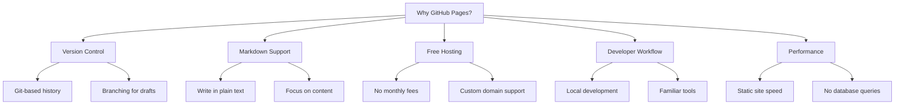
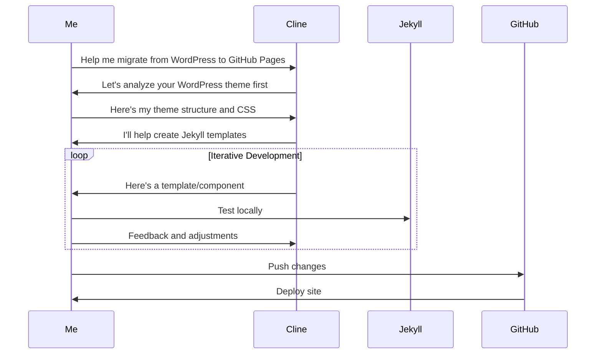
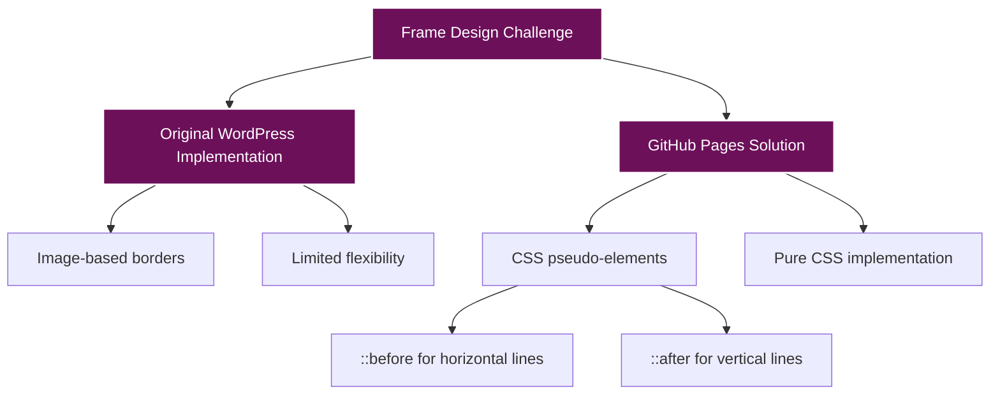
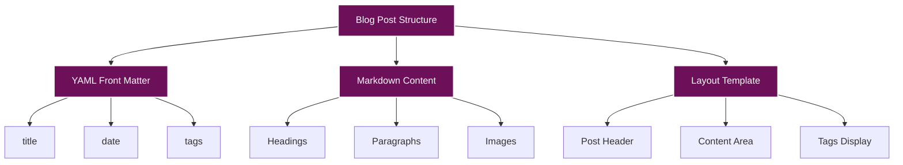
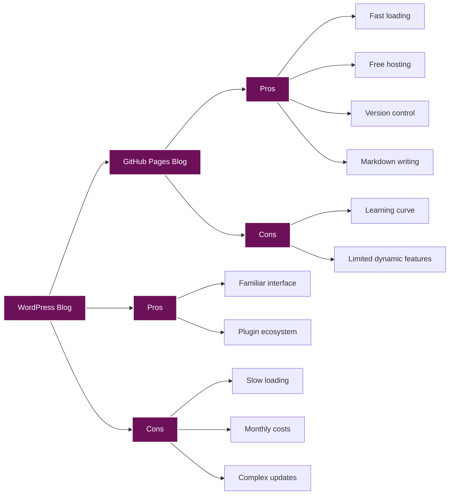

# WordPress to GitHub Pages: A Sunday Migration Journey

I've been running my blog on WordPress for years now. It's been reliable, but I've always felt a bit disconnected from the technical side of things. As a software engineer, I wanted more control, more flexibility, and honestly, a workflow that felt more natural to me. So today, I decided to take the plunge and migrate my entire site from WordPress to GitHub Pages.

## Why GitHub Pages?

Before I dive into the migration process, let me explain why I chose GitHub Pages:



As you can see, there were plenty of reasons to make the switch. But the biggest one? I wanted my blog to feel like *my* space again, where I could tinker and experiment without worrying about breaking plugins or themes.

## The Migration Plan

I woke up this Sunday morning with a cup of coffee and a plan. I knew I wanted to preserve my site's visual identity - the purple background, the DM Mono font, and that distinctive frame design I've grown to love. But I also wanted to leverage Jekyll's static site generation capabilities.

Here was my initial plan:


Seemed straightforward enough, right? Well, as with any technical project, things got a bit more complex once I dug in.

## Enter Cline: My AI Pair Programmer

I've been experimenting with AI tools for a while now, and for this migration, I decided to bring in Cline as my pair programmer. If you're not familiar, Cline is an AI assistant that can help with coding tasks, and it turned out to be incredibly helpful for this project.

I started by explaining my vision to Cline - I wanted to preserve the visual style of my WordPress site while moving to a Jekyll-based GitHub Pages implementation. Cline helped me analyze my existing WordPress theme, identify the key components, and create a plan for recreating them in Jekyll.

The collaboration looked something like this:



Working with Cline made the process much more efficient. Instead of spending hours researching Jekyll's structure or debugging CSS issues, I could focus on making decisions about the design and content while Cline handled much of the implementation details.

## The Frame Design Challenge

One of the most distinctive elements of my WordPress site was the frame design - that white border with connecting lines that gave my site its unique look. Recreating this in CSS was one of our biggest challenges.

In WordPress, this was implemented using images, but for better performance and maintainability, we decided to recreate it using CSS pseudo-elements:



The CSS implementation was tricky, but with Cline's help, we got it working perfectly:

```css
/* Post card container */
.post-card {
    position: relative;
    background-color: rgba(122, 1, 119, 0.7);
    border: 1px solid rgba(255, 255, 255, 0.3);
    padding: 30px;
    margin-bottom: 50px;
    border-radius: 0;
    box-shadow: 0 2px 5px rgba(0, 0, 0, 0.2);
}

/* Create a second border box underneath */
.post-card::after {
    content: '';
    position: absolute;
    top: 10px;
    bottom: -12px;
    right: -10px;
    width: 2px;
    background-color: #ffffff;
}

/* Create bottom horizontal line */
.post-card::before {
    content: '';
    position: absolute;
    left: 10px;
    right: -10px;
    bottom: -12px;
    height: 2px;
    background-color: #ffffff;
}
```

This pure CSS approach not only looked identical to the original design but also loaded faster and was easier to maintain.

## Blog Post Structure

Another important aspect was ensuring my blog posts maintained their structure and styling. In WordPress, this was handled by the theme, but in Jekyll, we needed to create a custom layout:



The Jekyll post structure was actually simpler and more intuitive than WordPress. Each post is a Markdown file with YAML front matter:

```markdown
---
layout: post
title: "Post Title"
date: 2025-04-20
tags: [tag1, tag2, tag3]
---

# Post Title

Content goes here...
```

This approach felt much more natural to me as a developer. No more fighting with the WordPress editor or worrying about formatting issues!

## The Sunday Marathon

What I thought might take a few hours ended up consuming my entire Sunday. Here's roughly how the day broke down:

```mermaid
gantt
    title Sunday Migration Timeline
    dateFormat  HH:mm
    axisFormat %H:%M
    
    section Morning
    Coffee & Planning           :a1, 08:00, 1h
    Setting Up Jekyll           :a2, 09:00, 1h
    Creating Basic Templates    :a3, 10:00, 2h
    
    section Afternoon
    CSS Styling                 :b1, 12:00, 2h
    Lunch Break                 :b2, 14:00, 30m
    Content Migration           :b3, 14:30, 2h
    
    section Evening
    Debugging Issues            :c1, 16:30, 2h
    Final Touches               :c2, 18:30, 1h
    Testing & Deployment        :c3, 19:30, 1h
    Celebration Drink           :c4, 20:30, 30m
```



By the end of the day, I was exhausted but satisfied. The site was up and running on GitHub Pages, looking almost identical to my WordPress site but with all the benefits of a static site generator.

## Lessons Learned

This migration taught me several valuable lessons:

1. **Start with a clear plan**: Having a detailed migration plan made the process much smoother.
2. **Leverage AI assistance**: Cline saved me hours of research and debugging.
3. **Focus on the core elements**: Identifying the key visual elements helped prioritize the work.
4. **Test continuously**: Regular testing throughout the day caught issues early.
5. **Document everything**: I created detailed documentation of the migration process for future reference.

## The Result

The final result was worth every minute spent. My blog now loads faster, is easier to maintain, and gives me complete control over the content and design. Plus, I can write posts in Markdown, which feels much more natural than the WordPress editor.



If you're considering a similar migration, I highly recommend giving it a try. Yes, it might take your entire Sunday (and maybe a bit of your sanity), but the result is a blog that truly feels like your own again.

And if you do decide to take the plunge, consider bringing Cline along for the journey. Having an AI pair programmer made the process not just more efficient, but also more enjoyable. It's like having a knowledgeable friend who never gets tired of your questions or debugging requests.

Off to enjoy the last hour of my day.
