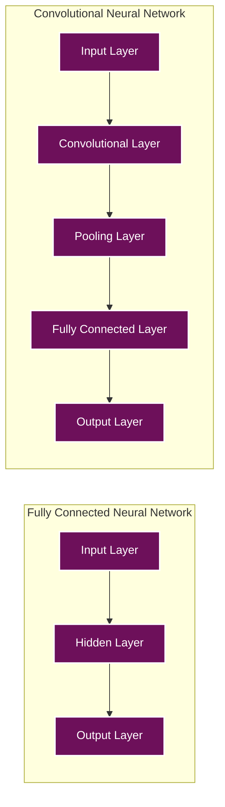
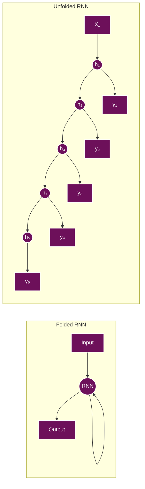
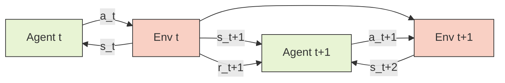
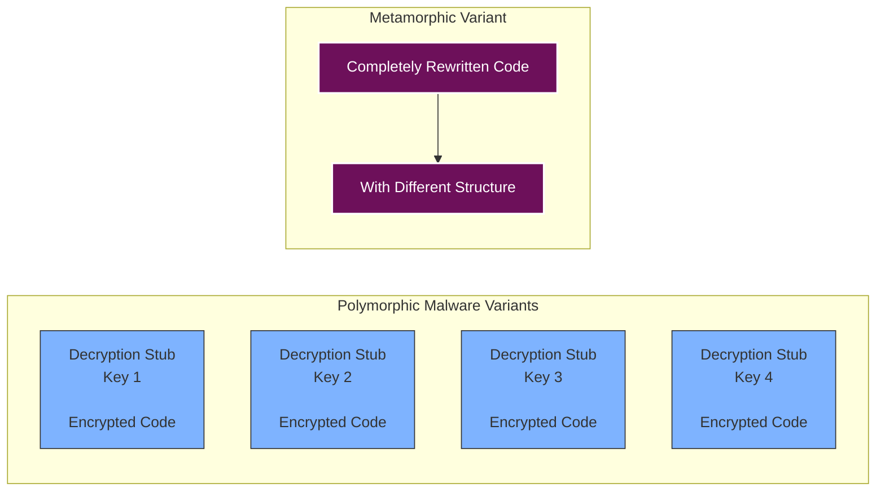
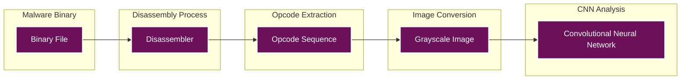

Research conducted in 2019

<h1 style="font-size: 24pt; margin-bottom: 10px;">DEEP LEARNING FOR MALWARE ANALYSIS</h1>

Kali Jackson

<strong>Abstract</strong>—Deep learning is a very popular tool with many potential uses including making identifying de-obfuscating and generating vaccines for Malware. Malware has become an ever-increasing issue for the world as it has been proven to harm our medical, power, and financial infrastructure with malware such as Stuxnet, WannaCry, and Locky. To understand how Deep Learning can help defend against Malware infections, this paper will go over what a neural network is, the different kinds, and the way deep learning is being used currently to combat Malware. Then I'll cover what we can do to improve those systems currently in use.

## I. INTRODUCTION

Neural networks are used and trained in many different ways. The different methods that are used to train neural networks that will be covered are fully connected, convolutional, recurrent, and deep reinforced learning. First we will go over what a neural network is and how it works. The TensorFlow framework will be used to explain how neural networks operate and the components within them. Then there will be an explanation of the different kinds of neural networks that exist and how they differ. All of this information tying together to explain why we need to use deep learning to combat malware and show how that idea has already begun to be implemented. Malware is constantly becoming more sophisticated by having machines instead of bad actors generate malware to be more intricate malware that can change its own code to avoid detection and use intense obfuscation to make the code unreadable. Due to these few reasons combating malware with deep learning seems to be the only way we can protect our systems from becoming overwhelmed with infectious attacks.

## II. NEURAL NETWORKS: HOW THEY OPERATE

Much like how we as people process and use information, data is taken in and then slightly adjusted to meet our version of truth based on successful attempts. Neural networks do something very similar where they learn from information and proof check based on success of the outcome of the that data. At a neural network framework's core there is a manager used for managing all the different versions of sources to determine which source should be loaded or trained. Depending on the circumstance, the manager may deny any one source's request because there may be a newer version of itself already loaded, forcing the old version to stay and continue to be trained. Sources keep track of streams of data called servables and prepares them for the loader. As the name implies, the loader is used for loading and unloading servables from the neural network. Servables are the objects used for computation in neural networks, they can either be a whole table or a single model. Different versions of servables exist to be trained to improve and pick the best version to train the dataset. The models that servables carry hold one or more algorithms and their weight on the neural network. In the case of TensorFlow, a model would be a tensor.

### A. Fully Connected

Neural Networks that scan entire objects are considered to be fully connected. When this type of neural network looks at an object or image, it studies it in a series of grids [3]. The neural network will take in all the attributes in each sector of the grid and compute them individually, then take all those pieces together to know what that object is. For instance, this is for image classification binary decision making, the object either is or isn't the desired object. An example would be an app that lets the user know the picture uploaded is of a dog or not.

### B. Convolutional

Convolutional neural networks work fairly similar to fully connected. Instead of taking in the full object, the program only takes in pieces of the object to create a more meaningful data set for each segment of the grid. Convolutional networks use objects called convolutional layers. Compared to how a fully connected neural network must scan an entire object at once, convolutional neural networks are able to scan with convolutional layers to seek out multiple sources on an object at once as shown in Figure 1. This kind of computing can save resources and power for more efficient detection.

Fig. 1. A visual comparison between fully connected and convolutional neural networks [7]

### C. Recurrent

Neural networks built using the recurrent method retrain themselves on the data flowing through the program. Compared to other neural networks, the information moving through is trained upon once and then passed through. With recurrent neural networking, that piece of data is put back into the system and trained alongside the new piece of data to create an analogous relationship within the data. When the data is retrained it becomes "unfolded" meaning the data is compartmentalized and trained again [8]. For example, when training a phrase that's seven words long, the phrase will be unwrapped into seven layers for each word. For an example of what this unfolding sequence looks like, please refer to Figure 2.

Fig. 2. A representation of unfolding data in a recurrent neural network [8]

As we can see, this would create a much deeper and trusted neural networks where all the data is thoroughly computed. Though this neural network can create more trustworthy data, it is also computationally more expensive than a conventional and fully connected neural network. By mix matching convolutional and recurrent neural network strategies, we can make a neural network more beneficial than a strict convolutional neural network and less computationally intensive as fully connected neural network.

### D. Deep Reinforced Learning

Neural Networks that use deep reinforced learning are somewhat similar to recurrent neural networks. They go back over data in such a way to create deeper connections between different datasets. With Deep reinforced neural networks though, the data needs to be thought of a little more intricately. There are two different data sets in deep reinforced neural networks, one called agent and the other named environment [3]. Whenever an agent makes a change, it reports that change to the environment which will give a negative or positive reaction to the same change. If the reaction to the change is positive to the environment, then the agent will continue on its course and try to make more actions similar to the previous. When a negative reaction is given, the agent will attempt to course correct and make less actions to the one it just made. This kind of "learn by doing" function of deep reinforced networks creates deeper meaning to the datasets being computed and therefore gives greater positive results.

Fig. 3. Illustration of how Agent and Environment components interact [3]

By using this system, we can attempt to develop a label-free neural network so that the network can functionally perform on its own with little to no human intervention.

## III. MACHINE GENERATED MALWARE

Malware takes all kinds of different forms and uses sophisticated tools to keep itself safe from detection. One such tool is using a program to make the malware to be either polymorphic or metamorphic. By giving malware these properties, it can change its own code to avoid detection. Polymorphic malware will change all of its code except for the actual virus, but metamorphic malware will obfuscate all the code from the virus body to its form [9]. For instance, when a piece of metamorphic malware is deployed on a machine, the malware will change its form until it avoids detection; each time in doing so, the virus core is also being obfuscated to avoid being detected and ruining its new disguised form as depicted in Figure 4.

Fig. 4. Showing the changes in Malware keys and form with machine generation [9]

Due to machine generated malware becoming increasingly frequent, we must use new tools to detect and de-obfuscate these infections.

## IV. DE-OBFUSCATION AND DETECTION WITH DEEP LEARNING

By using existing methods of reverse engineering and malware analysis, we can train these techniques on our own machines to help combat the ever-growing use of machine generated malware. One method of analysis is dynamic analysis; this type of analysis checks for behavior happening at execution time instead of analyzing the infectious code itself, allowing it to overlook anti-detection techniques such as obfuscation [4]. The other type of analysis is static analysis. Static analysis is the process of using tools to analyze source code and the executable that launches the malware. Using this type of analysis helps determine the function and structure of the malware [4].

Now to find which one of the previously mentioned type of neural networks would be best to use for analyzing malware. Using a fully connected layer would take too much computation time and the input data loses its shape as the computation takes longer, making it less than ideal for analyzing malware. Using a convolutional neural network is one step closer to our end goal as it can analyze piece by piece while retaining the data's shape and filter out parts of the infection we're not concerned with. Attempting to use a recurrent neural network will work in the short term, but after time the neural network will take too long to perform the job we need due to the repeated unfolding sequence.

With a little creativity, we can use a convolutional neural network to do the job since the other types of neural networks will take too long to compute. By using a process called imaging, we can create digital picture of the opcode that the malware uses. Figure 5 shows how this process works.

Fig. 5. Illustration of imaging malware opcode [4]

By imaging malware opcode and using a convolutional neural network, we can look for key parts of the infection to better detect the malware within a reasonable amount of time, even when it comes to machine generate malware. The machine generated malware version is usually very similar compared to its other versions, so if the convolutional neural network finds and defines one piece of this version of malware, it's very likely to do the same for all malware within that family.

## V. VACCINATION OF MALWARE WITH A NEURAL NETWORK

With our newfound way of detecting malware using a convolutional neural network, let's take one more step into malware defense by making a vaccination and implementing it with a neural network. By using dynamic analysis to check the behavior of the infection, we can find conditions in which the infection terminates or cuts resources that the infection needs for its deployment. The perfect malware vaccine can do both, but we can settle for just one out of the two to start with.

Using a convolutional neural network, we can image the infection and look for those key behaviors previously stated. Based on those behaviors, we can then look for similar malware that perform in the same way and begin to apply vaccinations that already exist. If a vaccination doesn't exist, then the neural network will begin to find and learn the opcode of the malware. By learning the opcode, the neural network can then begin to build its own vaccine with the same method used to make machine generated malware to force the malware to terminate. Once the malware terminates for the first time, the neural network will save that exploit, the vaccine used, and notate it as successful on the found malware. The neural network will then use the same vaccine when the malware comes up again in the future, and when it works the second time, the network will then consider the vaccine completely successful. If the malware is resistant to the vaccine but the malware seems to belong to the same family as the previous vaccinated malware, the neural network will continue more attempts to vaccinate and save the state of the new vaccine and an image of the new malware on a successful vaccination. This allows the neural network to learn more of how malware family structures work to better find vaccinations for other malware families in the future and not just that one particular malware family [10].

## VI. MALWARE REMOVAL WITH A NEURAL NETWORK

Now that we are automatically defining and immunizing malware with our neural network, the next step would be to remove the malware altogether. Even in current anti-virus right now, automatic removal is not implemented for various reasons. Sometimes the anti-virus will get a false-positive; this happens regularly with key generators for pirated programs. What normally happens right now is when a suspected piece of malware is found, it's immunized and then sectioned off for quarantine until the user designates that the file is indeed something they no longer want and chosen for removal. Depending on how the user or stakeholders feel, they could extend their malware defending neural network to automatically remove any infection that's found. This would need to be done in a sterile network environment such as a retail store or corporate network. In these managed environments, most users aren't allowed to make too many changes to their machines or user profile for the sake of security and reduction of user error. In these sanitized network environments, using this neural network to automatically remove malware may be a viable option.

## VII. CONCLUSION

With the threat of malware growing every day, we need a new system in place to detect, immunize, and remove malware. As shown, malware is able to be generated and obfuscated by machines without human intervention. This means more malware is being generated fast on a great scale. Since people move slower than computers, implementing neural networks for our defense will be one of the few ways to combat the advanced persistent attacks of malware in the near future. One such company already using this technology is Deep Instinct based in Israel. Their desires in creating the neural network were similar: to reduce the endless cycle of manually updating malware signatures [1]. Deep Instinct distributes a lightweight software to run on servers, desktops, laptops, and mobile devices that communicate back to their neural network to scan, immunize, and quarantine any found infections. According to Deep Instinct, their infection detection rate went from seventy-nine percent to almost ninety-nine percent with the implementation of their new neural network [1]. Neural networks may be the answer to our growing malware crisis.

## REFERENCES

[1] S. Greengard, "Cybersecurity Gets Smart," Communications of the ACM, vol. 59, no. 5, pp. 29–31, May 2016, doi:10.1145/2898969.

[2] Y.-S. Lee et al., "Trend of Malware Detection Using Deep Learning," Proceedings of the 2nd International Conference on Education and Multimedia Technology - ICEMT 2018, pp. 102–106, Jul. 2018, doi:10.1145/3206129.3239430.

[3] W. Di, A. Bhardwaj, and J. Wei, Deep Learning Essentials. PACKT Publishing Limited, 2018.

[4] Y.-S. Lee et al., "Trend of Malware Detection Using Deep Learning," Proceedings of the 2nd International Conference on Education and Multimedia Technology - ICEMT 2018, pp. 102–106, Jul. 2018, doi:10.1145/3206129.3239430.

[5] Z. Yuan et al., "Droid-Sec," ACM SIGCOMM Computer Communication Review, vol. 44, no. 4, pp. 371–372, 2014, doi:10.1145/2740070.2631434.

[6] I. Zafar, G. Tzanidou, R. Burton, N. Patel, and L. Araujo, Hands-On Convolutional Neural Networks with TensorFlow. PACKT Publishing Limited, 2018.

[7] I. Zafar, G. Tzanidou, R. Burton, N. Patel, and L. Araujo, Hands-On Convolutional Neural Networks with TensorFlow. PACKT Publishing Limited, 2018.

[8] M. Singh Ghotra and R. Dua, Neural Network Programming with TensorFlow. PACKT Publishing Limited, 2017.

[9] R. Wong, Mastering Reverse Engineering. PACKT Publishing Limited, 2018.

[10] Z. Xu et al., "Automatic Generation of Vaccines for Malware Immunization," Proceedings of the 2012 ACM Conference on Computer and Communications Security - CCS '12, pp. 1037–1039, Oct. 2012, doi:10.1145/2382196.2382317.
