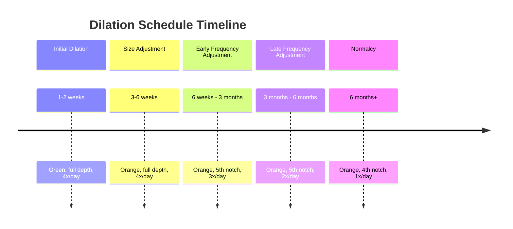

# After Launch: Continuing the Bottom Surgery Journey

My girlfriend Kat left back to her home at the end of October and I was on my own to continue healing. About a week later I developed a terrible UTI (Urinary Tract Infection). I tried contacting my surgeon's office who told me to contact my PCP, Primary Care Physician, or go to Urgent Care. I used a Telehealth service to get a prescription and had to go in for my first pee test post-surgery. This all happened on my birthday, which is why I chose the surgery date to begin with. I wanted to enjoy my birthday more as myself, instead I was miserable in bed. While I was sick with the UTI for a few days I was still continuing my dilation schedule of 4x (four times) a day. Eventually, I overcame being sick and returned to work. After this I was ready to move down to dilating 3x (three times) a day.

Returning to work wasn't fantastic. I basically came back to more issues than when I left and was tasked with playing clean-up. I was just thankful I work remotely and was able to recovery mostly from home.

I was mostly life coasting with this rhythm until Kat moved in with me on New Years. After she moved in lots of things got easier because I have her help.

I had my 6 week post-op appointment virtually which was very easy. Just send pictures to the surgeon and discuss healing and answer questions. The surgical team told me at this point I'm more of an expert on my body than they are and they're just there for support.

Not long after this conversation I had switched to using water based lubricant instead of Surgilube which caused me to develop and pretty nasty bacteria in my vaginal canal. I had to go on antibiotics again and got sick for about a week. When I reached out for help on this issue I had gotten the same message, go seek help from my PCP. When I reached out to my PCP, their team told me to reach out to the surgical team since they should know best. You can probably understand I was more than frustrated at this point. I used Telemed when gave me a prescription and told me I needed to have a vaginal swab performed at the hospital. I went and the hospital had no idea what I was talking about. Hours of run-around and I find that it's something my PCP has to do, not the hospital OBGYN. My PCP couldn't see me in time so I saw a random FNP, Family Nurse Practitioner, to get help. She had mentioned it was her first trans vagina and not comfortable with performing the swab test. I had to ease her anxiety and let her know it should be exactly the same and to please follow through. We got through the exam and I left. I had never felt more failed in my life. I couldn't get help from anyone for a serious issue and once I finally did I still had to beg to get the final result. Trans care shouldn't be like this.

After this, healing was pretty normal if not amazing. My results look fantastic and only continue to look, and feel, better. I had another post-op at the 3 month mark which I moved down to dilating 2x (two times) a day. I have lost some depth, but not any more than I feel scared of losing. I expected to lose at least a notch at some point.

Again, I just continue to life-coast. Enjoying life with my girlfriend, puppies and going on lots of walks to help with recovery. After my 6 month post-op mark I moved down to dilating only once a day.

Let's add a dilation history here to keep track:

Even with the complications I've had, money spent and life stressors added I would make this decision again. This was a life dream come true and I couldn't be happier ❤.

---

## Previous Post in this Series

  <h3><a href="/2024/10/30/bottom-surgery-hurdles-prep-and-joy.html">Bottom Surgery: Hurdles, Prep and Joy</a></h3>
  
October 30, 2024

  

    I've known bottom surgery was the answer to a major source of my dysphoria for a long time. Once I was ready to come out in 2021, searching for a surgeon and understanding how to correctly get permission for surgery became my number one priority...
  

  <a href="/2024/10/30/bottom-surgery-hurdles-prep-and-joy.html" class="read-more">Read the full post →</a>

