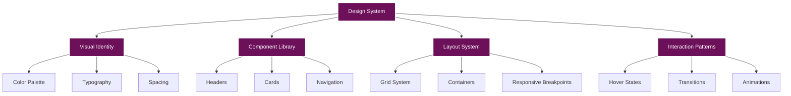

# Design System Documentation

**radicalkjax.com - Comprehensive Design System & Theme Guide**

**Last Updated:** October 2025

## Table of Contents

- [Overview](#overview)
- [Design Philosophy](#design-philosophy)
- [Color System](#color-system)
- [Typography](#typography)
- [Layout Architecture](#layout-architecture)
- [Component Patterns](#component-patterns)
- [Responsive Design](#responsive-design)
- [Accessibility](#accessibility)
- [CSS Architecture](#css-architecture)
- [JavaScript Modules](#javascript-modules)
- [Creating New Components](#creating-new-components)

---

## Overview

This design system defines the visual language, interaction patterns, and implementation guidelines for radicalkjax.com. The design emphasizes a **cyberpunk/hacker aesthetic** with technical precision, clean monospace typography, and a bold magenta/purple color scheme.



---

## Design Philosophy

### Core Principles

1. **Technical Precision**: Clean, monospace typography and structured layouts
2. **High Contrast**: White text on deep purple for maximum readability
3. **Distinctive Framing**: Double-border effects create depth and visual hierarchy
4. **Responsive First**: Mobile-friendly with progressive enhancement
5. **Accessible**: WCAG 2.1 AA compliant with proper ARIA labels
6. **Performance**: Optimized loading with critical CSS inline

### Aesthetic Guidelines

- **Cyberpunk/Hacker Aesthetic**: Technical, bold, futuristic
- **Minimalist Approach**: Clean layouts without clutter
- **Interactive Elements**: Smooth transitions and hover effects
- **Visual Hierarchy**: Clear content organization with consistent spacing

---

## Color System

### CSS Custom Properties

All colors are defined as CSS variables in `:root` for easy theming:

```css
:root {
  /* Primary Colors */
  --color-primary: #6d105a;        /* Deep purple/magenta */
  --color-secondary: #fff;          /* White */
  --color-accent: #f84ef8;         /* Hot pink/magenta */

  /* Background Colors */
  --color-background: #6d105a;     /* Same as primary */

  /* Text Colors */
  --color-text: #fff;              /* White */

  /* Interactive Colors */
  --color-link: #f84ef8;           /* Hot pink */
  --color-link-hover: #ff6bff;     /* Lighter pink */

  /* Border Colors */
  --color-border: rgba(255, 255, 255, 0.2);  /* Transparent white */

  /* Dark Mode Colors (prepared for future) */
  --dark-background: #1a1a1a;      /* Near black */
  --dark-primary: #3a0d2e;         /* Dark purple */
  --dark-text: #e0e0e0;            /* Light gray */
  --dark-border: rgba(255, 255, 255, 0.1);
}
```

### Color Palette Reference

| Color Name | Hex Code | RGB | Usage |
|-----------|----------|-----|-------|
| Deep Purple | `#6d105a` | `rgb(109, 16, 90)` | Primary background, branding |
| White | `#fff` | `rgb(255, 255, 255)` | Text, borders, icons |
| Hot Pink | `#f84ef8` | `rgb(248, 78, 248)` | Accents, links, highlights |
| Light Pink | `#ff6bff` | `rgb(255, 107, 255)` | Hover states |
| Near Black | `#1a1a1a` | `rgb(26, 26, 26)` | Dark mode background |

### Transparency Layers

- **Cards/Sections**: `rgba(109, 16, 90, 0.7)` - 70% opacity
- **Overlays**: `rgba(122, 1, 119, 0.7)` - 70% opacity
- **Borders**: `rgba(255, 255, 255, 0.2)` - 20% opacity
- **Hover States**: `rgba(255, 255, 255, 0.1)` - 10% opacity

### Color Usage Guidelines

- **Primary**: Use for main background and large areas
- **Secondary (White)**: Use for text and borders for maximum contrast
- **Accent (Hot Pink)**: Use sparingly for CTAs, links, and important highlights
- **Transparency**: Use layered transparency for depth and visual interest

---

## Typography

### Font Stack

```css
:root {
  /* Primary Font */
  --font-family: 'DM Mono', monospace;

  /* Special Font (for site title) */
  --font-family-title: 'Uni 05_53', 'DM Mono', monospace;
}
```

### Font Loading

Fonts are loaded with performance optimization:

```html
<!-- Preload critical fonts -->
<link rel="preload" href="{{ '/assets/fonts/uni0553-webfont.woff2' | relative_url }}"
      as="font" type="font/woff2" crossorigin>

<!-- Load DM Mono from Google Fonts -->
<link rel="preload" as="style"
      href="https://fonts.googleapis.com/css2?family=DM+Mono:ital,wght@0,300;0,400;0,500;1,300;1,400;1,500&display=swap">
<link rel="stylesheet"
      href="https://fonts.googleapis.com/css2?family=DM+Mono:ital,wght@0,300;0,400;0,500;1,300;1,400;1,500&display=swap"
      media="print" onload="this.media='all'">
```

### Type Scale

Fluid typography using `clamp()` for responsive sizing:

```css
:root {
  /* Base Sizes */
  --font-size-base: 16px;
  --line-height: 1.6;

  /* Fluid Heading Sizes */
  --font-size-h1: clamp(1.8rem, 5vw, 2.5rem);
  --font-size-h2: clamp(1.5rem, 4vw, 2rem);
  --font-size-h3: clamp(1.3rem, 3vw, 1.75rem);
}
```

### Typography Hierarchy

| Element | Size | Weight | Usage |
|---------|------|--------|-------|
| H1 | 3rem (48px) | 500 | Page titles, post titles |
| H2 | 2rem (32px) | 500 | Section headings |
| H3 | 1.5rem (24px) | 500 | Subsection headings |
| Body | 1rem (16px) | 400 | Body text, paragraphs |
| Small | 0.9rem (14px) | 400 | Captions, metadata |
| Tiny | 0.8rem (13px) | 400 | Tags, labels |

### Typography Guidelines

- **Consistency**: Use DM Mono for all text except the site title
- **Line Height**: 1.6 for body text, 1.2 for headings
- **Letter Spacing**: Default for body, uppercase with 1px spacing for labels
- **Font Weights**: 300 (light), 400 (regular), 500 (medium), 600 (bold)

---

## Layout Architecture

### Container System

```css
.container {
  width: 100%;
  max-width: var(--container-width);  /* 1000px */
  margin: 0 auto;
  padding: 0 var(--spacing-sm);        /* 16px */
}
```

### Spacing System

Consistent spacing using 8px base unit:

```css
:root {
  /* Spacing Scale */
  --spacing-xs: 8px;
  --spacing-sm: 16px;
  --spacing-md: 24px;
  --spacing-lg: 32px;
  --spacing-xl: 48px;
}
```

### Grid Layouts

Modern CSS Grid for responsive layouts:

```css
/* Blog Grid */
.blog-grid {
  display: grid;
  grid-template-columns: repeat(auto-fill, minmax(300px, 1fr));
  gap: var(--spacing-lg);
  margin: var(--spacing-xl) 0;
}

/* Skills Grid */
.skills-grid {
  display: grid;
  grid-template-columns: 1fr 1fr;
  gap: 20px;
  margin-bottom: 20px;
}

/* Photo Gallery */
.photo-gallery {
  display: grid;
  grid-template-columns: repeat(auto-fill, minmax(300px, 1fr));
  gap: 20px;
  margin-top: 20px;
}
```

### Z-Index Layers

```css
:root {
  --z-dropdown: 1000;
  --z-sticky: 1020;
  --z-fixed: 1030;
  --z-modal: 1050;
  --z-tooltip: 1070;
  --z-logo: 10000;
}
```

---

## Component Patterns

### 1. Double-Border Frame Effect

The signature visual element across the site:

```css
.component {
  background-color: rgba(109, 16, 90, 0.7);
  border: 2px solid #fff;
  padding: 30px;
  margin-bottom: 40px;
  position: relative;
  box-shadow: 0 2px 5px rgba(0, 0, 0, 0.2);
}

/* Right vertical line */
.component::after {
  content: '';
  position: absolute;
  top: 10px;
  bottom: -12px;
  right: -10px;
  width: 2px;
  background-color: #fff;
}

/* Bottom horizontal line */
.component::before {
  content: '';
  position: absolute;
  left: 10px;
  right: -10px;
  bottom: -12px;
  height: 2px;
  background-color: #fff;
}
```

**Visual Reference:**
```
┌─────────────────┐
│                 │
│   Content       │
│                 │
└──┬──────────────┤
   │              │
   └──────────────┘
```

### 2. Card Component

Used for blog posts, projects, photos:

```css
.card {
  background-color: rgba(109, 16, 90, 0.7);
  border: 2px solid #fff;
  padding: 30px;
  margin-bottom: 40px;
  transition: transform 0.3s ease;
}

.card:hover {
  transform: translateY(-5px);
  box-shadow: 0 8px 16px rgba(0, 0, 0, 0.3);
}
```

### 3. Button Component

```css
.btn {
  display: inline-flex;
  align-items: center;
  justify-content: center;
  padding: var(--spacing-sm) var(--spacing-md);
  font-family: var(--font-family);
  color: var(--color-text);
  background: var(--color-primary);
  border: 2px solid var(--color-secondary);
  border-radius: var(--border-radius);
  cursor: pointer;
  transition: all 0.3s ease;
  text-decoration: none;
}

.btn:hover {
  background: var(--color-accent);
  transform: translateY(-2px);
  box-shadow: 0 4px 8px rgba(0, 0, 0, 0.2);
}
```

### 4. Navigation with Dropdown

```css
nav ul {
  display: flex;
  list-style: none;
  justify-content: center;
  align-items: center;
  margin: 0;
  padding: 0;
}

nav ul li {
  margin: 0 6px;
  position: relative;
}

.dropdown-menu {
  display: none;
  position: absolute;
  top: 100%;
  left: 0;
  background-color: #6d105a;
  border: 1px solid #fff;
  min-width: 180px;
  z-index: 9999;
  padding: 5px 0;
  flex-direction: column;
  box-shadow: 0 2px 5px rgba(0, 0, 0, 0.2);
}

/* Show on hover (desktop) or via JavaScript (mobile) */
.dropdown:hover .dropdown-menu {
  display: flex;
}
```

### 5. Social Icons

```css
.social-icons {
  display: flex;
  align-items: center;
  gap: 8px;
}

.social-icons a {
  color: #fff;
  font-size: 1rem;
  transition: opacity 0.3s ease, transform 0.3s ease;
  display: flex;
  align-items: center;
  justify-content: center;
  width: 24px;
  height: 24px;
}

.social-icons a:hover {
  opacity: 0.8;
  transform: translateY(-3px);
}
```

### 6. Fixed Elements

**Logo:**
```css
.site-logo-container {
  position: fixed;
  left: 10px;
  top: 1px;
  z-index: 10000;
}

.site-logo-outside {
  width: 120px;
  height: 120px;
  display: block;
}
```

**Table of Contents:**
```css
#floating-toc {
  position: fixed;
  left: 20px;
  top: 150px;
  width: 280px;
  max-height: 70vh;
  overflow-y: hidden;
  background-color: #1a1a1a;
  border: 2px solid #6d105a;
  border-radius: 4px;
  box-shadow: 0 4px 8px rgba(0, 0, 0, 0.5);
  z-index: 1000;
}
```

---

## Responsive Design

### Breakpoints

```css
/* Compact layout for medium screens */
@media (max-width: 1200px) and (min-width: 1025px) {
  /* Tighter spacing, smaller fonts */
}

/* Transitional layout */
@media (max-width: 1024px) and (min-width: 901px) {
  /* Vertical stacking begins */
}

/* Mobile layout */
@media (max-width: 900px) {
  /* Full mobile experience */
}

/* Tablet */
@media (max-width: 768px) {
  /* Further mobile adjustments */
}

/* Small phones */
@media (max-width: 500px) {
  /* Ultra-compact layout */
}

/* Extra small phones */
@media (max-width: 350px) {
  /* Minimal layout */
}
```

### Responsive Patterns

**Header Transformation:**
- **Desktop (>900px)**: Horizontal layout with all elements visible
- **Tablet (768-900px)**: Stacked layout with visible navigation
- **Mobile (<768px)**: Hamburger menu with collapsible navigation

**Logo Positioning:**
- **Desktop**: Fixed top-left (120x120px)
- **Mobile**: Static centered (60x60px)

**TOC Behavior:**
- **Desktop**: Fixed sidebar (left/right)
- **Mobile**: Slide-in overlay with dark backdrop

**Grid Adjustments:**
```css
/* Desktop: 2 columns */
.skills-grid {
  grid-template-columns: 1fr 1fr;
}

/* Mobile: 1 column */
@media (max-width: 768px) {
  .skills-grid {
    grid-template-columns: 1fr;
  }
}
```

---

## Accessibility

### ARIA Labels

All interactive elements include proper ARIA labels:

```html
<!-- Navigation -->
<nav id="navigation" aria-label="Main navigation">

<!-- Social Links -->
<a href="..." aria-label="BlueSky" target="_blank" title="BlueSky">

<!-- Skip Links -->
<a href="#main-content" class="skip-link">Skip to main content</a>

<!-- Toggle Buttons -->
<button aria-label="Toggle Table of Contents">☰</button>
```

### Focus States

```css
:focus-visible {
  outline: 2px solid var(--color-accent);
  outline-offset: 2px;
}

.skip-link {
  position: absolute;
  top: -40px;
  left: 0;
  background: var(--color-primary);
  color: var(--color-secondary);
  padding: 8px;
  text-decoration: none;
  z-index: 100;
}

.skip-link:focus {
  top: 0;
}
```

### Reduced Motion

```css
@media (prefers-reduced-motion: reduce) {
  *,
  *::before,
  *::after {
    animation-duration: 0.01ms !important;
    animation-iteration-count: 1 !important;
    transition-duration: 0.01ms !important;
  }

  html {
    scroll-behavior: auto;
  }
}
```

### Color Contrast

- **Text on Background**: White (#fff) on Deep Purple (#6d105a) = **11.8:1** (WCAG AAA)
- **Links**: Hot Pink (#f84ef8) on Deep Purple = **4.8:1** (WCAG AA)
- **Borders**: White with 20% opacity on purple = **sufficient contrast**

---

## CSS Architecture

### File Structure

```
assets/css/
├── main.css                    # Primary styles (1876 lines)
├── modern.css                  # Modern CSS features (460 lines)
├── modern-features.css         # Progressive enhancements
├── fonts.css                   # Font loading
├── vendor-prefixes.css         # Browser prefixes
├── key-terms.css              # Key terms component
├── collapsible-references.css # Collapsible sections
├── mathjax-custom.css         # Math rendering
├── mermaid-custom.css         # Diagram styling
└── language-switcher.css      # i18n switcher
```

### CSS Methodology

**BEM-inspired naming:**
```css
/* Block */
.post-card { }

/* Element */
.post-card__title { }

/* Modifier */
.post-card--featured { }
```

**Utility classes:**
```css
.text-center { text-align: center; }
.mt-md { margin-top: var(--spacing-md); }
.mb-lg { margin-bottom: var(--spacing-lg); }
```

### Critical CSS

Inline critical CSS in `<head>` to prevent FOUC:

```html
<style>
  /* Critical above-the-fold CSS */
  :root{--color-primary:#6d105a;--color-secondary:#fff;--color-text:#fff;--color-background:#6d105a;--font-family:'DM Mono',monospace;--spacing-sm:16px;--spacing-md:24px;--container-width:1000px}
  *{margin:0;padding:0;box-sizing:border-box}
  body{font-family:var(--font-family);background-color:var(--color-background);color:var(--color-text);line-height:1.6;min-height:100vh}
  .site-logo-container{position:fixed;left:10px;top:1px;transform:none;z-index:10000}
  .site-logo-outside{width:120px;height:120px;display:block}
  header{padding:12px 0;border:2px solid #ffffff;background-color:#6d105a;position:relative}
  .container{max-width:var(--container-width);margin:0 auto;padding:0 var(--spacing-sm)}
</style>
```

---

## JavaScript Modules

### Core Modules

| Module | Purpose | File |
|--------|---------|------|
| Main | General interactions | `main.js` |
| Social Links | Icon animations | `social-links.js` |
| TOC | Table of contents | `toc.js` |
| Key Terms | Interactive glossary | `key-terms.js` |
| Print PDF | Print optimization | `print-pdf.js` |
| MathJax | Math rendering | `mathjax-custom.js` |
| Mermaid | Diagrams | `mermaid-custom.js` |
| Collapsible | Expandable sections | `collapsible-references.js` |
| Reference Links | Citation system | `reference-links.js` |
| Locale Detector | i18n detection | `modules/locale-detector.js` |
| Localized Images | i18n images | `modules/localized-images.js` |

### Loading Strategy

All JavaScript loaded with `defer` attribute:

```html
<script src="{{ '/assets/js/main.js' | relative_url }}" defer></script>
<script src="{{ '/assets/js/social-links.js' | relative_url }}" defer></script>
<script src="{{ '/assets/js/toc.js' | relative_url }}" defer></script>
```

### Progressive Enhancement

JavaScript enhances the experience but isn't required:

- Navigation works without JS (CSS hover)
- Content is fully accessible
- Forms submit normally
- Links work as expected

---

## Creating New Components

### Step-by-Step Guide

#### 1. Define Component Structure

```html
<div class="your-component">
  <div class="your-component__header">
    <h2 class="your-component__title">Title</h2>
  </div>
  <div class="your-component__content">
    <!-- Content here -->
  </div>
</div>
```

#### 2. Apply Base Styles

```css
.your-component {
  /* Container */
  background-color: rgba(109, 16, 90, 0.7);
  border: 2px solid #fff;
  padding: 30px;
  margin-bottom: 40px;
  position: relative;
  box-shadow: 0 2px 5px rgba(0, 0, 0, 0.2);
}

/* Double border effect */
.your-component::after {
  content: '';
  position: absolute;
  top: 10px;
  bottom: -12px;
  right: -10px;
  width: 2px;
  background-color: #fff;
}

.your-component::before {
  content: '';
  position: absolute;
  left: 10px;
  right: -10px;
  bottom: -12px;
  height: 2px;
  background-color: #fff;
}
```

#### 3. Add Typography

```css
.your-component__title {
  font-size: 2rem;
  font-weight: 500;
  margin-bottom: 20px;
  color: #fff;
}

.your-component__content {
  font-size: 1rem;
  line-height: 1.6;
  color: #fff;
}
```

#### 4. Add Interactive States

```css
.your-component {
  transition: transform 0.3s ease, box-shadow 0.3s ease;
}

.your-component:hover {
  transform: translateY(-2px);
  box-shadow: 0 4px 8px rgba(0, 0, 0, 0.3);
}
```

#### 5. Make Responsive

```css
@media (max-width: 768px) {
  .your-component {
    padding: 20px;
    margin-bottom: 30px;
  }

  .your-component__title {
    font-size: 1.5rem;
  }
}
```

#### 6. Add Accessibility

```html
<div class="your-component" role="region" aria-label="Component description">
  <h2 id="component-title" class="your-component__title">Title</h2>
  <div class="your-component__content" aria-labelledby="component-title">
    <!-- Content -->
  </div>
</div>
```

### Component Checklist

- [ ] Follows double-border pattern
- [ ] Uses CSS custom properties
- [ ] Includes hover/focus states
- [ ] Responsive at all breakpoints
- [ ] Has proper ARIA labels
- [ ] Matches color palette
- [ ] Uses DM Mono font
- [ ] Includes transitions (0.3s ease)
- [ ] Works without JavaScript
- [ ] Tested with reduced motion

---

## Design Tokens

### Complete Token Reference

```css
:root {
  /* Colors */
  --color-primary: #6d105a;
  --color-secondary: #fff;
  --color-accent: #f84ef8;
  --color-background: #6d105a;
  --color-text: #fff;
  --color-link: #f84ef8;
  --color-link-hover: #ff6bff;
  --color-border: rgba(255, 255, 255, 0.2);

  /* Dark Mode */
  --dark-background: #1a1a1a;
  --dark-primary: #3a0d2e;
  --dark-text: #e0e0e0;
  --dark-border: rgba(255, 255, 255, 0.1);

  /* Typography */
  --font-family: 'DM Mono', monospace;
  --font-size-base: 16px;
  --line-height: 1.6;

  /* Spacing */
  --spacing-xs: 8px;
  --spacing-sm: 16px;
  --spacing-md: 24px;
  --spacing-lg: 32px;
  --spacing-xl: 48px;

  /* Layout */
  --container-width: 1000px;

  /* Transitions */
  --transition: all 0.3s ease;

  /* Z-Index */
  --z-dropdown: 1000;
  --z-sticky: 1020;
  --z-fixed: 1030;
  --z-modal: 1050;
  --z-tooltip: 1070;
  --z-logo: 10000;
}
```

---

## Resources

### Documentation Links

- [Architecture Documentation](./architecture/README.md)
- [Components Documentation](./components/README.md)
- [Development Guide](./development/README.md)
- [Customization Guide](./customization/README.md)

### External Resources

- [DM Mono Font](https://fonts.google.com/specimen/DM+Mono)
- [Font Awesome Icons](https://fontawesome.com/)
- [CSS Grid Guide](https://css-tricks.com/snippets/css/complete-guide-grid/)
- [WCAG Guidelines](https://www.w3.org/WAI/WCAG21/quickref/)

---

**For questions or suggestions about the design system, please create an issue on GitHub.**
