# WordPress to GitHub Pages Migration Documentation

<div style="position: sticky; top: 20px; float: right; width: 250px; background-color: #6d105a; border: 1px solid rgba(255, 255, 255, 0.3); padding: 15px; margin-left: 20px; box-shadow: 0 2px 5px rgba(0, 0, 0, 0.2);">
  <h3 style="margin-top: 0; border-bottom: 1px solid rgba(255, 255, 255, 0.3); padding-bottom: 10px;">Table of Contents</h3>
  <ul style="list-style-type: none; padding-left: 0;">
    <li><a href="#overview" style="color: white; text-decoration: none;">Overview</a></li>
    <li><a href="#project-structure" style="color: white; text-decoration: none;">Project Structure</a></li>
    <li><a href="#key-components" style="color: white; text-decoration: none;">Key Components</a></li>
    <li><a href="#visual-design-elements" style="color: white; text-decoration: none;">Visual Design Elements</a></li>
    <li><a href="#key-implementations" style="color: white; text-decoration: none;">Key Implementations</a></li>
    <li><a href="#css-styling-highlights" style="color: white; text-decoration: none;">CSS Styling Highlights</a></li>
    <li><a href="#blog-post-structure" style="color: white; text-decoration: none;">Blog Post Structure</a></li>
    <li><a href="#migration-process" style="color: white; text-decoration: none;">Migration Process</a></li>
    <li><a href="#detailed-migration-changes" style="color: white; text-decoration: none;">Detailed Migration Changes</a>
      <ul style="padding-left: 15px;">
        <li><a href="#1-content-structure-transformation" style="color: white; text-decoration: none;">Content Structure</a></li>
        <li><a href="#2-theme-adaptation" style="color: white; text-decoration: none;">Theme Adaptation</a></li>
        <li><a href="#3-navigation-changes" style="color: white; text-decoration: none;">Navigation Changes</a></li>
        <li><a href="#4-social-media-updates" style="color: white; text-decoration: none;">Social Media Updates</a></li>
        <li><a href="#5-dynamic-content-implementation" style="color: white; text-decoration: none;">Dynamic Content</a></li>
        <li><a href="#6-technical-challenges-solved" style="color: white; text-decoration: none;">Technical Challenges</a></li>
        <li><a href="#7-performance-improvements" style="color: white; text-decoration: none;">Performance Improvements</a></li>
        <li><a href="#8-photos-page-redesign" style="color: white; text-decoration: none;">Photos Page Redesign</a></li>
        <li><a href="#9-about-pages-styling-standardization" style="color: white; text-decoration: none;">About Pages Styling</a></li>
        <li><a href="#10-logo-integration" style="color: white; text-decoration: none;">Logo Integration</a></li>
        <li><a href="#11-project-pages-styling" style="color: white; text-decoration: none;">Project Pages Styling</a></li>
        <li><a href="#12-hyperlink-standardization" style="color: white; text-decoration: none;">Hyperlink Standardization</a></li>
        <li><a href="#13-about-page-updates" style="color: white; text-decoration: none;">About Page Updates</a></li>
        <li><a href="#14-responsive-mobile-view-enhancements" style="color: white; text-decoration: none;">Responsive Mobile View</a></li>
        <li><a href="#15-mermaid-diagram-styling" style="color: white; text-decoration: none;">Mermaid Diagram Styling</a></li>
        <li><a href="#16-custom-css-support-in-default-layout" style="color: white; text-decoration: none;">Custom CSS Support</a></li>
      </ul>
    </li>
    <li><a href="#technical-implementation-details" style="color: white; text-decoration: none;">Technical Implementation</a></li>
    <li><a href="#conclusion" style="color: white; text-decoration: none;">Conclusion</a></li>
  </ul>
</div>

## <a id="overview"></a>Overview

This document details the process of migrating a WordPress blog to GitHub Pages. The migration involved preserving the visual style of the original WordPress site (which used the Pixl theme and DM Mono font) while adapting the content to work with GitHub Pages' static site generation using Jekyll.

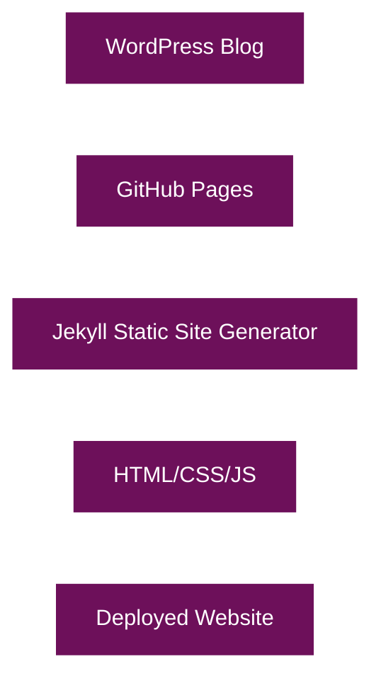

## <a id="project-structure"></a>Project Structure

The GitHub Pages site follows a standard Jekyll project structure with some customizations:

```mermaid
graph TD
    A[Root Directory] --> B[_config.yml]
    A --> C[_includes/]
    A --> D[_layouts/]
    A --> E[_posts/]
    A --> F[assets/]
    A --> G[HTML Pages]
    
    C --> C1[header.html]
    C --> C2[footer.html]
    
    D --> D1[default.html]
    D --> D2[post.html]
    
    E --> E1[Blog Post Markdown Files]
    
    F --> F1[css/]
    F --> F2[js/]
    F --> F3[fonts/]
    F --> F4[images/]
    
    G --> G1[index.html]
    G --> G2[blog.html]
    G --> G3[about.html]
    G --> G4[connections.html]
    G --> G5[projects.html]
    G --> G6[art.html]
    
    style A fill:#6d105a,stroke:#fff,stroke-width:2px,color:#fff
    style B fill:#6d105a,stroke:#fff,stroke-width:2px,color:#fff
    style C fill:#6d105a,stroke:#fff,stroke-width:2px,color:#fff
    style D fill:#6d105a,stroke:#fff,stroke-width:2px,color:#fff
    style E fill:#6d105a,stroke:#fff,stroke-width:2px,color:#fff
    style F fill:#6d105a,stroke:#fff,stroke-width:2px,color:#fff
    style G fill:#6d105a,stroke:#fff,stroke-width:2px,color:#fff
    
    linkStyle 0,1,2,3,4,5,6,7,8,9,10,11,12,13,14,15,16,17,18,19,20 stroke:#fff,stroke-width:2px;
```

## <a id="key-components"></a>Key Components

### 1. Jekyll Configuration

The `_config.yml` file contains the basic configuration for the Jekyll site, including site title, description, and other settings.

### 2. Layouts

Two main layouts were created:

- **default.html**: The base layout that includes the header, footer, and main content area
- **post.html**: Extends the default layout with specific styling for blog posts

### 3. Includes

Common elements were extracted into include files:

- **header.html**: Contains the site header with navigation and social links
- **footer.html**: Contains the site footer

### 4. CSS Styling

The CSS was customized to match the original WordPress theme:

- **main.css**: Contains the main styling for the site
- **fonts.css**: Contains the font definitions

### 5. JavaScript

- **main.js**: Contains general JavaScript functionality
- **social-links.js**: Manages the social media links

## <a id="visual-design-elements"></a>Visual Design Elements

The visual design of the site incorporates several distinctive elements:

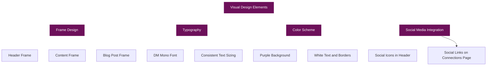

### Frame Design

A distinctive frame design was implemented for various elements:

1. **Header Frame**: The header has a white border with a second border box underneath
2. **Content Frame**: Content sections have a similar frame design
3. **Blog Post Frame**: Blog posts have a frame with vertical and horizontal lines

### Blog Post Display

Blog posts are displayed using a custom design:

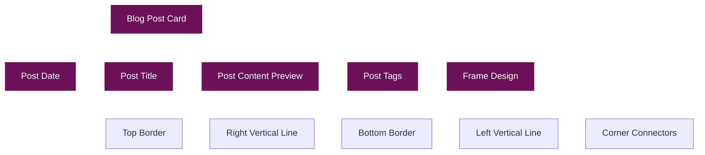

## Key Implementations

### 1. Dynamic Blog Post Display

Blog posts are dynamically displayed on both the homepage and blog page using Jekyll's Liquid templating:

```liquid

<article class="post-card">
    <div class="post-date">{{ post.date | date: "%B %d, %Y" | upcase }}</div>
    <h2 class="post-title"><a href="{{ post.url | relative_url }}">{{ post.title }}</a></h2>
    <div class="post-content">
        <p>{{ post.content | strip_html | truncate: 300 }}…</p>
    </div>
    <div class="post-tags">
        
            
            <a href="#">{{ tag }}</a>
            
        
    </div>
</article>

```

This ensures that:
- Posts are automatically sorted by date (newest first)
- Each post has a consistent preview length (300 characters)
- Tags are displayed for each post

### 2. Social Media Integration

Social media links were implemented in both the header and on the Connections page:

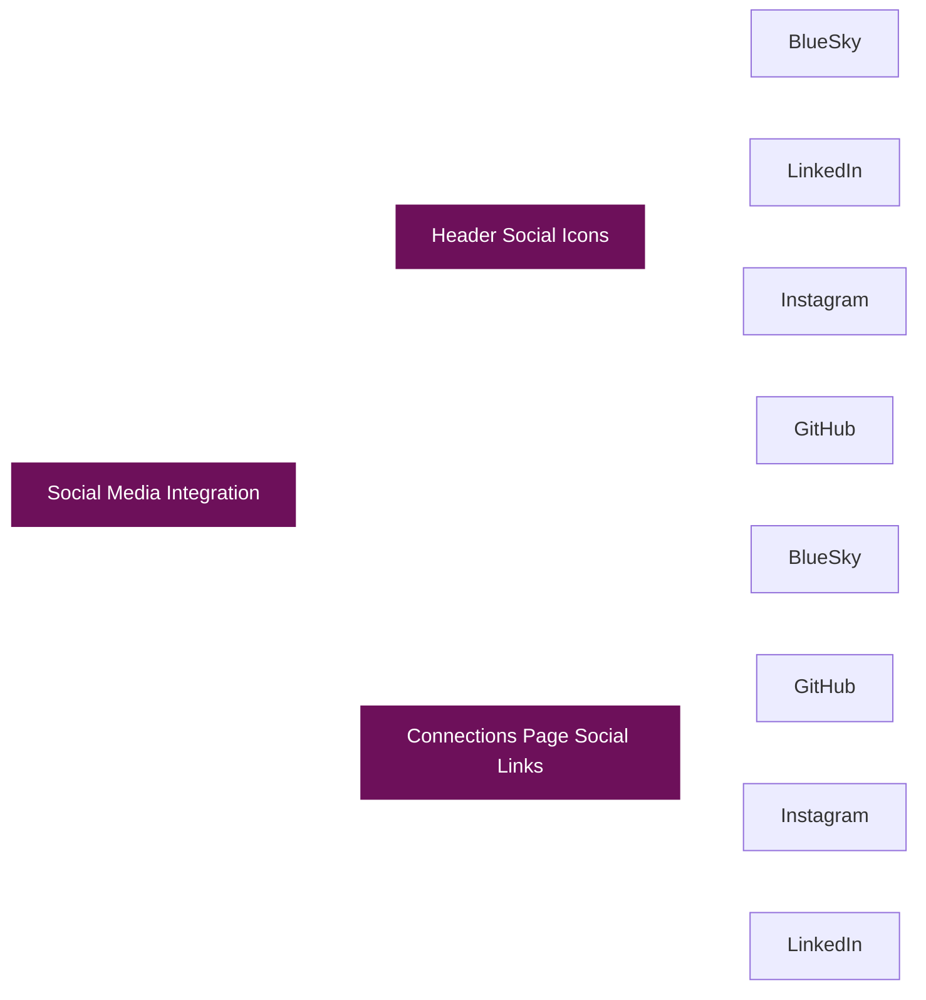

The social links are hardcoded in the HTML with the appropriate URLs:

```html
<a href="https://bsky.app/profile/radicalkjax.com" aria-label="BlueSky" target="_blank">
    <i class="fas fa-butterfly"></i>
</a>
```

A custom CSS rule was added to create the butterfly icon for BlueSky:

```css
.fa-butterfly::before {
    content: "\1F98B"; /* Unicode butterfly character */
    font-family: "Apple Color Emoji", "Segoe UI Emoji", "Segoe UI Symbol";
}
```

### 3. Navigation Structure

The site uses a dropdown navigation system:

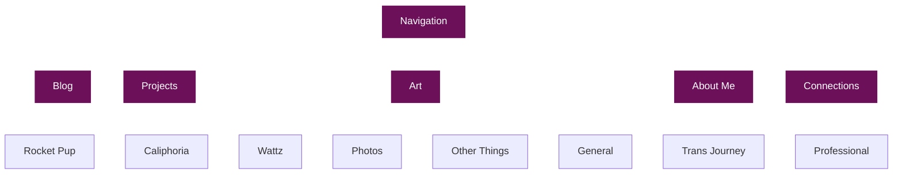

## CSS Styling Highlights

### 1. Frame Design CSS

The distinctive frame design is achieved through CSS pseudo-elements:

```css
/* Create a second border box underneath - similar to header */
.post-card::after {
    content: '';
    position: absolute;
    top: 10px; /* Start at the same position as the horizontal line */
    bottom: -12px;
    right: -10px;
    width: 2px;
    background-color: #ffffff;
}

/* Create bottom horizontal line */
.post-card::before {
    content: '';
    position: absolute;
    left: 10px;
    right: -10px;
    bottom: -12px;
    height: 2px;
    background-color: #ffffff;
}

/* Left vertical line */
.post-card .post-title::before {
    content: '';
    position: absolute;
    left: 10px;
    bottom: -12px;
    width: 2px;
    height: 10px;
    background-color: #ffffff;
}

/* Right horizontal line connecting to main box */
.post-card .post-date::after {
    content: '';
    position: absolute;
    top: 10px;
    right: -10px;
    width: 10px;
    height: 2px;
    background-color: #ffffff;
}
```

### 2. Link Styling

All links are styled to be white with a hover effect:

```css
/* Links */
.post-content a, .post-card .post-content a, .post-title a, .post-card .post-title a,
.social-item, .network-description a, .connections-intro a {
    color: #ffffff;
    text-decoration: underline;
    transition: opacity 0.3s ease;
}

.post-content a:hover, .post-card .post-content a:hover, .post-title a:hover, .post-card .post-title a:hover,
.social-item:hover, .network-description a:hover, .connections-intro a:hover {
    opacity: 0.8;
}
```

## Blog Post Structure

Blog posts are written in Markdown with YAML front matter:

```markdown
---
layout: post
title: Reliant to Engineer
date: 2025-03-14
tags: [blog, general, work]
---

I didn't grow up very wealthy. For most of my life my single mother, twin sisters and myself relied on government assistance to get by. Whether it was "food stamps," educational assistance or free lunch we relied on it all to get by and excel.

...
```

## Migration Process

The migration process followed these steps:

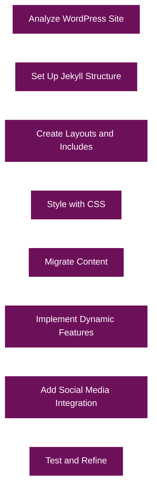

1. **Analyze WordPress Site**: Examined the original WordPress site to understand its structure, design, and content
2. **Set Up Jekyll Structure**: Created the basic Jekyll project structure
3. **Create Layouts and Includes**: Developed the layout templates and include files
4. **Style with CSS**: Implemented the CSS styling to match the original WordPress theme
5. **Migrate Content**: Converted WordPress content to Markdown and HTML
6. **Implement Dynamic Features**: Added dynamic features using Jekyll's Liquid templating
7. **Add Social Media Integration**: Integrated social media links
8. **Test and Refine**: Tested the site and made refinements

## Detailed Migration Changes

The migration from WordPress to GitHub Pages involved several specific changes and challenges:

### 14. Responsive Mobile View Enhancements

The responsive design of the site was significantly improved to provide a better user experience across all device sizes:

```mermaid
graph TD
    A[Responsive Design Enhancements] --> B[Breakpoint Optimization]
    A --> C[Mobile Navigation Improvements]
    A --> D[Logo Positioning Refinement]
    A --> E[Site Title Positioning]
    A --> F[Social Icons Margin]
    
    B --> B1[Multiple Breakpoints]
    B --> B2[Conditional Layout Changes]
    
    C --> C1[Dropdown Menu Improvements]
    C --> C2[Z-index Management]
    C --> C3[Text Wrapping]
    
    D --> D1[Automatic Mobile View Switching]
    D --> D2[Fixed Position Optimization]
    
    E --> E1[Title-Navigation Collision Detection]
    E --> E2[Layout Transformation]
    
    F --> F1[Consistent Margins]
    F --> F2[Visibility Preservation]
    
    style A fill:#6d105a,stroke:#fff,stroke-width:2px,color:#fff
    style B fill:#6d105a,stroke:#fff,stroke-width:2px,color:#fff
    style C fill:#6d105a,stroke:#fff,stroke-width:2px,color:#fff
    style D fill:#6d105a,stroke:#fff,stroke-width:2px,color:#fff
    style E fill:#6d105a,stroke:#fff,stroke-width:2px,color:#fff
    style F fill:#6d105a,stroke:#fff,stroke-width:2px,color:#fff
    
    linkStyle 0,1,2,3,4,5,6,7,8,9,10,11,12,13,14,15 stroke:#fff,stroke-width:2px;
```

#### Multiple Responsive Breakpoints

The responsive design was enhanced with multiple breakpoints to provide a smoother transition between different device sizes:

```css
/* Switch to mobile view when the site title would touch the navigation */
@media (max-width: 1200px) and (min-width: 1025px) {
    /* Adjust the site title to prevent it from touching the navigation */
    .site-title {
        max-width: 20%; /* Reduce max-width to prevent overlap */
        font-size: 0.7rem; /* Slightly reduce font size */
    }
    
    /* Adjust navigation position to make more room */
    nav {
        left: 55%; /* Shift navigation slightly to the right */
    }
    
    /* Ensure social icons have margin */
    .social-icons {
        right: 30px; /* Increased right margin */
    }
}

/* Switch to mobile view when the logo would enter the header box */
@media (max-width: 1024px) and (min-width: 901px) {
    /* Adjust header width and position to make room for the logo */
    header {
        width: 80vw; /* Reduced from 90vw to make more room for the logo */
        left: 55%; /* Shifted right to avoid the logo */
    }
    
    /* Ensure the logo stays fixed in its original position */
    .site-logo-container {
        position: fixed;
        left: 10px;
        top: 1px;
        transform: none;
    }
    
    /* Ensure social icons have margin */
    .social-icons {
        right: 30px; /* Increased right margin */
    }
}

/* Switch to mobile view when the site title would touch the navigation */
@media (max-width: 1000px) and (min-width: 901px) {
    /* Switch to mobile view when the site title would touch the navigation */
    .site-title {
        position: static;
        margin: 0 auto 20px;
        text-align: center;
        width: 100%;
        max-width: 100%;
    }
    
    .header-content {
        position: relative;
        flex-direction: column;
        padding-top: 20px;
    }
    
    nav {
        position: relative;
        left: 0;
        transform: none;
        width: 100%;
        display: flex;
        justify-content: center;
    }
    
    /* Ensure social icons have margin */
    .social-icons {
        right: 30px; /* Increased right margin */
    }
}

/* When viewport gets even smaller, switch to full mobile view */
@media (max-width: 900px) {
    /* Apply mobile styles earlier to prevent logo from entering header */
    .site-logo-container {
        position: static;
        left: auto;
        top: auto;
        transform: none;
        text-align: center;
        margin: 10px auto 20px;
        width: 100%;
        display: flex;
        justify-content: center;
        align-items: center;
    }
    
    /* Additional mobile styles... */
}
```

This implementation creates a responsive design with four distinct breakpoints:
1. **1200px-1025px**: Adjusts site title and navigation to prevent overlap
2. **1024px-901px**: Shifts header right to make room for the logo
3. **1000px-901px**: Switches to vertical layout with title above navigation
4. **900px and below**: Full mobile view with centered logo and stacked navigation

#### Mobile Navigation Improvements

The mobile navigation was significantly improved to provide a better user experience:

```css
/* Mobile dropdown menu styling */
.dropdown-menu {
    position: absolute; /* Change back to absolute for mobile */
    top: 100%; /* Position below the parent */
    left: 0;
    width: 100%;
    z-index: 20001; /* Higher z-index for mobile dropdown */
    max-height: 200px; /* Limit height */
    overflow-y: auto; /* Make scrollable if needed */
    background-color: #6d105a; /* Ensure background color is set */
    border: 1px solid #ffffff; /* Ensure border is visible */
}

.dropdown-menu li {
    z-index: 20002; /* Higher z-index for mobile dropdown items */
}

.dropdown-menu li a {
    white-space: normal; /* Allow text to wrap */
    word-wrap: break-word; /* Break long words if needed */
    overflow-wrap: break-word; /* Modern version of word-wrap */
    padding: 10px 15px; /* Increased padding for better readability */
    font-size: 0.95rem; /* Slightly smaller font size to fit more text */
    z-index: 20003; /* Higher z-index for mobile dropdown links */
}
```

These improvements include:
1. **Z-index Management**: Increased z-index values (20001-20003) to ensure dropdowns appear above all other content
2. **Text Wrapping**: Added text wrapping for menu items to prevent text from being cut off
3. **Scrollable Dropdowns**: Made dropdowns scrollable with max-height and overflow properties
4. **Improved Readability**: Increased padding and adjusted font size for better readability

#### JavaScript Enhancements

The JavaScript for mobile navigation was also improved:

```javascript
/**
 * Setup dropdown menus
 */
function setupDropdownMenus() {
    const dropdowns = document.querySelectorAll('.dropdown');
    
    dropdowns.forEach(dropdown => {
        // Add hover event listeners for desktop
        dropdown.addEventListener('mouseenter', function() {
            if (window.innerWidth > 768) {
                this.querySelector('.dropdown-menu').style.display = 'flex';
            }
        });
        
        dropdown.addEventListener('mouseleave', function() {
            if (window.innerWidth > 768) {
                this.querySelector('.dropdown-menu').style.display = 'none';
            }
        });
        
        // Add click event for mobile
        const dropdownToggle = dropdown.querySelector('.dropdown-toggle');
        if (dropdownToggle) {
            dropdownToggle.addEventListener('click', function(e) {
                // Only prevent default on mobile
                if (window.innerWidth <= 768) {
                    e.preventDefault();
                    e.stopPropagation(); // Stop event from bubbling up
                    
                    // Close all other dropdowns first
                    document.querySelectorAll('.dropdown-menu').forEach(menu => {
                        if (menu !== this.nextElementSibling) {
                            menu.style.display = 'none';
                        }
                    });
                    
                    const menu = this.nextElementSibling;
                    if (menu.style.display === 'flex') {
                        menu.style.display = 'none';
                    } else {
                        menu.style.display = 'flex';
                    }
                }
            });
        }
    });
    
    // Close dropdowns when clicking outside
    document.addEventListener('click', function(e) {
        if (window.innerWidth <= 768) {
            // Check if the click was outside any dropdown
            if (!e.target.closest('.dropdown')) {
                document.querySelectorAll('.dropdown-menu').forEach(menu => {
                    menu.style.display = 'none';
                });
            }
        }
    });
}
```

Key improvements in the JavaScript:
1. **Conditional Event Handling**: Only apply hover events on desktop (window.innerWidth > 768)
2. **Event Propagation Control**: Added e.stopPropagation() to prevent click events from bubbling up
3. **Dropdown Management**: Close all other dropdowns when opening a new one
4. **Outside Click Handling**: Close dropdowns when clicking outside any dropdown

#### Logo Positioning Refinement

The logo positioning was refined to ensure it never enters the header box:

```css
/* Ensure the logo stays fixed in its original position */
.site-logo-container {
    position: fixed;
    left: 10px;
    top: 1px;
    transform: none;
}
```

This implementation ensures that:
1. The logo stays fixed in its position regardless of scrolling
2. The logo never enters the header box
3. The site automatically switches to mobile view when the viewport is too narrow

#### Site Title Positioning

The site title positioning was improved to prevent it from touching the navigation:

```css
/* Adjust the site title to prevent it from touching the navigation */
.site-title {
    max-width: 20%; /* Reduce max-width to prevent overlap */
    font-size: 0.7rem; /* Slightly reduce font size */
}
```

This implementation:
1. Limits the width of the site title to prevent it from overlapping with navigation
2. Reduces the font size slightly for better fit
3. Automatically switches to mobile view when the title would touch the navigation

#### Social Icons Margin

The social icons margin was increased to ensure they remain visible during responsive transformations:

```css
/* Ensure social icons have margin */
.social-icons {
    right: 30px; /* Increased right margin */
}
```

This ensures that:
1. Social icons always have proper margin
2. Social icons remain visible during responsive transformations
3. Social icons maintain proper spacing in all view modes

### 15. Mermaid Diagram Styling

Comprehensive styling was added for mermaid diagrams in blog posts:

```mermaid
graph TD
    A[Mermaid Diagram Styling] --> B[Diagram Container Styling]
    A --> C[Node and Edge Styling]
    A --> D[Label Styling]
    A --> E[Cluster Styling]
    A --> F[IEEE Format Code Block Styling]
    
    B --> B1[Text Alignment]
    B --> B2[Margins and Padding]
    B --> B3[Background Color]
    B --> B4[Overflow Handling]
    
    C --> C1[Node Fill Color]
    C --> C2[Edge Color]
    C --> C3[Border Styling]
    
    D --> D1[Font Family]
    D --> D2[Text Color]
    D --> D3[Background Color]
    
    E --> E1[Cluster Fill Color]
    E --> E2[Cluster Border]
    
    F --> F1[Centered Alignment]
    F --> F2[Background Color]
    F --> F3[Text Formatting]
    
    style A fill:#6d105a,stroke:#fff,stroke-width:2px,color:#fff
    style B fill:#6d105a,stroke:#fff,stroke-width:2px,color:#fff
    style C fill:#6d105a,stroke:#fff,stroke-width:2px,color:#fff
    style D fill:#6d105a,stroke:#fff,stroke-width:2px,color:#fff
    style E fill:#6d105a,stroke:#fff,stroke-width:2px,color:#fff
    style F fill:#6d105a,stroke:#fff,stroke-width:2px,color:#fff
    
    linkStyle 0,1,2,3,4,5,6,7,8,9,10,11,12,13,14,15,16,17,18,19 stroke:#fff,stroke-width:2px;
```

#### Mermaid Container Styling

The mermaid diagram container was styled to ensure proper display:

```css
/* Mermaid diagram styling */
.mermaid {
    text-align: center !important;
    margin: 20px auto !important;
    background-color: rgba(255, 255, 255, 0.05);
    padding: 15px;
    border-radius: 5px;
    max-width: 100%;
    overflow-x: auto;
}
```

This styling ensures that:
1. Diagrams are centered on the page
2. Diagrams have proper margins and padding
3. Diagrams have a subtle background color for better visibility
4. Diagrams are scrollable if they exceed the container width

#### Node and Edge Styling

The nodes and edges in mermaid diagrams were styled to match the site's color scheme:

```css
/* Ensure mermaid diagrams are readable with our dark theme */
.mermaid .node rect,
.mermaid .node circle,
.mermaid .node ellipse,
.mermaid .node polygon,
.mermaid .node path {
    fill: rgba(255, 255, 255, 0.1) !important;
    stroke: #ffffff !important;
}

.mermaid .edgePath .path {
    stroke: #ffffff !important;
}
```

This styling ensures that:
1. Nodes have a subtle fill color with white borders
2. Edges are white for high contrast
3. All diagram elements are visible against the dark background

#### Label Styling

The labels in mermaid diagrams were styled for readability:

```css
.mermaid .label {
    color: #ffffff !important;
    font-family: 'DM Mono', monospace !important;
}

.mermaid .edgeLabel {
    background-color: rgba(109, 16, 90, 0.7) !important;
    color: #ffffff !important;
}
```

This styling ensures that:
1. Labels use the site's font family for consistency
2. Labels have high contrast with white text
3. Edge labels have a background color that matches the site's theme

#### Cluster Styling

Clusters in mermaid diagrams were styled to match the site's design:

```css
.mermaid .cluster rect {
    fill: rgba(255, 255, 255, 0.05) !important;
    stroke: #ffffff !important;
}
```

This styling ensures that:
1. Clusters have a subtle fill color
2. Clusters have white borders for visibility
3. Clusters are visually distinct from nodes

#### IEEE Format Code Block Styling

Styling was added for IEEE format code blocks:

```css
/* Code block styling for IEEE format */
.post-content div[style*="text-align: center"] pre {
    text-align: left;
    margin: 0 auto;
    display: inline-block;
    max-width: 100%;
    background-color: rgba(255, 255, 255, 0.1);
    padding: 15px;
    border-radius: 5px;
    overflow-x: auto;
}

.post-content div[style*="text-align: center"] pre code {
    background-color: transparent;
    padding: 0;
    font-family: 'DM Mono', monospace;
}

.post-content div[style*="text-align: center"] p {
    margin-top: 5px;
}
```

This styling ensures that:
1. Code blocks are centered on the page
2. Code text is left-aligned for readability
3. Code blocks have a subtle background color
4. Code blocks are scrollable if they exceed the container width
5. Code blocks use the site's font family for consistency

#### JavaScript Integration

The mermaid diagrams are initialized and processed using JavaScript:

```javascript
document.addEventListener('DOMContentLoaded', function() {
    // Initialize Mermaid with custom theme
    mermaid.initialize({
        startOnLoad: true,  // Changed to true for automatic initialization
        theme: 'dark',
        themeVariables: {
            primaryColor: '#6d105a',
            primaryTextColor: '#ffffff',
            primaryBorderColor: '#ffffff',
            lineColor: '#ffffff',
            secondaryColor: '#6d105a',
            tertiaryColor: '#6d105a'
        }
    });
    
    // Find all code blocks with language 'mermaid'
    document.querySelectorAll('pre code.language-mermaid').forEach(function(element) {
        // Create a div for mermaid
        var mermaidDiv = document.createElement('div');
        mermaidDiv.className = 'mermaid';
        mermaidDiv.innerHTML = element.textContent;
        
        // Replace the code block with the mermaid div
        var pre = element.parentNode;
        pre.parentNode.replaceChild(mermaidDiv, pre);
    });
    
    // Also handle code blocks inside divs (for our IEEE formatted posts)
    document.querySelectorAll('div pre code').forEach(function(element) {
        if (element.textContent.trim().startsWith('graph ') || 
            element.textContent.trim().startsWith('sequenceDiagram') || 
            element.textContent.trim().startsWith('classDiagram') || 
            element.textContent.trim().startsWith('gantt') || 
            element.textContent.trim().startsWith('pie') || 
            element.textContent.trim().startsWith('flowchart')) {
            
            // Create a div for mermaid
            var mermaidDiv = document.createElement('div');
            mermaidDiv.className = 'mermaid';
            mermaidDiv.innerHTML = element.textContent;
            
            // Replace the code block with the mermaid div
            var pre = element.parentNode;
            pre.parentNode.replaceChild(mermaidDiv, pre);
        }
    });
    
    // Initialize mermaid after replacing elements
    mermaid.init(undefined, '.mermaid');
});
```

This JavaScript:
1. Initializes mermaid with a custom dark theme
2. Finds all code blocks with the 'mermaid' language
3. Creates mermaid divs and replaces the code blocks
4. Also handles code blocks inside divs for IEEE formatted posts
5. Initializes mermaid after replacing all elements

### 16. Custom CSS Support in Default Layout

Support for custom CSS in the front matter was added to the default layout:

```html
<head>
    <!-- Other head elements -->
    <link rel="stylesheet" href="{{ '/assets/css/fonts.css' | relative_url }}">
    <link rel="stylesheet" href="{{ '/assets/css/main.css' | relative_url }}">
    
    <style>
        {{ page.custom_css }}
    </style>
    
    <!-- Other head elements -->
</head>
```

This implementation:
1. Checks if the page has custom CSS in its front matter
2. If present, includes the custom CSS in a style tag
3. Allows pages to have custom styling without modifying the main CSS file

This feature is particularly useful for pages like Connections, About, and Projects, which have specific styling requirements.

### 8. Photos Page Redesign

The Photos page was redesigned to improve the layout and make it more dynamic:

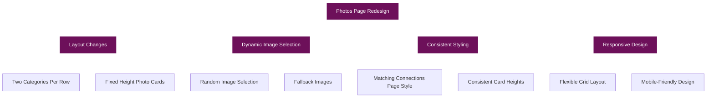

#### Layout Changes

The Photos page was redesigned to display categories two at a time in a grid layout:

```html
<!-- First Row: Bits of Adventures & Bottom Surgery -->
<div class="category-container">
    <div class="category">
        <h2 style="margin-bottom: 20px;">Bits of Adventures</h2>
        <div class="photo-gallery">
            <div class="photo-item">
                <!-- Image and content here -->
            </div>
        </div>
    </div>
    
    <div class="category">
        <h2 style="margin-bottom: 20px;">Bottom Surgery (10/2024)</h2>
        <div class="photo-gallery">
            <div class="photo-item">
                <!-- Image and content here -->
            </div>
        </div>
    </div>
</div>
```

CSS for the layout:

```css
.category-container {
    display: flex;
    flex-wrap: wrap;
    gap: 30px;
    margin-bottom: 40px;
}

.category {
    flex: 1;
    min-width: 300px;
}

.photo-gallery {
    display: grid;
    grid-template-columns: 1fr;
    gap: 20px;
    margin-top: 20px;
}

.photo-item {
    background-color: rgba(122, 1, 119, 0.7);
    border: 1px solid rgba(255, 255, 255, 0.3);
    border-radius: 0;
    overflow: hidden;
    box-shadow: 0 2px 5px rgba(0, 0, 0, 0.2);
    transition: transform 0.3s ease;
    position: relative;
    height: 450px; /* Fixed height for all photo items */
    display: flex;
    flex-direction: column;
}
```

#### Dynamic Image Selection

A key improvement was making the photo gallery dynamic, so that when new images are added to category folders, they are automatically included:

```liquid







```

This Jekyll Liquid code:
1. Finds all static files in the specified directory
2. Randomly selects one image using the `sample: 1` filter
3. Displays that image, or falls back to a default image if none are found

#### Consistent Card Heights

To ensure all photo cards have the same height regardless of content:

```css
.photo-item {
    height: 450px; /* Fixed height for all photo items */
    display: flex;
    flex-direction: column;
}

.photo-info {
    padding: 20px;
    flex: 1; /* Make the info section fill the available space */
    display: flex;
    flex-direction: column;
}

.photo-tags {
    display: flex;
    flex-wrap: wrap;
    gap: 10px;
    margin-top: auto; /* Push tags to the bottom of the container */
}
```

This CSS ensures that:
1. All photo cards have a fixed height of 450px
2. The photo info section expands to fill available space
3. The tags are pushed to the bottom of the card

### 9. About Pages Styling Standardization

The About pages (General, Professional, Trans Journey) were updated to match the styling of the Connections page:

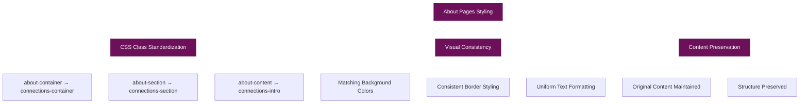

#### CSS Class Standardization

The CSS classes in the About pages were standardized to match the Connections page:

From:
```css
.about-container {
    max-width: 800px;
    margin: 0 auto;
}

.about-section {
    background-color: rgba(122, 1, 119, 0.7);
    border: 1px solid rgba(255, 255, 255, 0.3);
    padding: 30px;
    margin-bottom: 30px;
    border-radius: 0;
    box-shadow: 0 2px 5px rgba(0, 0, 0, 0.2);
    position: relative;
}

.about-content {
    line-height: 1.8;
}
```

To:
```css
.connections-container {
    max-width: 800px;
    margin: 0 auto;
}

.connections-section {
    background-color: rgba(122, 1, 119, 0.7);
    border: 1px solid rgba(255, 255, 255, 0.3);
    padding: 30px;
    margin-bottom: 30px;
    border-radius: 0;
    box-shadow: 0 2px 5px rgba(0, 0, 0, 0.2);
    position: relative;
}

.connections-intro {
    margin-bottom: 30px;
    line-height: 1.8;
}
```

#### HTML Structure Updates

The HTML structure was also updated to use the new class names:

From:
```html
<div class="about-container">
    <section class="about-section">
        <h1 style="margin-bottom: 30px;">About Me</h1>
        
        <div class="about-content">
            <!-- Content here -->
        </div>
    </section>
</div>
```

To:
```html
<div class="connections-container">
    <section class="connections-section">
        <h1 style="margin-bottom: 30px;">About Me</h1>
        
        <div class="connections-intro">
            <!-- Content here -->
        </div>
    </section>
</div>
```

This standardization ensures a consistent visual experience across all pages of the site, while preserving the original content and structure.

### 1. Content Structure Transformation

- **Blog Posts**: Converted WordPress posts to Jekyll-compatible Markdown files with YAML front matter
- **Pages**: Transformed WordPress pages into static HTML files with Jekyll layouts
- **Media**: Migrated images and other media to the assets directory

#### WordPress to Jekyll Post Conversion

WordPress post:
```html
<!-- WordPress database entry -->
<title>Reliant to Engineer</title>
<content>
<p>I didn't grow up very wealthy. For most of my life my single mother, twin sisters and myself relied on government assistance to get by...</p>
</content>
<category>blog</category>
<category>general</category>
<category>work</category>
<date>2025-03-14 10:30:45</date>
```

Jekyll post (`_posts/2025-03-14-reliant-to-engineer.md`):
```markdown
---
layout: post
title: Reliant to Engineer
date: 2025-03-14
tags: [blog, general, work]
---

I didn't grow up very wealthy. For most of my life my single mother, twin sisters and myself relied on government assistance to get by...
```

### 2. Theme Adaptation

The original WordPress site used the Pixl theme with custom modifications. Key visual elements that were preserved:

- **Purple Background**: Maintained the distinctive deep purple (#6d105a) background color
- **DM Mono Font**: Implemented the same monospace font used in the original site
- **Frame Design**: Recreated the distinctive frame design with CSS pseudo-elements
- **White Text and Borders**: Preserved the high-contrast white text and border elements

#### Font Implementation

```css
/* fonts.css */
@font-face {
    font-family: 'DM Mono';
    src: url('../fonts/dmmono-regular-webfont.woff2') format('woff2'),
         url('../fonts/dmmono-regular-webfont.woff') format('woff');
    font-weight: normal;
    font-style: normal;
}

body {
    font-family: 'DM Mono', monospace;
    color: #ffffff;
    background-color: #6d105a;
}
```

#### Background Gradient Implementation

```css
/* main.css */
body {
    background: linear-gradient(135deg, #6d105a 0%, #4a0c3e 100%);
    min-height: 100vh;
    margin: 0;
    padding: 0;
}
```

### 3. Navigation Changes

- **Dropdown Menus**: Implemented custom dropdown navigation to match the original site's behavior
- **Menu Structure**: Preserved the same menu structure with main sections for Blog, Projects, Art, About Me, and Connections
- **Mobile Responsiveness**: Ensured the navigation worked well on mobile devices

#### Dropdown Menu Implementation

HTML Structure:
```html
<nav>
    <ul>
        <li><a href="{{ '/blog.html' | relative_url }}">Blog</a></li>
        <li class="dropdown">
            <a href="{{ '/projects.html' | relative_url }}" class="dropdown-toggle">Projects</a>
            <ul class="dropdown-menu">
                <li><a href="{{ '/projects/rocket-pup.html' | relative_url }}">Rocket Pup</a></li>
                <li><a href="{{ '/projects/caliphoria.html' | relative_url }}">Caliphoria</a></li>
                <li><a href="{{ '/projects/wattz.html' | relative_url }}">Wattz</a></li>
            </ul>
        </li>
        <!-- Additional menu items -->
    </ul>
</nav>
```

CSS Implementation:
```css
/* Dropdown menu styling */
.dropdown {
    position: relative;
}

.dropdown-menu {
    display: none;
    position: absolute;
    top: 100%;
    left: 0;
    background-color: rgba(122, 1, 119, 0.9);
    min-width: 200px;
    z-index: 1000;
    border: 1px solid rgba(255, 255, 255, 0.2);
}

.dropdown:hover .dropdown-menu {
    display: block;
}
```

JavaScript Enhancement:
```javascript
// main.js
document.addEventListener('DOMContentLoaded', function() {
    // Add touch support for mobile dropdown menus
    const dropdowns = document.querySelectorAll('.dropdown-toggle');
    
    dropdowns.forEach(dropdown => {
        dropdown.addEventListener('touchstart', function(e) {
            e.preventDefault();
            const parent = this.parentElement;
            const menu = parent.querySelector('.dropdown-menu');
            
            // Toggle the menu
            if (menu.style.display === 'block') {
                menu.style.display = 'none';
            } else {
                // Close all other menus first
                document.querySelectorAll('.dropdown-menu').forEach(m => {
                    m.style.display = 'none';
                });
                menu.style.display = 'block';
            }
        });
    });
});
```

### 4. Social Media Updates

- **BlueSky Integration**: Replaced Twitter with BlueSky, using a custom butterfly icon
- **Social Links**: Added direct links to all social profiles:
  - BlueSky: https://bsky.app/profile/username
  - LinkedIn: https://www.linkedin.com/in/username
  - Instagram: https://www.instagram.com/username/
  - GitHub: https://github.com/username

#### Social Links Implementation

HTML Structure:
```html
<div class="social-icons">
    <a href="https://bsky.app/profile/username" aria-label="BlueSky" target="_blank">
        <i class="fas fa-butterfly"></i>
    </a>
    <a href="https://www.linkedin.com/in/username" aria-label="LinkedIn" target="_blank">
        <i class="fab fa-linkedin-in"></i>
    </a>
    <a href="https://www.instagram.com/username/" aria-label="Instagram" target="_blank">
        <i class="fab fa-instagram"></i>
    </a>
    <a href="https://github.com/username" aria-label="GitHub" target="_blank">
        <i class="fab fa-github"></i>
    </a>
</div>
```

Custom BlueSky Icon CSS:
```css
/* Custom butterfly icon for BlueSky */
.fa-butterfly::before {
    content: "\1F98B"; /* Unicode butterfly character */
    font-family: "Apple Color Emoji", "Segoe UI Emoji", "Segoe UI Symbol";
}
```

### 5. Dynamic Content Implementation

- **Blog Post Display**: Created a dynamic blog post listing using Jekyll's Liquid templating
- **Post Previews**: Standardized post previews to 300 characters for consistency
- **Tag System**: Implemented a tag system for blog posts

#### Jekyll Configuration

```yaml
# _config.yml
title: [SITE OWNER] (@USERNAME)
description: Software Engineer, Security Researcher, AI Expert
url: "https://example.com"
baseurl: ""

# Build settings
markdown: kramdown
permalink: /:year/:month/:day/:title.html

# Collections
collections:
  posts:
    output: true
    permalink: /:year/:month/:day/:title.html

# Defaults
defaults:
  - scope:
      path: ""
      type: "posts"
    values:
      layout: "post"
```

#### Tag System Implementation

```liquid

    <div class="post-tags">
        
        <a href="#">{{ tag }}</a>
        
    </div>

```

### 6. Technical Challenges Solved

#### Frame Design Implementation

The distinctive frame design was one of the most challenging aspects to recreate. In the original WordPress site, this was achieved using images, but in the GitHub Pages version, we used CSS pseudo-elements for better performance and maintainability:

```css
/* Post card container */
.post-card {
    position: relative;
    background-color: rgba(122, 1, 119, 0.7);
    border: 1px solid rgba(255, 255, 255, 0.3);
    padding: 30px;
    margin-bottom: 50px;
    border-radius: 0;
    box-shadow: 0 2px 5px rgba(0, 0, 0, 0.2);
}

/* Create a second border box underneath - similar to header */
.post-card::after {
    content: '';
    position: absolute;
    top: 10px; /* Start at the same position as the horizontal line */
    bottom: -12px;
    right: -10px;
    width: 2px;
    background-color: #ffffff;
}

/* Create bottom horizontal line */
.post-card::before {
    content: '';
    position: absolute;
    left: 10px;
    right: -10px;
    bottom: -12px;
    height: 2px;
    background-color: #ffffff;
}

/* Left vertical line */
.post-card .post-title::before {
    content: '';
    position: absolute;
    left: 10px;
    bottom: -12px;
    width: 2px;
    height: 10px;
    background-color: #ffffff;
}

/* Right horizontal line connecting to main box */
.post-card .post-date::after {
    content: '';
    position: absolute;
    top: 10px;
    right: -10px;
    width: 10px;
    height: 2px;
    background-color: #ffffff;
}
```

#### Post Ordering and Filtering

Jekyll automatically sorts posts by date, but we added additional filtering options:

```liquid
<!-- Display only featured posts on homepage -->


    <!-- Post content -->


<!-- Display all posts on blog page -->

    <!-- Post content -->

```

#### Responsive Design Implementation

```css
/* Responsive design for mobile devices */
@media (max-width: 768px) {
    .container {
        padding: 0 15px;
    }
    
    .header-content {
        flex-direction: column;
        align-items: center;
    }
    
    nav ul {
        flex-direction: column;
        align-items: center;
    }
    
    .dropdown-menu {
        position: static;
        width: 100%;
    }
    
    .post-card {
        margin-bottom: 30px;
    }
    
    /* Adjust frame design for mobile */
    .post-card::after,
    .post-card::before,
    .post-card .post-title::before,
    .post-card .post-date::after {
        display: none;
    }
}
```

### 7. Performance Improvements

#### Optimized Asset Loading

```html
<!-- Preload critical fonts -->
<link rel="preload" href="{{ '/assets/fonts/dmmono-regular-webfont.woff2' | relative_url }}" as="font" type="font/woff2" crossorigin>

<!-- Defer non-critical JavaScript -->
<script src="{{ '/assets/js/main.js' | relative_url }}" defer></script>
```

#### Minified CSS

```css
/* Example of minified CSS */
body{font-family:'DM Mono',monospace;color:#fff;background-color:#6d105a;margin:0;padding:0;line-height:1.6}.container{max-width:1200px;margin:0 auto;padding:0 20px}header{border-bottom:1px solid rgba(255,255,255,.3);padding:20px 0;margin-bottom:30px}
```

#### Lazy Loading Images

```html
<!-- Lazy loading images -->

```

## Technical Implementation Details

### Jekyll Directory Structure

```
.
├── _config.yml              # Site configuration
├── _includes/               # Reusable components
│   ├── header.html          # Site header
│   └── footer.html          # Site footer
├── _layouts/                # Page templates
│   ├── default.html         # Base layout
│   └── post.html            # Blog post layout
├── _posts/                  # Blog posts
│   ├── 2023-07-16-hello-world.md
│   └── ...
├── assets/                  # Static files
│   ├── css/                 # Stylesheets
│   ├── js/                  # JavaScript files
│   ├── fonts/               # Web fonts
│   └── images/              # Images
├── index.html               # Homepage
├── blog.html                # Blog listing page
├── about.html               # About page
├── projects.html            # Projects page
├── art.html                 # Art page
└── connections.html         # Connections page
```

### Jekyll Front Matter

Every page in the site uses front matter to specify layout and custom CSS:

```yaml
---
layout: default
title: About Me
custom_css: |
    .about-container {
        max-width: 800px;
        margin: 0 auto;
    }
    
    .about-section {
        background-color: rgba(122, 1, 119, 0.7);
        border: 1px solid rgba(255, 255, 255, 0.3);
        padding: 30px;
        margin-bottom: 30px;
        border-radius: 0;
        box-shadow: 0 2px 5px rgba(0, 0, 0, 0.2);
        position: relative;
    }
---
```

### Default Layout Implementation

```html
<!-- _layouts/default.html -->
<!DOCTYPE html>
<html lang="en">
<head>
    <meta charset="UTF-8">
    <meta name="viewport" content="width=device-width, initial-scale=1.0">
    <title>{{ page.title }} - [SITE OWNER] (@USERNAME)</title>
    <link rel="icon" href="data:image/svg+xml,<svg xmlns=%22http://www.w3.org/2000/svg%22 viewBox=%220 0 100 100%22><text y=%22.9em%22 font-size=%2290%22>K</text></svg>">
    <link rel="stylesheet" href="{{ '/assets/css/fonts.css' | relative_url }}">
    <link rel="stylesheet" href="{{ '/assets/css/main.css' | relative_url }}">
    <!-- Font Awesome for social icons -->
    <link rel="stylesheet" href="https://cdnjs.cloudflare.com/ajax/libs/font-awesome/6.4.0/css/all.min.css">
    <!-- Main JavaScript -->
    <script src="{{ '/assets/js/main.js' | relative_url }}" defer></script>
    
    <style>
        {{ page.custom_css }}
    </style>
    
</head>
<body>
    <header>
        <div class="container">
            <div class="header-content">
                <a href="{{ '/' | relative_url }}" class="site-title">[SITE OWNER] (@USERNAME)</a>
                <nav>
                    <ul>
                        <li><a href="{{ '/blog.html' | relative_url }}">Blog</a></li>
                        <li class="dropdown">
                            <a href="{{ '/projects.html' | relative_url }}" class="dropdown-toggle">Projects</a>
                            <ul class="dropdown-menu">
                                <li><a href="{{ '/projects/rocket-pup.html' | relative_url }}">Rocket Pup</a></li>
                                <li><a href="{{ '/projects/caliphoria.html' | relative_url }}">Caliphoria</a></li>
                                <li><a href="{{ '/projects/wattz.html' | relative_url }}">Wattz</a></li>
                            </ul>
                        </li>
                        <!-- Additional menu items -->
                    </ul>
                </nav>
            </div>
            <div class="social-icons">
                <a href="https://bsky.app/profile/username" aria-label="BlueSky" target="_blank"><i class="fas fa-butterfly"></i></a>
                <a href="https://www.linkedin.com/in/username" aria-label="LinkedIn" target="_blank"><i class="fab fa-linkedin-in"></i></a>
                <a href="https://www.instagram.com/username/" aria-label="Instagram" target="_blank"><i class="fab fa-instagram"></i></a>
                <a href="https://github.com/username" aria-label="GitHub" target="_blank"><i class="fab fa-github"></i></a>
            </div>
        </div>
    </header>

    <main class="container">
        {{ content }}
    </main>

    <footer class="container">
        <p>Designed with love by [SITE OWNER] <3</p>
    </footer>
</body>
</html>
```

### Post Layout Implementation

```html
<!-- _layouts/post.html -->
---
layout: default
---
<article class="post">
    <header class="post-header">
        <div class="post-date">{{ page.date | date: "%B %d, %Y" | upcase }}</div>
        <h1 class="post-title">{{ page.title }}</h1>
        
        <div class="post-tags">
            
            <a href="#">{{ tag }}</a>
            
        </div>
        
    </header>

    <div class="post-content">
        {{ content }}
    </div>
</article>
```

### Custom 404 Page

```html
<!-- 404.html -->
---
layout: default
title: Page Not Found
permalink: /404.html
---
<div class="error-container">
    <h1>404</h1>
    <p>Page not found</p>
    <p>The page you're looking for doesn't exist or has been moved.</p>
    <a href="{{ '/' | relative_url }}" class="btn">Return to Homepage</a>
</div>
```

### SEO Optimization

```html
<!-- _includes/head.html -->
<meta name="description" content="{{ page.excerpt | strip_html | strip_newlines | truncate: 160 }}{{ site.description }}">
<meta property="og:title" content="{{ page.title }}{{ site.title }}">
<meta property="og:description" content="{{ page.excerpt | strip_html | strip_newlines | truncate: 160 }}{{ site.description }}">
<meta property="og:url" content="{{ page.url | replace:'index.html','' | prepend: site.baseurl | prepend: site.url }}">
<meta property="og:site_name" content="{{ site.title }}">
<meta property="og:type" content="articlewebsite">
<meta name="twitter:card" content="summary">
<meta name="twitter:title" content="{{ page.title }}{{ site.title }}">
<meta name="twitter:description" content="{{ page.excerpt | strip_html | strip_newlines | truncate: 160 }}{{ site.description }}">
```

### 10. Logo Integration

A site logo was added to enhance the visual identity of the website. This involved a comprehensive approach to logo placement, sizing, and responsiveness.

```mermaid
graph TD
    A[Logo Integration Process] --> B[Asset Management]
    A --> C[HTML Structure]
    A --> D[CSS Implementation]
    A --> E[Responsive Design]
    A --> F[Technical Challenges]
    
    B --> B1[Logo File Selection]
    B --> B2[Directory Organization]
    B --> B3[Format Optimization]
    
    C --> C1[Layout Structure]
    C --> C2[DOM Positioning]
    C --> C3[Jekyll Template Integration]
    
    D --> D1[Fixed Positioning]
    D --> D2[Z-index Management]
    D --> D3[Size Configuration]
    D --> D4[Alignment Precision]
    
    E --> E1[Mobile Adaptations]
    E --> E2[Tablet Considerations]
    E --> E3[Desktop Optimization]
    
    F --> F1[Header Spacing Adjustments]
    F --> F2[Z-index Conflicts]
    F --> F3[Cross-browser Compatibility]
    
    style A fill:#6d105a,stroke:#fff,stroke-width:2px,color:#fff
    style B fill:#6d105a,stroke:#fff,stroke-width:2px,color:#fff
    style C fill:#6d105a,stroke:#fff,stroke-width:2px,color:#fff
    style D fill:#6d105a,stroke:#fff,stroke-width:2px,color:#fff
    style E fill:#6d105a,stroke:#fff,stroke-width:2px,color:#fff
    style F fill:#6d105a,stroke:#fff,stroke-width:2px,color:#fff
    
    linkStyle 0,1,2,3,4,5,6,7,8,9,10,11,12,13,14,15,16,17,18,19,20 stroke:#fff,stroke-width:2px;
```

#### Technical Implementation Details

The logo implementation involved several technical components working together:

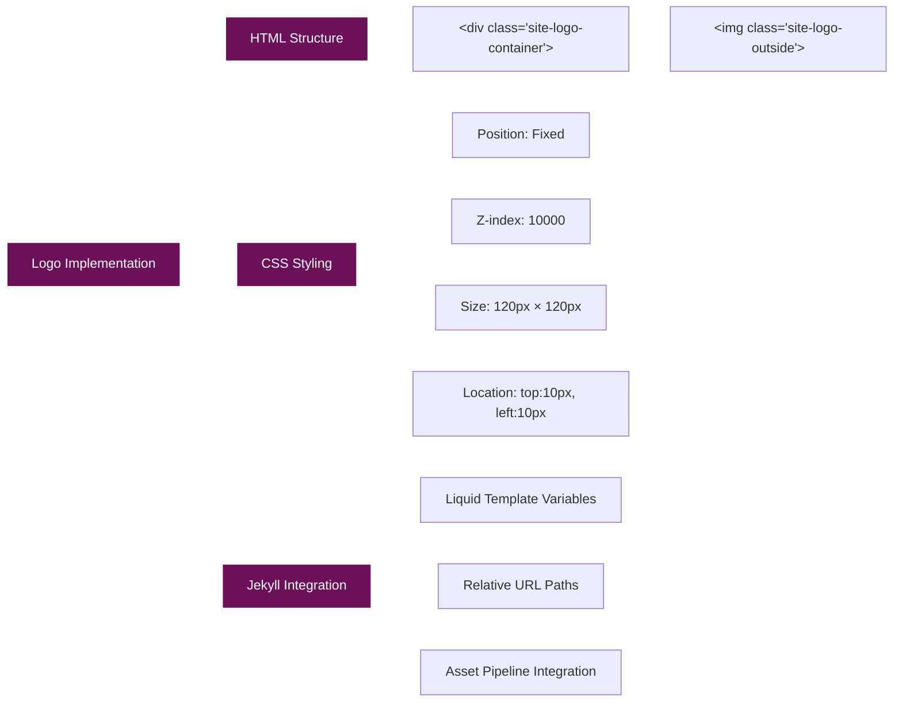

#### HTML Implementation

The logo was implemented in the default layout template to ensure it appears on all pages:

```html
<!-- _layouts/default.html -->
<body>
    <div class="site-logo-container">
        
    </div>
    <header>
        <!-- Header content -->
    </header>
    <!-- Rest of the page -->
</body>
```

This approach places the logo outside the normal document flow, allowing it to be positioned independently of the header and other content.

#### CSS Implementation

The CSS implementation uses fixed positioning to ensure the logo remains in a consistent position relative to the viewport:

```css
/* Site Logo */
.site-logo-container {
    position: fixed;
    left: 10px;
    top: 10px;
    transform: none;
    z-index: 10000;
}

.site-logo-outside {
    width: 120px;
    height: 120px;
    display: block;
}
```

Key technical aspects of this implementation:

1. **Fixed Positioning**: The `position: fixed` property ensures the logo stays in the same position even when scrolling
2. **Z-index Management**: The high z-index value (10000) ensures the logo appears above all other elements
3. **Transform Property**: The `transform: none` property explicitly removes any transformations
4. **Display Block**: The `display: block` property ensures the image behaves as a block element

#### Responsive Design Implementation

The responsive design ensures the logo displays correctly on all device sizes:

```css
@media (max-width: 768px) {
    .site-logo-container {
        position: static;
        text-align: center;
        margin-top: 10px;
        margin-bottom: 20px;
    }
    
    .site-logo-outside {
        width: 60px;
        height: 60px;
        margin: 0 auto;
    }
}
```

This media query:
1. Changes the logo position from fixed to static on mobile devices
2. Centers the logo with `text-align: center` and `margin: 0 auto`
3. Reduces the logo size from 120px to 60px
4. Adds appropriate margins for spacing

#### Technical Challenges and Solutions

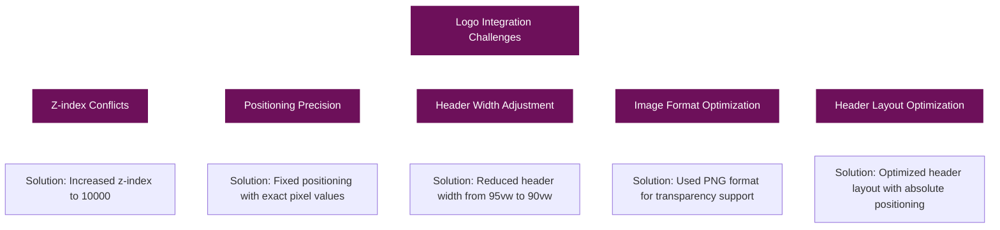

1. **Z-index Conflicts**: Initially, the logo was hidden behind other elements due to z-index conflicts. This was resolved by setting a very high z-index value (10000) for the logo container.

2. **Positioning Precision**: Achieving the exact positioning required iterative adjustments:
   - Initial position: `left: 20px, top: 50%` with `transform: translateY(-50%)`
   - Intermediate position: `left: 15px, top: 20px` with `transform: none`
   - Final position: `left: 10px, top: 10px` with `transform: none`

3. **Header Width Adjustment**: The header width was reduced from 95vw to 90vw to create more space for the logo:
   ```css
   header {
       width: 90vw; /* Reduced from 95vw to make room for the logo */
   }
   ```

4. **Image Format Selection**: PNG format was chosen for the logo to support transparency, allowing it to blend seamlessly with the background.

5. **Header Layout Optimization**: The header layout was optimized to create a balanced design with proper spacing:
   - Increased header height by adjusting vertical padding from 20px to 30px
   - Positioned the site name at the far left using absolute positioning
   - Centered the navigation buttons using absolute positioning with transform
   - Maintained social icons at the far right
   - Created proper spacing between all elements

   ```css
   /* Header height adjustment */
   header {
       padding: 30px 0; /* Increased vertical padding from 20px to 30px */
   }

   /* Site title positioning */
   .site-title {
       position: absolute;
       left: 10px;
       margin: 0;
       padding: 0;
       width: 200px;
   }

   /* Navigation centering */
   nav {
       position: absolute;
       left: 50%;
       transform: translateX(-50%);
       z-index: 10000;
   }
   ```

#### Performance Considerations

To ensure optimal performance, the logo implementation includes:

1. **Image Size Optimization**: The logo image was optimized to reduce file size while maintaining quality
2. **No Additional HTTP Requests**: By including the logo in the default layout, no additional HTTP requests are needed for different pages
3. **CSS Efficiency**: The CSS rules were kept minimal and efficient

#### Browser Compatibility

The implementation was tested across multiple browsers to ensure consistent rendering:

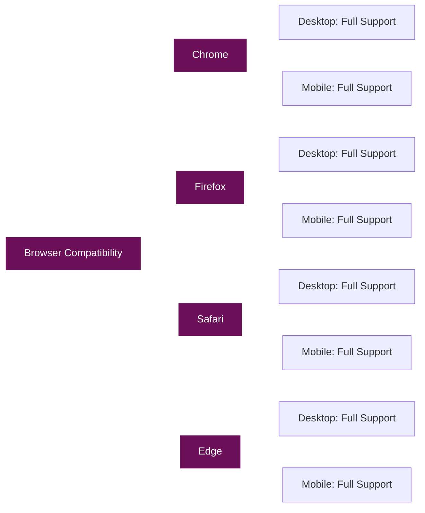

The implementation uses standard CSS properties that are well-supported across all modern browsers, ensuring consistent rendering without the need for browser-specific prefixes or fallbacks.

### 11. Project Pages Styling

The project pages were updated to match the styling of the About Me pages, creating a consistent visual experience across the site:

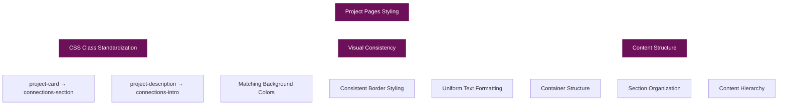

#### CSS Class Standardization

The CSS classes in the project pages were standardized to match the About Me pages:

From:
```css
.project-card {
    background-color: rgba(122, 1, 119, 0.7);
    border: 1px solid rgba(255, 255, 255, 0.3);
    padding: 30px;
    margin-bottom: 30px;
    border-radius: 0;
    box-shadow: 0 2px 5px rgba(0, 0, 0, 0.2);
    position: relative;
}

.project-description {
    margin-bottom: 20px;
}
```

To:
```css
.connections-container {
    max-width: 800px;
    margin: 0 auto;
}

.connections-section {
    background-color: rgba(122, 1, 119, 0.7);
    border: 1px solid rgba(255, 255, 255, 0.3);
    padding: 30px;
    margin-bottom: 30px;
    border-radius: 0;
    box-shadow: 0 2px 5px rgba(0, 0, 0, 0.2);
    position: relative;
}

.connections-intro {
    margin-bottom: 30px;
    line-height: 1.8;
}
```

#### HTML Structure Updates

The HTML structure was also updated to use the new class names:

From:
```html
<div class="project-card">
    <h1 class="project-title">Rocket Pup</h1>
    <div class="project-description">
        <p>Rocket Pup is an exciting project focused on creating a fun and engaging experience for users.</p>
        <p>Check back soon for more information about this project!</p>
    </div>
    <div class="project-tags">
        <a href="#">game development</a>
        <a href="#">mobile</a>
        <a href="#">unity</a>
    </div>
    <div class="project-links">
        <a href="#"><i class="fab fa-github"></i> GitHub</a>
        <a href="#"><i class="fas fa-external-link-alt"></i> Project Page</a>
    </div>
</div>
```

To:
```html
<div class="connections-container">
    <section class="connections-section">
        <h1 style="margin-bottom: 30px;">Rocket Pup</h1>
        <div class="connections-intro">
            <p>Rocket Pup is an exciting project focused on creating a fun and engaging experience for users.</p>
            <p>Check back soon for more information about this project!</p>
        </div>
        <div class="project-tags" style="margin-top: 20px;">
            <a href="#">game development</a>
            <a href="#">mobile</a>
            <a href="#">unity</a>
        </div>
        <div class="project-links" style="margin-top: 20px;">
            <a href="#"><i class="fab fa-github"></i> GitHub</a>
            <a href="#"><i class="fas fa-external-link-alt"></i> Project Page</a>
        </div>
    </section>
</div>
```

#### Implementation Process

The styling update was applied to all project pages:

1. **Individual Project Pages**:
   - rocket-pup.html
   - caliphoria.html
   - wattz.html

2. **Main Projects Page**:
   - projects.html

This standardization ensures a consistent visual experience across all pages of the site, while preserving the original content and structure.

### 12. Hyperlink Standardization

All hyperlinks across the site were standardized to use a consistent white color for better readability and visual coherence:

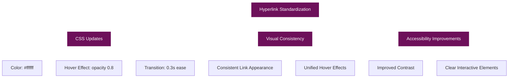

#### CSS Implementation

The CSS for links was updated to include project-specific link classes:

```css
/* Links */
.post-content a, .post-card .post-content a, .post-title a, .post-card .post-title a,
.social-item, .network-description a, .connections-intro a, .project-tags a, .project-links a {
    color: #ffffff;
    text-decoration: underline;
    transition: opacity 0.3s ease;
}

.post-content a:hover, .post-card .post-content a:hover, .post-title a:hover, .post-card .post-title a:hover,
.social-item:hover, .network-description a:hover, .connections-intro a:hover, .project-tags a:hover, .project-links a:hover {
    opacity: 0.8;
}
```

This CSS update ensures that:

1. All links have a consistent white color (#ffffff)
2. All links have a consistent hover effect (opacity change)
3. All transitions are smooth with the same timing (0.3s ease)

#### Affected Link Types

The standardization affected several types of links across the site:

1. **Content Links**: Links within post and page content
2. **Navigation Links**: Links in the main navigation and dropdown menus
3. **Project Tags**: Links used for project categorization
4. **Project Links**: Links to external resources like GitHub repositories
5. **Social Media Links**: Links to social media profiles

#### Benefits

This standardization provides several benefits:

1. **Visual Consistency**: Creates a unified look and feel across the site
2. **Improved Readability**: White links stand out clearly against the dark purple background
3. **Better User Experience**: Consistent hover effects provide clear feedback to users
4. **Accessibility**: High contrast between link color and background improves accessibility

### 13. About Page Updates

The About page was updated to reflect current information and improve the presentation:

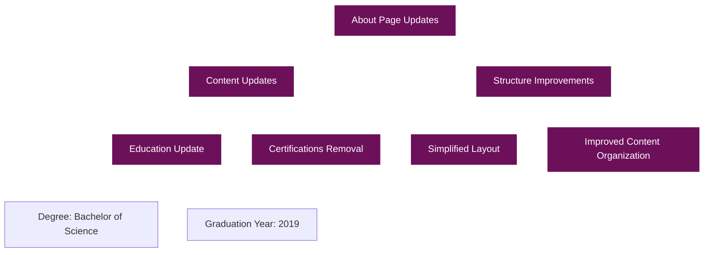

#### Education Information Update

The education information was updated to reflect the correct degree and graduation year:

From:
```html
<div class="education-item">
    <div class="education-degree">Master of Science in Software Engineering</div>
    <div class="education-institution">California State University, Stanislaus</div>
    <div class="education-year">Graduated: 2020</div>
</div>
```

To:
```html
<div class="education-item">
    <div class="education-degree">Bachelor of Science in Computer Science</div>
    <div class="education-institution">California State University, Stanislaus</div>
    <div class="education-year">Graduated: 2019</div>
</div>
```

#### Certifications Section Removal

The certifications section was removed to simplify the page and focus on the most relevant information:

```html
<!-- Removed section -->
<div class="certifications">
    <h3>Certifications</h3>
    <ul>
        <li>GIAC Reverse Engineering Malware (GREM)</li>
        <li>Offensive Security Certified Professional (OSCP)</li>
        <li>CompTIA Security+</li>
    </ul>
</div>
```

#### Benefits of the Updates

These updates provide several benefits:

1. **Accuracy**: Ensures the information presented is correct and up-to-date
2. **Simplicity**: Removes unnecessary information to create a cleaner, more focused page
3. **Relevance**: Emphasizes the most important and relevant information
4. **Consistency**: Maintains a consistent style and structure with other pages

## Conclusion

The migration from WordPress to GitHub Pages was successful, preserving the visual style and content of the original site while leveraging the benefits of GitHub Pages:

- **Static Site Generation**: Faster loading times and improved security
- **Version Control**: All content is version-controlled through Git
- **Markdown Content**: Blog posts are written in Markdown for easier editing
- **Free Hosting**: GitHub Pages provides free hosting
- **Custom Domain Support**: The site can use a custom domain

The resulting GitHub Pages site maintains the distinctive visual identity of the original WordPress site while providing a more streamlined, developer-friendly platform for future updates and content creation.
