# Documentation

Welcome to the comprehensive documentation for the site. This documentation provides detailed information about the site's architecture, components, development process, deployment, and customization options.

## Table of Contents

- [Architecture Documentation](#architecture-documentation)
- [Components Documentation](#components-documentation)
- [Development Guide](#development-guide)
- [Deployment Guide](#deployment-guide)
- [Customization Guide](#customization-guide)

## Overview

This documentation is designed to help you understand the site's structure and functionality, as well as provide guidance for development, deployment, and customization. Whether you're a developer looking to contribute to the site, a content creator looking to add new content, or a site owner looking to customize the site's appearance, this documentation has you covered.

```mermaid
graph TD
    A[Documentation] --> B[Architecture Documentation]
    A --> C[Components Documentation]
    A --> D[Development Guide]
    A --> E[Deployment Guide]
    A --> F[Customization Guide]
    
    B --> B1[Site Structure]
    B --> B2[Data Flow]
    B --> B3[Technical Stack]
    
    C --> C1[Layouts]
    C --> C2[Includes]
    C --> C3[Page Components]
    
    D --> D1[Local Development Setup]
    D --> D2[Content Creation]
    D --> D3[Testing]
    
    E --> E1[GitHub Pages Deployment]
    E --> E2[Custom Domain Setup]
    E --> E3[Troubleshooting]
    
    F --> F1[Theme Customization]
    F --> F2[Layout Modifications]
    F --> F3[Adding Features]
    
    style A fill:#6d105a,stroke:#fff,stroke-width:2px,color:#fff
    style B fill:#6d105a,stroke:#fff,stroke-width:2px,color:#fff
    style C fill:#6d105a,stroke:#fff,stroke-width:2px,color:#fff
    style D fill:#6d105a,stroke:#fff,stroke-width:2px,color:#fff
    style E fill:#6d105a,stroke:#fff,stroke-width:2px,color:#fff
    style F fill:#6d105a,stroke:#fff,stroke-width:2px,color:#fff
```

## Architecture Documentation

The [Architecture Documentation](architecture/README.md) provides a comprehensive overview of the site's architecture, including its structure, data flow, and technical stack. It covers:

- **Site Structure**: Detailed information about the site's directory structure and file organization.
- **Data Flow**: Explanation of how data flows through the site, from content creation to rendering.
- **Technical Stack**: Overview of the technologies used to build the site, including Jekyll, HTML, CSS, and JavaScript.
- **Key Components**: Detailed information about the site's key components, such as layouts, includes, and assets.
- **Navigation Structure**: Explanation of the site's navigation structure and how it's implemented.
- **Visual Design Architecture**: Overview of the site's visual design elements and how they're implemented.

## Components Documentation

The [Components Documentation](components/README.md) provides detailed information about the components used in the site, including layouts, includes, and page components. It covers:

- **Layouts**: Detailed information about the site's layouts, including the default layout and post layout.
- **Includes**: Explanation of the site's includes, such as the header and footer.
- **Page Components**: Detailed information about the components used in pages, such as blog post cards, navigation, and social icons.
- **Blog Components**: Explanation of the components used in blog posts, such as post headers, post content, and post tags.
- **Special Components**: Detailed information about special components, such as Mermaid diagrams, photo galleries, and project cards.

## Development Guide

The [Development Guide](development/README.md) provides comprehensive instructions for local development, content creation, and testing. It covers:

- **Local Development Setup**: Step-by-step instructions for setting up a local development environment.
- **Content Creation**: Detailed information about creating content for the site, including blog posts, pages, projects, and photos.
- **Testing**: Guidance for testing the site locally, including cross-browser testing and mobile testing.
- **Best Practices**: Recommendations for code style, performance optimization, and accessibility.

## Deployment Guide

The [Deployment Guide](deployment/README.md) provides comprehensive instructions for deploying the site to GitHub Pages and setting up a custom domain. It covers:

- **GitHub Pages Deployment**: Step-by-step instructions for deploying the site to GitHub Pages.
- **Custom Domain Setup**: Detailed information about setting up a custom domain for the site.
- **HTTPS Configuration**: Guidance for configuring HTTPS for the site.
- **Troubleshooting**: Solutions for common deployment issues.
- **Maintenance**: Recommendations for maintaining the site after deployment.

## Customization Guide

The [Customization Guide](customization/README.md) provides comprehensive instructions for customizing the site's appearance and functionality. It covers:

- **Theme Customization**: Detailed information about customizing the site's theme, including color scheme, typography, layout, and frame design.
- **Layout Modifications**: Guidance for modifying the site's layout, including the header, footer, navigation, and content areas.
- **Adding Features**: Instructions for adding features to the site, such as social media integration, comments system, search functionality, and analytics.
- **Advanced Customization**: Detailed information about advanced customization options, such as custom JavaScript, custom Liquid templates, custom plugins, and custom layouts.

## Getting Started

To get started with the documentation, choose a section from the table of contents above based on your needs:

- If you want to understand the site's structure and technical stack, start with the [Architecture Documentation](architecture/README.md).
- If you want to learn about the components used in the site, check out the [Components Documentation](components/README.md).
- If you want to set up a local development environment or create content, refer to the [Development Guide](development/README.md).
- If you want to deploy the site to GitHub Pages or set up a custom domain, see the [Deployment Guide](deployment/README.md).
- If you want to customize the site's appearance or functionality, consult the [Customization Guide](customization/README.md).

## Contributing

If you'd like to contribute to the documentation, please follow these steps:

1. Fork the repository.
2. Create a new branch for your changes.
3. Make your changes to the documentation.
4. Submit a pull request with a clear description of your changes.

## License

This documentation is licensed under the MIT License. See the LICENSE file for details.
