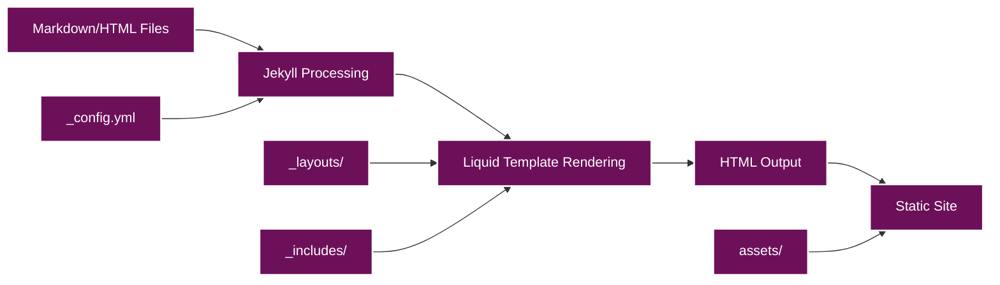
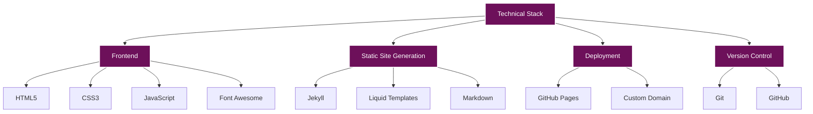
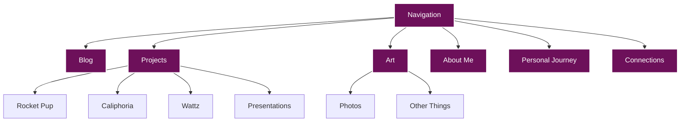
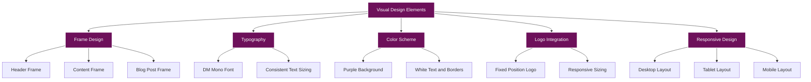

# Site Architecture Documentation

This document provides a comprehensive overview of the site's architecture, including its structure, data flow, and technical stack.

## Site Structure (Updated September 2025)

The site follows a modern Jekyll project structure with organized directories:

```mermaid
graph TD
    A[Root Directory] --> B[_config.yml]
    A --> C[Jekyll Directories]
    A --> D[Content Directories]
    A --> E[Static Files]
    A --> F[Documentation]
    
    C --> C1[_includes/]
    C --> C2[_layouts/]
    C --> C3[_posts/]
    C --> C4[_data/]
    C --> C5[_i18n/]
    C --> C6[_config/]
    C --> C7[_feeds/]
    C --> C8[_tests/]
    
    D --> D1[pages/]
    D --> D2[projects/]
    D --> D3[art/]
    D --> D4[about/]
    
    E --> E1[assets/]
    E --> E2[index.html]
    E --> E3[feed.xml]
    E --> E4[manifest.json]
    E --> E5[service-worker.js]
    
    F --> F1[docs/]
    
    G --> G1[index.html]
    G --> G2[blog.html]
    G --> G3[about.html]
    G --> G4[connections.html]
    G --> G5[projects.html]
    G --> G6[art.html]
    
    H --> H1[architecture/]
    H --> H2[components/]
    H --> H3[development/]
    H --> H4[deployment/]
    H --> H5[customization/]
    
    style A fill:#6d105a,stroke:#fff,stroke-width:2px,color:#fff
    style B fill:#6d105a,stroke:#fff,stroke-width:2px,color:#fff
    style C fill:#6d105a,stroke:#fff,stroke-width:2px,color:#fff
    style D fill:#6d105a,stroke:#fff,stroke-width:2px,color:#fff
    style E fill:#6d105a,stroke:#fff,stroke-width:2px,color:#fff
    style F fill:#6d105a,stroke:#fff,stroke-width:2px,color:#fff
    style G fill:#6d105a,stroke:#fff,stroke-width:2px,color:#fff
    style H fill:#6d105a,stroke:#fff,stroke-width:2px,color:#fff
```



### Directory Structure

```
.
├── _config.yml              # Jekyll configuration
├── _includes/               # Reusable components
│   ├── header.html          # Site header with navigation
│   └── footer.html          # Site footer
├── _layouts/                # Page templates
│   ├── default.html         # Base layout
│   └── post.html            # Blog post layout
├── _posts/                  # Blog posts (Markdown)
│   ├── 2023-07-16-hello-world.md
│   └── ...
├── assets/                  # Static assets
│   ├── css/                 # Stylesheets
│   │   ├── main.css         # Main styling
│   │   └── fonts.css        # Font definitions
│   ├── js/                  # JavaScript files
│   │   ├── main.js          # Main functionality
│   │   └── social-links.js  # Social media integration
│   ├── fonts/               # Web fonts
│   └── images/              # Images and media
│       ├── logo/            # Site logo
│       └── photos/          # Photo galleries
├── docs/                    # Documentation
│   ├── architecture/        # Architecture documentation
│   ├── components/          # Components documentation
│   ├── development/         # Development guide
│   ├── deployment/          # Deployment guide
│   └── customization/       # Customization guide
├── includes/                # Additional includes (outside Jekyll standard)
├── index.html               # Homepage
├── blog.html                # Blog listing page
├── projects.html            # Projects overview
├── projects/                # Individual project pages
├── art.html                 # Art gallery overview
├── art/                     # Individual art pages
├── about.html               # Combined About Me page
├── about/                   # Additional about pages
│   └── trans-journey.html   # Personal Journey page
├── connections.html         # Contact information
├── MIGRATION_DOCUMENTATION.md # Detailed migration documentation
└── README.md                # Repository readme
```

## Data Flow

The site's data flow follows Jekyll's standard processing pipeline:



### Processing Steps

1. **Content Creation**: Content is written in Markdown (blog posts) or HTML (pages)
2. **Jekyll Processing**: Jekyll processes the content and applies front matter
3. **Liquid Template Rendering**: Liquid templates are rendered with content
4. **HTML Output**: Final HTML is generated
5. **Static Site**: The static site is created with all assets

## Technical Stack

The site is built using the following technologies:



### Frontend Technologies

- **HTML5**: Structure and content
- **CSS3**: Styling and visual design
- **JavaScript**: Interactive elements and functionality
- **Font Awesome**: Icons for social media and UI elements

### Static Site Generation

- **Jekyll**: Static site generator
- **Liquid Templates**: Templating language for dynamic content
- **Markdown**: Content format for blog posts

### Deployment

- **GitHub Pages**: Hosting platform
- **Custom Domain**: Custom domain configuration

### Version Control

- **Git**: Version control system
- **GitHub**: Repository hosting and collaboration

### External Integrations

- **GitHub API**: Used in the About page to dynamically fetch and display public repositories from both personal (@radicalkjax) and organization (@goldenapplestudios) accounts
- **Google Fonts**: DM Mono font integration
- **Font Awesome**: Icon library for social media and UI elements

## Key Components

### Jekyll Configuration

The `_config.yml` file contains the site's configuration:

```yaml
# Site settings
title: [SITE OWNER] (@USERNAME)
description: Software Engineer, Security Researcher, AI Expert
url: "https://radicalkjax.com"
baseurl: ""

# Build settings
markdown: kramdown
permalink: /:year/:month/:day/:title.html

# Collections
collections:
  posts:
    output: true
    permalink: /:year/:month/:day/:title.html

# Defaults
defaults:
  - scope:
      path: ""
      type: "posts"
    values:
      layout: "post"
```

### Layouts

The site uses two main layouts:

1. **default.html**: Base layout for all pages
2. **post.html**: Layout for blog posts (extends default.html)

### Includes

Common elements are extracted into include files:

1. **header.html**: Site header with navigation and social links
2. **footer.html**: Site footer

### Assets

Static assets are organized into directories:

1. **css/**: Stylesheets
2. **js/**: JavaScript files
3. **fonts/**: Web fonts
4. **images/**: Images and media

### Content

Content is organized into several types:

1. **Blog Posts**: Markdown files in the `_posts` directory
2. **Projects**: HTML files in the `projects` directory
3. **Art Gallery**: HTML files in the `art` directory
4. **About Pages**: HTML files in the `about` directory
5. **Static Pages**: HTML files in the root directory

## Navigation Structure

The site uses a navigation system with dropdown menus for some sections:



## Visual Design Architecture

The visual design of the site incorporates several distinctive elements:



### Frame Design

A distinctive frame design is implemented for various elements:

1. **Header Frame**: The header has a white border with a second border box underneath
2. **Content Frame**: Content sections have a similar frame design
3. **Blog Post Frame**: Blog posts have a frame with vertical and horizontal lines

### Typography

The site uses a consistent typography system:

1. **DM Mono Font**: A monospace font used throughout the site
2. **Consistent Text Sizing**: Standardized text sizes for different elements

### Color Scheme

The site uses a distinctive color scheme:

1. **Purple Background**: Deep purple background (#6d105a)
2. **White Text and Borders**: White text and borders for high contrast

### Logo Integration

The site features a custom logo:

1. **Fixed Position Logo**: Logo positioned in the top-left corner
2. **Responsive Sizing**: Logo size adjusts based on screen size

### Responsive Design

The site is fully responsive:

1. **Desktop Layout**: Full layout with all features
2. **Tablet Layout**: Adjusted layout for medium screens
3. **Mobile Layout**: Simplified layout for small screens

## Next Steps

- [Components Documentation](../components/README.md)
- [Development Guide](../development/README.md)
- [Deployment Guide](../deployment/README.md)
- [Customization Guide](../customization/README.md)
