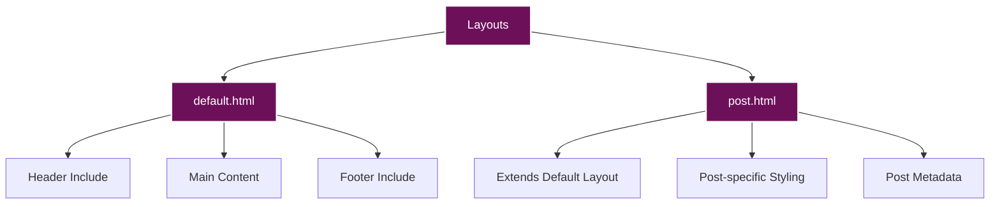
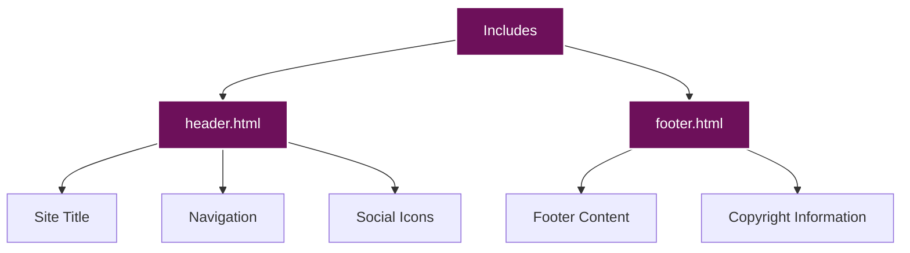

# Components Documentation

This document provides detailed information about the components used in the site, including layouts, includes, and page components.

## Table of Contents

- [Layouts](#layouts)
  - [Default Layout](#default-layout)
  - [Post Layout](#post-layout)
- [Includes](#includes)
  - [Header](#header)
  - [Footer](#footer)
- [Page Components](#page-components)
  - [Blog Post Cards](#blog-post-cards)
  - [Navigation](#navigation)
  - [Social Icons](#social-icons)
  - [Frame Design](#frame-design)
- [Blog Components](#blog-components)
  - [Post Header](#post-header)
  - [Post Content](#post-content)
  - [Post Tags](#post-tags)
- [Special Components](#special-components)
  - [Mermaid Diagrams](#mermaid-diagrams)
  - [Photo Gallery](#photo-gallery)
  - [Project Cards](#project-cards)

## Layouts

The site uses two main layouts:



### Default Layout

The default layout (`_layouts/default.html`) serves as the base template for all pages. It includes:

- HTML5 doctype and structure
- Meta tags for SEO and responsive design
- CSS and JavaScript includes
- Header and footer includes
- Main content area

```html
<!DOCTYPE html>
<html lang="en">
<head>
    <meta charset="UTF-8">
    <meta name="viewport" content="width=device-width, initial-scale=1.0">
    <title>{{ page.title }} - [SITE OWNER] (@USERNAME)</title>
    <link rel="icon" href="data:image/svg+xml,<svg xmlns=%22http://www.w3.org/2000/svg%22 viewBox=%220 0 100 100%22><text y=%22.9em%22 font-size=%2290%22>K</text></svg>">
    <link rel="stylesheet" href="{{ '/assets/css/fonts.css' | relative_url }}">
    <link rel="stylesheet" href="{{ '/assets/css/main.css' | relative_url }}">
    <!-- Font Awesome for social icons -->
    <link rel="stylesheet" href="https://cdnjs.cloudflare.com/ajax/libs/font-awesome/6.4.0/css/all.min.css">
    <!-- Main JavaScript -->
    <script src="{{ '/assets/js/main.js' | relative_url }}" defer></script>
    
    <style>
        {{ page.custom_css }}
    </style>
    
</head>
<body>
    <div class="site-logo-container">
        
    </div>
    
    

    <main class="container">
        {{ content }}
    </main>

    
</body>
</html>
```

#### Key Features

- **Dynamic Title**: Uses the page title if available
- **Favicon**: Uses an SVG favicon
- **CSS Includes**: Loads fonts.css and main.css
- **Font Awesome**: Loads Font Awesome for icons
- **JavaScript**: Loads main.js with defer attribute
- **Custom CSS**: Supports custom CSS in page front matter
- **Logo**: Includes the site logo
- **Header and Footer**: Includes header.html and footer.html
- **Content Area**: Renders the page content

### Post Layout

The post layout (`_layouts/post.html`) extends the default layout and adds post-specific styling and metadata:

```html
---
layout: default
---
<article class="post">
    <header class="post-header">
        <div class="post-date">{{ page.date | date: "%B %d, %Y" | upcase }}</div>
        <h1 class="post-title">{{ page.title }}</h1>
        
        <div class="post-tags">
            
            <a href="#">{{ tag }}</a>
            
        </div>
        
    </header>

    <div class="post-content">
        {{ content }}
    </div>
</article>
```

#### Key Features

- **Layout Extension**: Extends the default layout
- **Post Date**: Displays the post date in a formatted style
- **Post Title**: Displays the post title
- **Post Tags**: Displays post tags if available
- **Post Content**: Renders the post content

## Includes

The site uses two main includes:



### Header

The header include (`_includes/header.html`) contains the site header with navigation and social links:

```html
<header>
    <div class="container">
        <div class="header-content">
            <a href="{{ '/' | relative_url }}" class="site-title">[SITE OWNER] (@USERNAME)</a>
            <nav>
                <ul>
                    <li><a href="{{ '/blog.html' | relative_url }}">Blog</a></li>
                    <li class="dropdown">
                        <a href="{{ '/projects.html' | relative_url }}" class="dropdown-toggle">Projects</a>
                        <ul class="dropdown-menu">
                            <li><a href="{{ '/projects/rocket-pup.html' | relative_url }}">Rocket Pup</a></li>
                            <li><a href="{{ '/projects/caliphoria.html' | relative_url }}">Caliphoria</a></li>
                            <li><a href="{{ '/projects/wattz.html' | relative_url }}">Wattz</a></li>
                        </ul>
                    </li>
                    <li class="dropdown">
                        <a href="{{ '/art.html' | relative_url }}" class="dropdown-toggle">Art</a>
                        <ul class="dropdown-menu">
                            <li><a href="{{ '/art/photos.html' | relative_url }}">Photos</a></li>
                            <li><a href="{{ '/art/other-things.html' | relative_url }}">Other Things</a></li>
                        </ul>
                    </li>
                    <li class="dropdown">
                        <a href="{{ '/about.html' | relative_url }}" class="dropdown-toggle">About Me</a>
                        <ul class="dropdown-menu">
                            <li><a href="{{ '/about/general.html' | relative_url }}">General</a></li>
                            <li><a href="{{ '/about/trans-journey.html' | relative_url }}">Trans Journey</a></li>
                            <li><a href="{{ '/about/professional.html' | relative_url }}">Professional</a></li>
                        </ul>
                    </li>
                    <li><a href="{{ '/connections.html' | relative_url }}">Connections</a></li>
                </ul>
            </nav>
        </div>
        <div class="social-icons">
            <a href="https://bsky.app/profile/radicalkjax.com" aria-label="BlueSky" target="_blank"><i class="fas fa-butterfly"></i></a>
            <a href="https://www.linkedin.com/in/username" aria-label="LinkedIn" target="_blank"><i class="fab fa-linkedin-in"></i></a>
            <a href="https://www.instagram.com/username/" aria-label="Instagram" target="_blank"><i class="fab fa-instagram"></i></a>
            <a href="https://github.com/username" aria-label="GitHub" target="_blank"><i class="fab fa-github"></i></a>
        </div>
    </div>
</header>
```

#### Key Features

- **Site Title**: Links to the homepage
- **Navigation**: Main navigation with dropdown menus
- **Social Icons**: Links to social media profiles
- **Responsive Design**: Adapts to different screen sizes

### Footer

The footer include (`_includes/footer.html`) contains the site footer:

```html
<footer class="container">
    <p>Designed with love by [SITE OWNER] <3</p>
</footer>
```

#### Key Features

- **Simple Design**: Minimalist footer with a personal touch
- **Container Class**: Uses the same container class as the main content

## Page Components

### Blog Post Cards

Blog post cards are used on the homepage and blog page to display post previews:

```html
<article class="post-card">
    <div class="post-date">{{ post.date | date: "%B %d, %Y" | upcase }}</div>
    <h2 class="post-title"><a href="{{ post.url | relative_url }}">{{ post.title }}</a></h2>
    <div class="post-content">
        <p>{{ post.content | strip_html | truncate: 300 }}…</p>
    </div>
    <div class="post-tags">
        
            
            <a href="#">{{ tag }}</a>
            
        
    </div>
</article>
```

#### CSS Implementation

```css
/* Post card container */
.post-card {
    position: relative;
    background-color: rgba(122, 1, 119, 0.7);
    border: 1px solid rgba(255, 255, 255, 0.3);
    padding: 30px;
    margin-bottom: 50px;
    border-radius: 0;
    box-shadow: 0 2px 5px rgba(0, 0, 0, 0.2);
}

/* Create a second border box underneath - similar to header */
.post-card::after {
    content: '';
    position: absolute;
    top: 10px; /* Start at the same position as the horizontal line */
    bottom: -12px;
    right: -10px;
    width: 2px;
    background-color: #ffffff;
}

/* Create bottom horizontal line */
.post-card::before {
    content: '';
    position: absolute;
    left: 10px;
    right: -10px;
    bottom: -12px;
    height: 2px;
    background-color: #ffffff;
}

/* Left vertical line */
.post-card .post-title::before {
    content: '';
    position: absolute;
    left: 10px;
    bottom: -12px;
    width: 2px;
    height: 10px;
    background-color: #ffffff;
}

/* Right horizontal line connecting to main box */
.post-card .post-date::after {
    content: '';
    position: absolute;
    top: 10px;
    right: -10px;
    width: 10px;
    height: 2px;
    background-color: #ffffff;
}
```

### Navigation

The navigation component includes dropdown menus:

```css
/* Navigation styling */
nav ul {
    display: flex;
    list-style: none;
    margin: 0;
    padding: 0;
}

nav ul li {
    margin-right: 20px;
    position: relative;
}

nav ul li a {
    color: #ffffff;
    text-decoration: none;
    font-size: 0.9rem;
    transition: opacity 0.3s ease;
}

nav ul li a:hover {
    opacity: 0.8;
}

/* Dropdown menu styling */
.dropdown {
    position: relative;
}

.dropdown-menu {
    display: none;
    position: absolute;
    top: 100%;
    left: 0;
    background-color: rgba(122, 1, 119, 0.9);
    min-width: 200px;
    z-index: 1000;
    border: 1px solid rgba(255, 255, 255, 0.2);
}

.dropdown:hover .dropdown-menu {
    display: block;
}

.dropdown-menu li {
    margin: 0;
    padding: 0;
}

.dropdown-menu li a {
    display: block;
    padding: 10px 15px;
    white-space: nowrap;
}

.dropdown-menu li a:hover {
    background-color: rgba(255, 255, 255, 0.1);
}
```

### Social Icons

The social icons component includes links to social media profiles:

```css
/* Social icons styling */
.social-icons {
    position: absolute;
    right: 20px;
    top: 50%;
    transform: translateY(-50%);
    display: flex;
    align-items: center;
}

.social-icons a {
    color: #ffffff;
    font-size: 1.2rem;
    margin-left: 15px;
    transition: opacity 0.3s ease;
}

.social-icons a:hover {
    opacity: 0.8;
}

/* Custom butterfly icon for BlueSky */
.fa-butterfly::before {
    content: "\1F98B"; /* Unicode butterfly character */
    font-family: "Apple Color Emoji", "Segoe UI Emoji", "Segoe UI Symbol";
}
```

### Frame Design

The frame design is a distinctive visual element used throughout the site:

```css
/* Header frame design */
header {
    position: relative;
    width: 90vw;
    margin: 20px auto;
    border: 2px solid #ffffff;
    padding: 30px 0;
}

header::after {
    content: '';
    position: absolute;
    top: 10px;
    bottom: -12px;
    right: -10px;
    width: 2px;
    background-color: #ffffff;
}

header::before {
    content: '';
    position: absolute;
    left: 10px;
    right: -10px;
    bottom: -12px;
    height: 2px;
    background-color: #ffffff;
}
```

## Blog Components

### Post Header

The post header component displays the post title, date, and tags:

```css
/* Post header styling */
.post-header {
    margin-bottom: 30px;
}

.post-date {
    font-size: 0.8rem;
    color: rgba(255, 255, 255, 0.7);
    margin-bottom: 10px;
}

.post-title {
    font-size: 1.8rem;
    margin: 0 0 15px 0;
}
```

### Post Content

The post content component displays the post content with proper styling:

```css
/* Post content styling */
.post-content {
    line-height: 1.8;
}

.post-content p {
    margin-bottom: 20px;
}

.post-content h2 {
    font-size: 1.5rem;
    margin: 30px 0 15px;
}

.post-content h3 {
    font-size: 1.3rem;
    margin: 25px 0 15px;
}

.post-content ul, .post-content ol {
    margin-bottom: 20px;
    padding-left: 20px;
}

.post-content li {
    margin-bottom: 10px;
}

.post-content img {
    max-width: 100%;
    height: auto;
    margin: 20px 0;
}

.post-content code {
    background-color: rgba(255, 255, 255, 0.1);
    padding: 2px 5px;
    border-radius: 3px;
    font-family: 'DM Mono', monospace;
}

.post-content pre {
    background-color: rgba(255, 255, 255, 0.1);
    padding: 15px;
    border-radius: 5px;
    overflow-x: auto;
    margin-bottom: 20px;
}

.post-content pre code {
    background-color: transparent;
    padding: 0;
}
```

### Post Tags

The post tags component displays the post tags:

```css
/* Post tags styling */
.post-tags {
    margin-top: 20px;
}

.post-tags a {
    display: inline-block;
    background-color: rgba(255, 255, 255, 0.1);
    color: #ffffff;
    padding: 5px 10px;
    margin-right: 10px;
    margin-bottom: 10px;
    border-radius: 3px;
    font-size: 0.8rem;
    text-decoration: none;
    transition: background-color 0.3s ease;
}

.post-tags a:hover {
    background-color: rgba(255, 255, 255, 0.2);
}
```

## Special Components

### Mermaid Diagrams

The site includes comprehensive styling for mermaid diagrams:

```css
/* Mermaid diagram styling */
.mermaid {
    text-align: center !important;
    margin: 20px auto !important;
    background-color: rgba(255, 255, 255, 0.05);
    padding: 15px;
    border-radius: 5px;
    max-width: 100%;
    overflow-x: auto;
}

/* Ensure mermaid diagrams are readable with our dark theme */
.mermaid .node rect,
.mermaid .node circle,
.mermaid .node ellipse,
.mermaid .node polygon,
.mermaid .node path {
    fill: rgba(255, 255, 255, 0.1) !important;
    stroke: #ffffff !important;
}

.mermaid .edgePath .path {
    stroke: #ffffff !important;
}

.mermaid .label {
    color: #ffffff !important;
    font-family: 'DM Mono', monospace !important;
}

.mermaid .edgeLabel {
    background-color: rgba(109, 16, 90, 0.7) !important;
    color: #ffffff !important;
}

.mermaid .cluster rect {
    fill: rgba(255, 255, 255, 0.05) !important;
    stroke: #ffffff !important;
}
```

### Photo Gallery

The photo gallery component displays photos in a grid layout:

```css
.photo-gallery {
    display: grid;
    grid-template-columns: repeat(auto-fill, minmax(300px, 1fr));
    gap: 20px;
    margin-top: 20px;
}

.photo-item {
    background-color: rgba(122, 1, 119, 0.7);
    border: 1px solid rgba(255, 255, 255, 0.3);
    border-radius: 0;
    overflow: hidden;
    box-shadow: 0 2px 5px rgba(0, 0, 0, 0.2);
    transition: transform 0.3s ease;
    position: relative;
    height: 450px; /* Fixed height for all photo items */
    display: flex;
    flex-direction: column;
}

.photo-item:hover {
    transform: translateY(-5px);
}

.photo-item img {
    width: 100%;
    height: 250px;
    object-fit: cover;
}

.photo-info {
    padding: 20px;
    flex: 1; /* Make the info section fill the available space */
    display: flex;
    flex-direction: column;
}

.photo-title {
    font-size: 1.2rem;
    margin: 0 0 10px 0;
}

.photo-description {
    margin-bottom: 15px;
    line-height: 1.6;
    flex: 1; /* Make the description fill the available space */
}

.photo-tags {
    display: flex;
    flex-wrap: wrap;
    gap: 10px;
    margin-top: auto; /* Push tags to the bottom of the container */
}

.photo-tags a {
    background-color: rgba(255, 255, 255, 0.1);
    color: #ffffff;
    padding: 5px 10px;
    border-radius: 3px;
    font-size: 0.8rem;
    text-decoration: none;
    transition: background-color 0.3s ease;
}

.photo-tags a:hover {
    background-color: rgba(255, 255, 255, 0.2);
}
```

### Project Cards

The project cards component displays project information:

```css
.connections-section {
    background-color: rgba(122, 1, 119, 0.7);
    border: 1px solid rgba(255, 255, 255, 0.3);
    padding: 30px;
    margin-bottom: 30px;
    border-radius: 0;
    box-shadow: 0 2px 5px rgba(0, 0, 0, 0.2);
    position: relative;
}

.connections-intro {
    margin-bottom: 30px;
    line-height: 1.8;
}

.project-tags {
    margin-top: 20px;
}

.project-tags a {
    display: inline-block;
    background-color: rgba(255, 255, 255, 0.1);
    color: #ffffff;
    padding: 5px 10px;
    margin-right: 10px;
    margin-bottom: 10px;
    border-radius: 3px;
    font-size: 0.8rem;
    text-decoration: none;
    transition: background-color 0.3s ease;
}

.project-tags a:hover {
    background-color: rgba(255, 255, 255, 0.2);
}

.project-links {
    margin-top: 20px;
}

.project-links a {
    display: inline-block;
    color: #ffffff;
    margin-right: 20px;
    text-decoration: none;
    transition: opacity 0.3s ease;
}

.project-links a:hover {
    opacity: 0.8;
}

.project-links a i {
    margin-right: 5px;
}
```

## Next Steps

- [Development Guide](../development/README.md)
- [Deployment Guide](../deployment/README.md)
- [Customization Guide](../customization/README.md)
