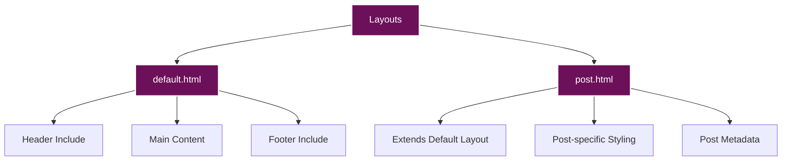
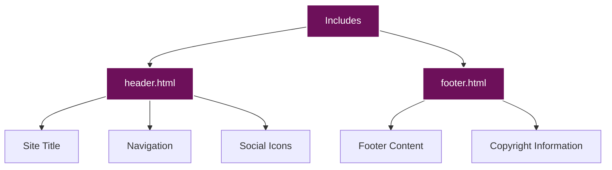

# Components Documentation

This document provides detailed information about the components used in the site, including layouts, includes, and page components.

## Table of Contents

- [Layouts](#layouts)
  - [Default Layout](#default-layout)
  - [Post Layout](#post-layout)
- [Includes](#includes)
  - [Header](#header)
  - [Footer](#footer)
- [Page Components](#page-components)
  - [Blog Post Cards](#blog-post-cards)
  - [Navigation](#navigation)
  - [Social Icons](#social-icons)
  - [Frame Design](#frame-design)
- [Blog Components](#blog-components)
  - [Post Header](#post-header)
  - [Post Content](#post-content)
  - [Post Tags](#post-tags)
- [Special Components](#special-components)
  - [About Page Components](#about-page-components)
  - [Mermaid Diagrams](#mermaid-diagrams)
  - [Photo Gallery](#photo-gallery)
  - [Project Cards](#project-cards)
- [Blog Enhancement Components](#blog-enhancement-components)
  - [Table of Contents (TOC)](#table-of-contents-toc)
  - [Key Terms System](#key-terms-system)
  - [Print to PDF](#print-to-pdf)

## Layouts

The site uses two main layouts:



### Default Layout

The default layout (`_layouts/default.html`) serves as the base template for all pages. It includes:

- HTML5 doctype and structure
- Meta tags for SEO and responsive design
- CSS and JavaScript includes
- Header and footer includes
- Main content area

```html
<!DOCTYPE html>
<html lang="en">
<head>
    <meta charset="UTF-8">
    <meta name="viewport" content="width=device-width, initial-scale=1.0">
    <title>{{ page.title }} - [SITE OWNER] (@USERNAME)</title>
    <link rel="icon" href="data:image/svg+xml,<svg xmlns=%22http://www.w3.org/2000/svg%22 viewBox=%220 0 100 100%22><text y=%22.9em%22 font-size=%2290%22>K</text></svg>">
    <link rel="stylesheet" href="{{ '/assets/css/fonts.css' | relative_url }}">
    <link rel="stylesheet" href="{{ '/assets/css/main.css' | relative_url }}">
    <!-- Font Awesome for social icons -->
    <link rel="stylesheet" href="https://cdnjs.cloudflare.com/ajax/libs/font-awesome/6.4.0/css/all.min.css">
    <!-- Main JavaScript -->
    <script src="{{ '/assets/js/main.js' | relative_url }}" defer></script>
    
    <style>
        {{ page.custom_css }}
    </style>
    
</head>
<body>
    <div class="site-logo-container">
        
    </div>

    

    <main class="container">
        {{ content }}
    </main>

    
</body>
</html>
```

#### Key Features

- **Dynamic Title**: Uses the page title if available
- **Favicon**: Uses an SVG favicon
- **CSS Includes**: Loads fonts.css and main.css
- **Font Awesome**: Loads Font Awesome for icons
- **JavaScript**: Loads main.js with defer attribute
- **Custom CSS**: Supports custom CSS in page front matter
- **Logo**: Includes the site logo
- **Header and Footer**: Includes header.html and footer.html
- **Content Area**: Renders the page content

### Post Layout

The post layout (`_layouts/post.html`) extends the default layout and adds post-specific styling and metadata:

```html
---
layout: default
---
<article class="post">
    <header class="post-header">
        <div class="post-date">{{ page.date | date: "%B %d, %Y" | upcase }}</div>
        <h1 class="post-title">{{ page.title }}</h1>
        
        <div class="post-tags">
            
            <a href="#">{{ tag }}</a>
            
        </div>
        
    </header>

    <div class="post-content">
        {{ content }}
    </div>
</article>
```

#### Key Features

- **Layout Extension**: Extends the default layout
- **Post Date**: Displays the post date in a formatted style
- **Post Title**: Displays the post title
- **Post Tags**: Displays post tags if available
- **Post Content**: Renders the post content

## Includes

The site uses two main includes:



### Header

The header include (`_includes/header.html`) contains the site header with navigation and social links:

```html
<header>
    <div class="container">
        <div class="header-content">
            <a href="{{ '/' | relative_url }}" class="site-title">KALI JACKSON (@RADICALKJAX)</a>
            <nav>
                <ul>
                    <li><a href="{{ '/blog.html' | relative_url }}">Blog</a></li>
                    <li class="dropdown">
                        <a href="{{ '/projects.html' | relative_url }}" class="dropdown-toggle">Projects</a>
                        <ul class="dropdown-menu">
                            <li><a href="{{ '/projects/rocket-pup.html' | relative_url }}">Rocket Pup</a></li>
                            <li><a href="{{ '/projects/caliphoria.html' | relative_url }}">Caliphoria</a></li>
                            <li><a href="{{ '/projects/wattz.html' | relative_url }}">Wattz</a></li>
                            <li><a href="{{ '/projects/presentations.html' | relative_url }}">Presentations</a></li>
                        </ul>
                    </li>
                    <li class="dropdown">
                        <a href="{{ '/art.html' | relative_url }}" class="dropdown-toggle">Art</a>
                        <ul class="dropdown-menu">
                            <li><a href="{{ '/art/photos.html' | relative_url }}">Photos</a></li>
                            <li><a href="{{ '/art/other-things.html' | relative_url }}">Other Things</a></li>
                        </ul>
                    </li>
                    <li><a href="{{ '/about.html' | relative_url }}">About Me</a></li>
                    <li><a href="{{ '/about/trans-journey.html' | relative_url }}">Personal Journey</a></li>
                    <li><a href="{{ '/connections.html' | relative_url }}">Connections</a></li>
                </ul>
            </nav>
        </div>
        <div class="social-icons">
            <a href="https://bsky.app/profile/radicalkjax.com" aria-label="BlueSky" target="_blank"><i class="fas fa-butterfly"></i></a>
            <a href="https://www.linkedin.com/in/kali-jackson-647094245" aria-label="LinkedIn" target="_blank"><i class="fab fa-linkedin-in"></i></a>
            <a href="https://www.instagram.com/radicalkjax/" aria-label="Instagram" target="_blank"><i class="fab fa-instagram"></i></a>
            <a href="https://github.com/radicalkjax" aria-label="GitHub" target="_blank"><i class="fab fa-github"></i></a>
        </div>
    </div>
</header>
```

#### Key Features

- **Site Title**: Links to the homepage (KALI JACKSON (@RADICALKJAX))
- **Navigation**: Main navigation with dropdown menus for Projects and Art sections
- **Standalone Pages**: About Me and Personal Journey as separate navigation items
- **Social Icons**: Links to BlueSky, LinkedIn, Instagram, and GitHub profiles
- **Responsive Design**: Adapts to different screen sizes with mobile-friendly dropdowns

### Footer

The footer include (`_includes/footer.html`) contains the site footer:

```html
<footer class="container">
    <p>Designed with love by Kali <3</p>
</footer>
```

#### Key Features

- **Simple Design**: Minimalist footer with a personal touch
- **Container Class**: Uses the same container class as the main content

## Page Components

### Blog Post Cards

Blog post cards are used on the homepage and blog page to display post previews:

```html
<article class="post-card">
    <div class="post-date">{{ post.date | date: "%B %d, %Y" | upcase }}</div>
    <h2 class="post-title"><a href="{{ post.url | relative_url }}">{{ post.title }}</a></h2>
    <div class="post-content">
        <p>{{ post.content | strip_html | truncate: 300 }}…</p>
    </div>
    <div class="post-tags">
        
            
            <a href="#">{{ tag }}</a>
            
        
    </div>
</article>
```

#### CSS Implementation

```css
/* Post card container */
.post-card {
    position: relative;
    background-color: rgba(122, 1, 119, 0.7);
    border: 1px solid rgba(255, 255, 255, 0.3);
    padding: 30px;
    margin-bottom: 50px;
    border-radius: 0;
    box-shadow: 0 2px 5px rgba(0, 0, 0, 0.2);
}

/* Create a second border box underneath - similar to header */
.post-card::after {
    content: '';
    position: absolute;
    top: 10px; /* Start at the same position as the horizontal line */
    bottom: -12px;
    right: -10px;
    width: 2px;
    background-color: #ffffff;
}

/* Create bottom horizontal line */
.post-card::before {
    content: '';
    position: absolute;
    left: 10px;
    right: -10px;
    bottom: -12px;
    height: 2px;
    background-color: #ffffff;
}

/* Left vertical line */
.post-card .post-title::before {
    content: '';
    position: absolute;
    left: 10px;
    bottom: -12px;
    width: 2px;
    height: 10px;
    background-color: #ffffff;
}

/* Right horizontal line connecting to main box */
.post-card .post-date::after {
    content: '';
    position: absolute;
    top: 10px;
    right: -10px;
    width: 10px;
    height: 2px;
    background-color: #ffffff;
}
```

### Navigation

The navigation component includes dropdown menus:

```css
/* Navigation styling */
nav ul {
    display: flex;
    list-style: none;
    margin: 0;
    padding: 0;
}

nav ul li {
    margin-right: 20px;
    position: relative;
}

nav ul li a {
    color: #ffffff;
    text-decoration: none;
    font-size: 0.9rem;
    transition: opacity 0.3s ease;
}

nav ul li a:hover {
    opacity: 0.8;
}

/* Dropdown menu styling */
.dropdown {
    position: relative;
}

.dropdown-menu {
    display: none;
    position: absolute;
    top: 100%;
    left: 0;
    background-color: rgba(122, 1, 119, 0.9);
    min-width: 200px;
    z-index: 1000;
    border: 1px solid rgba(255, 255, 255, 0.2);
}

.dropdown:hover .dropdown-menu {
    display: block;
}

.dropdown-menu li {
    margin: 0;
    padding: 0;
}

.dropdown-menu li a {
    display: block;
    padding: 10px 15px;
    white-space: nowrap;
}

.dropdown-menu li a:hover {
    background-color: rgba(255, 255, 255, 0.1);
}
```

### Social Icons

The social icons component includes links to social media profiles:

```css
/* Social icons styling */
.social-icons {
    position: absolute;
    right: 20px;
    top: 50%;
    transform: translateY(-50%);
    display: flex;
    align-items: center;
}

.social-icons a {
    color: #ffffff;
    font-size: 1.2rem;
    margin-left: 15px;
    transition: opacity 0.3s ease;
}

.social-icons a:hover {
    opacity: 0.8;
}

/* Custom butterfly icon for BlueSky */
.fa-butterfly::before {
    content: "\1F98B"; /* Unicode butterfly character */
    font-family: "Apple Color Emoji", "Segoe UI Emoji", "Segoe UI Symbol";
}
```

### Frame Design

The frame design is a distinctive visual element used throughout the site:

```css
/* Header frame design */
header {
    position: relative;
    width: 90vw;
    margin: 20px auto;
    border: 2px solid #ffffff;
    padding: 30px 0;
}

header::after {
    content: '';
    position: absolute;
    top: 10px;
    bottom: -12px;
    right: -10px;
    width: 2px;
    background-color: #ffffff;
}

header::before {
    content: '';
    position: absolute;
    left: 10px;
    right: -10px;
    bottom: -12px;
    height: 2px;
    background-color: #ffffff;
}
```

## Blog Components

### Post Header

The post header component displays the post title, date, and tags:

```css
/* Post header styling */
.post-header {
    margin-bottom: 30px;
}

.post-date {
    font-size: 0.8rem;
    color: rgba(255, 255, 255, 0.7);
    margin-bottom: 10px;
}

.post-title {
    font-size: 1.8rem;
    margin: 0 0 15px 0;
}
```

### Post Content

The post content component displays the post content with proper styling:

```css
/* Post content styling */
.post-content {
    line-height: 1.8;
}

.post-content p {
    margin-bottom: 20px;
}

.post-content h2 {
    font-size: 1.5rem;
    margin: 30px 0 15px;
}

.post-content h3 {
    font-size: 1.3rem;
    margin: 25px 0 15px;
}

.post-content ul, .post-content ol {
    margin-bottom: 20px;
    padding-left: 20px;
}

.post-content li {
    margin-bottom: 10px;
}

.post-content img {
    max-width: 100%;
    height: auto;
    margin: 20px 0;
}

.post-content code {
    background-color: rgba(255, 255, 255, 0.1);
    padding: 2px 5px;
    border-radius: 3px;
    font-family: 'DM Mono', monospace;
}

.post-content pre {
    background-color: rgba(255, 255, 255, 0.1);
    padding: 15px;
    border-radius: 5px;
    overflow-x: auto;
    margin-bottom: 20px;
}

.post-content pre code {
    background-color: transparent;
    padding: 0;
}
```

### Post Tags

The post tags component displays the post tags:

```css
/* Post tags styling */
.post-tags {
    margin-top: 20px;
}

.post-tags a {
    display: inline-block;
    background-color: rgba(255, 255, 255, 0.1);
    color: #ffffff;
    padding: 5px 10px;
    margin-right: 10px;
    margin-bottom: 10px;
    border-radius: 3px;
    font-size: 0.8rem;
    text-decoration: none;
    transition: background-color 0.3s ease;
}

.post-tags a:hover {
    background-color: rgba(255, 255, 255, 0.2);
}
```

## Special Components

### About Page Components

The About page includes several sophisticated components for organizing and displaying personal and professional information:

#### Navigator

The About page features a floating navigation sidebar based on the Document Navigator pattern:

```javascript
// Navigator implementation for About page
document.addEventListener('DOMContentLoaded', function() {
    // Get all sections with IDs
    const sections = aboutContainer.querySelectorAll('section[id]');
    
    // Create navigator header
    tocHeader.textContent = 'Navigator'; // Not "Document Navigation"
    
    // Special handling for intro section
    if (sectionId === 'intro') {
        sectionTitle = 'Summary'; // Shows "Summary" instead of "Kali Jackson"
    }
});
```

**Features:**
- **Custom Naming**: Displays "Navigator" as the header (not "Document Navigation")
- **Summary Section**: Shows "Summary" for the intro section instead of extracting the h1 title
- **Auto-detection**: Automatically detects all sections with IDs on the page
- **Active Highlighting**: Highlights the currently visible section as you scroll
- **Smooth Scrolling**: Click any link for smooth scrolling to that section
- **Mobile Responsive**: Includes hamburger menu for mobile devices
- **No Key Terms**: Unlike blog posts, the About page Navigator does not include the Key Terms functionality

**CSS Styling:**
```css
#floating-toc {
    position: fixed;
    top: 120px;
    left: 30px;
    width: 250px;
    background-color: #1a1a1a;
    border: 1px solid #6d105a;
    box-shadow: 0 4px 8px rgba(0, 0, 0, 0.3);
    z-index: 1000;
}

#toc-header {
    background-color: #6d105a;
    color: #ffffff;
    padding: 15px 20px;
    font-weight: 600;
    text-transform: uppercase;
    letter-spacing: 1px;
    font-size: 14px;
}
```

#### Skills Grid System

The skills grid displays technical skills in organized categories:

```css
.skills-grid {
    display: grid;
    grid-template-columns: 1fr 1fr;
    gap: 20px;
    margin-bottom: 20px;
}

.skill-category {
    padding: 15px;
    background-color: rgba(255, 255, 255, 0.05);
    border: 1px solid rgba(255, 255, 255, 0.1);
}

.skill-label {
    font-weight: 600;
    margin-bottom: 10px;
    color: rgba(255, 255, 255, 0.9);
}

.skill-list {
    line-height: 1.6;
    opacity: 0.85;
}
```

#### Collapsible Sections

The About page features collapsible sections for expanded content:

```javascript
function toggleCollapsible(element) {
    element.classList.toggle('active');
    var content = element.nextElementSibling;
    content.classList.toggle('show');
}
```

```css
.collapsible-header {
    background-color: rgba(255, 255, 255, 0.1);
    border: 1px solid rgba(255, 255, 255, 0.2);
    padding: 15px 20px;
    cursor: pointer;
    display: flex;
    justify-content: space-between;
    align-items: center;
    transition: all 0.3s ease;
}

.collapsible-content {
    display: none;
    padding: 20px;
    background-color: rgba(255, 255, 255, 0.05);
    border: 1px solid rgba(255, 255, 255, 0.2);
    border-top: none;
}

.collapsible-content.show {
    display: block;
}
```

#### Media I Love - Interactive Grid

The Media I Love section features collapsible category boxes with centered title bubbles:

```javascript
function toggleMedia(element) {
    element.classList.toggle('expanded');
    element.classList.toggle('collapsed');
}
```

```css
.media-category {
    position: relative;
    padding: 15px;
    background-color: rgba(255, 255, 255, 0.05);
    border: 1px solid rgba(255, 255, 255, 0.1);
    cursor: pointer;
    transition: all 0.3s ease;
}

.media-bubble {
    position: absolute;
    top: 50%;
    left: 50%;
    transform: translate(-50%, -50%);
    background-color: rgba(122, 1, 119, 0.9);
    border: 2px solid rgba(255, 255, 255, 0.3);
    border-radius: 50px;
    padding: 10px 20px;
    font-weight: 600;
    z-index: 1;
    transition: all 0.3s ease;
}

.media-category.expanded .media-bubble {
    top: 20px;
    transform: translate(-50%, 0);
}

.media-content {
    opacity: 0;
    max-height: 0;
    overflow: hidden;
    transition: all 0.3s ease;
    padding-top: 80px;
}

.media-category.expanded .media-content {
    opacity: 1;
    max-height: 500px;
}
```

#### Open Source Projects - GitHub Integration

The Open Source Projects section dynamically fetches and displays GitHub repositories:

```javascript
// Fetches repositories from personal and organization accounts
const userReposResponse = await fetch(`https://api.github.com/users/${username}/repos?sort=updated&per_page=100`);
const orgReposResponse = await fetch(`https://api.github.com/orgs/goldenapplestudios/repos?sort=updated&per_page=100`);

// Combines and filters repositories
const ownRepos = allRepos
    .filter(repo => !repo.fork)
    .sort((a, b) => {
        if (b.stargazers_count !== a.stargazers_count) {
            return b.stargazers_count - a.stargazers_count;
        }
        return new Date(b.updated_at) - new Date(a.updated_at);
    });
```

```css
.repo-card {
    background-color: rgba(255, 255, 255, 0.05);
    border: 1px solid rgba(255, 255, 255, 0.1);
    padding: 20px;
    transition: all 0.3s ease;
    display: flex;
    flex-direction: column;
    height: 100%;
}

.repo-card:hover {
    background-color: rgba(255, 255, 255, 0.08);
    transform: translateY(-2px);
}

.repo-language {
    display: flex;
    align-items: center;
    gap: 5px;
    font-size: 0.85rem;
    margin-bottom: 10px;
}

.language-dot {
    width: 12px;
    height: 12px;
    border-radius: 50%;
    display: inline-block;
}

.repo-stats {
    display: flex;
    gap: 20px;
    font-size: 0.85rem;
    opacity: 0.7;
    margin-top: auto;
}
```

##### Key Features

- **Multi-Source Fetching**: Pulls repositories from both personal and organization accounts
- **Smart Filtering**: Excludes forked repositories to show only original contributions
- **Lazy Loading**: Only fetches data when the collapsible section is expanded
- **Visual Indicators**: 
  - Language color dots matching GitHub's color scheme
  - Repository statistics (stars, forks, issues)
  - Organization attribution for non-personal repos
- **Responsive Layout**: Uses CSS Grid with auto-fit for responsive design

### Mermaid Diagrams

The site includes comprehensive styling for mermaid diagrams:

```css
/* Mermaid diagram styling */
.mermaid {
    text-align: center !important;
    margin: 20px auto !important;
    background-color: rgba(255, 255, 255, 0.05);
    padding: 15px;
    border-radius: 5px;
    max-width: 100%;
    overflow-x: auto;
}

/* Ensure mermaid diagrams are readable with our dark theme */
.mermaid .node rect,
.mermaid .node circle,
.mermaid .node ellipse,
.mermaid .node polygon,
.mermaid .node path {
    fill: rgba(255, 255, 255, 0.1) !important;
    stroke: #ffffff !important;
}

.mermaid .edgePath .path {
    stroke: #ffffff !important;
}

.mermaid .label {
    color: #ffffff !important;
    font-family: 'DM Mono', monospace !important;
}

.mermaid .edgeLabel {
    background-color: rgba(109, 16, 90, 0.7) !important;
    color: #ffffff !important;
}

.mermaid .cluster rect {
    fill: rgba(255, 255, 255, 0.05) !important;
    stroke: #ffffff !important;
}
```

### Photo Gallery

The photo gallery component displays photos in a grid layout:

```css
.photo-gallery {
    display: grid;
    grid-template-columns: repeat(auto-fill, minmax(300px, 1fr));
    gap: 20px;
    margin-top: 20px;
}

.photo-item {
    background-color: rgba(122, 1, 119, 0.7);
    border: 1px solid rgba(255, 255, 255, 0.3);
    border-radius: 0;
    overflow: hidden;
    box-shadow: 0 2px 5px rgba(0, 0, 0, 0.2);
    transition: transform 0.3s ease;
    position: relative;
    height: 450px; /* Fixed height for all photo items */
    display: flex;
    flex-direction: column;
}

.photo-item:hover {
    transform: translateY(-5px);
}

.photo-item img {
    width: 100%;
    height: 250px;
    object-fit: cover;
}

.photo-info {
    padding: 20px;
    flex: 1; /* Make the info section fill the available space */
    display: flex;
    flex-direction: column;
}

.photo-title {
    font-size: 1.2rem;
    margin: 0 0 10px 0;
}

.photo-description {
    margin-bottom: 15px;
    line-height: 1.6;
    flex: 1; /* Make the description fill the available space */
}

.photo-tags {
    display: flex;
    flex-wrap: wrap;
    gap: 10px;
    margin-top: auto; /* Push tags to the bottom of the container */
}

.photo-tags a {
    background-color: rgba(255, 255, 255, 0.1);
    color: #ffffff;
    padding: 5px 10px;
    border-radius: 3px;
    font-size: 0.8rem;
    text-decoration: none;
    transition: background-color 0.3s ease;
}

.photo-tags a:hover {
    background-color: rgba(255, 255, 255, 0.2);
}
```

### Project Cards

The project cards component displays project information:

```css
.connections-section {
    background-color: rgba(122, 1, 119, 0.7);
    border: 1px solid rgba(255, 255, 255, 0.3);
    padding: 30px;
    margin-bottom: 30px;
    border-radius: 0;
    box-shadow: 0 2px 5px rgba(0, 0, 0, 0.2);
    position: relative;
}

.connections-intro {
    margin-bottom: 30px;
    line-height: 1.8;
}

.project-tags {
    margin-top: 20px;
}

.project-tags a {
    display: inline-block;
    background-color: rgba(255, 255, 255, 0.1);
    color: #ffffff;
    padding: 5px 10px;
    margin-right: 10px;
    margin-bottom: 10px;
    border-radius: 3px;
    font-size: 0.8rem;
    text-decoration: none;
    transition: background-color 0.3s ease;
}

.project-tags a:hover {
    background-color: rgba(255, 255, 255, 0.2);
}

.project-links {
    margin-top: 20px;
}

.project-links a {
    display: inline-block;
    color: #ffffff;
    margin-right: 20px;
    text-decoration: none;
    transition: opacity 0.3s ease;
}

.project-links a:hover {
    opacity: 0.8;
}

.project-links a i {
    margin-right: 5px;
}
```

## Blog Enhancement Components

The blog system includes three powerful enhancement features that improve the reading experience and content management. These features are specific to blog posts and are only activated on pages with the `.post-content` class:

### Table of Contents (TOC)

The TOC component (`/assets/js/toc.js`) provides automatic navigation generation for blog posts:

#### Features

- **Automatic Generation**: Creates a floating sidebar from H2, H3, and H4 headings
- **Smart Visibility**: Only appears when there are 2+ headings in the post
- **Scroll Highlighting**: Highlights the currently visible section as you read
- **Smooth Scrolling**: Click any TOC link for smooth navigation
- **Mobile Responsive**: Collapsible with hamburger menu (☰) on mobile
- **Fixed Positioning**: Stays visible on the right side while scrolling

#### Implementation

```javascript
// TOC container structure
<div id="toc-container">
    <button id="toc-toggle" aria-label="Toggle Table of Contents">☰</button>
    <div id="toc">
        <h3>Table of Contents</h3>
        <nav id="toc-nav">
            <!-- Generated TOC links -->
        </nav>
        <div id="key-terms-storage">
            <!-- Key terms integration -->
        </div>
    </div>
</div>
```

#### CSS Styling

```css
#toc-container {
    position: fixed;
    right: 20px;
    top: 100px;
    width: 250px;
    max-height: 80vh;
    overflow-y: auto;
    background-color: rgba(122, 1, 119, 0.9);
    border: 2px solid #ffffff;
    padding: 20px;
    z-index: 1000;
    transition: transform 0.3s ease;
}

#toc h3 {
    margin-top: 0;
    font-size: 1.1rem;
    margin-bottom: 15px;
}

#toc-nav ul {
    list-style: none;
    padding-left: 0;
}

#toc-nav li {
    margin-bottom: 8px;
}

#toc-nav a {
    color: #ffffff;
    text-decoration: none;
    font-size: 0.9rem;
    display: block;
    padding: 5px 0;
    transition: all 0.3s ease;
}

#toc-nav a:hover {
    padding-left: 5px;
    background-color: rgba(255, 255, 255, 0.1);
}

#toc-nav a.active {
    font-weight: bold;
    background-color: rgba(255, 255, 255, 0.2);
    padding-left: 5px;
}
```

### Key Terms System

The Key Terms component (`/assets/js/key-terms.js`) provides an interactive glossary system for blog posts only. This feature checks for the `.post-content` class and is not activated on other pages like the About page:

#### Features

- **Automatic Detection**: Highlights technical terms with dotted purple underlines
- **Interactive Storage**: Click highlighted terms to save them
- **Persistent Storage**: Uses localStorage to maintain terms across sessions
- **Quick Research**: Click term bubbles to search Google/Wikipedia
- **Manual Entry**: Add custom terms via input field
- **Easy Management**: Remove terms with × button
- **Extensive Dictionary**: Pre-configured with cybersecurity, AI, and malware terms

#### Implementation

```javascript
// Key terms structure
<div id="key-terms-storage">
    <h4>Your Key Terms</h4>
    <div id="key-terms-input-container">
        <input type="text" id="key-terms-input" placeholder="Add a term...">
        <button id="add-term-btn">+</button>
    </div>
    <div id="key-terms-list">
        <!-- Stored term bubbles -->
    </div>
</div>
```

#### CSS Styling

```css
/* Highlighted terms in content */
.key-term {
    cursor: pointer;
    text-decoration: underline;
    text-decoration-style: dotted;
    text-decoration-color: #6d105a;
    text-underline-offset: 0.2em;
    transition: all 0.3s ease;
}

.key-term:hover {
    background-color: rgba(109, 16, 90, 0.2);
    text-decoration-color: #ffffff;
}

/* Term bubbles */
.key-term-bubble {
    display: inline-flex;
    align-items: center;
    background-color: rgba(255, 255, 255, 0.1);
    color: #ffffff;
    padding: 5px 10px;
    margin: 5px 5px 5px 0;
    border-radius: 15px;
    font-size: 0.85rem;
    cursor: pointer;
    transition: all 0.3s ease;
    position: relative;
}

.key-term-bubble:hover {
    background-color: rgba(255, 255, 255, 0.2);
    transform: translateY(-2px);
}

.key-term-bubble .remove-term {
    margin-left: 8px;
    cursor: pointer;
    font-weight: bold;
    opacity: 0.7;
    transition: opacity 0.3s ease;
}

.key-term-bubble .remove-term:hover {
    opacity: 1;
}
```

### Print to PDF

The Print to PDF component (`/assets/js/print-pdf.js`) provides optimized printing functionality:

#### Features

- **Floating Button**: Printer emoji (🖨️) button in bottom-right corner
- **Print Optimization**: 
  - Hides navigation elements
  - Converts to black and white
  - Shows URLs after links
  - Handles code blocks and tables
  - Preserves diagrams and equations
  - Prevents awkward page breaks
- **Smart Loading**: Waits for all images before printing
- **Mobile Responsive**: Adjusts position on small screens

#### Implementation

```javascript
// Print button structure
<button id="print-pdf-btn" aria-label="Print to PDF" title="Print this page to PDF">
    🖨️
</button>
```

#### Print Media Styles

```css
@media print {
    /* Hide non-content elements */
    header, footer, #toc-container, #print-pdf-btn,
    .social-icons, nav, .site-logo-container {
        display: none !important;
    }
    
    /* Reset colors for print */
    body {
        background-color: white !important;
        color: black !important;
    }
    
    /* Show URLs after links */
    a[href]:after {
        content: " (" attr(href) ")";
        font-size: 0.8em;
        color: #666;
    }
    
    /* Optimize code blocks */
    pre, code {
        background-color: #f5f5f5 !important;
        border: 1px solid #ddd !important;
        color: black !important;
    }
    
    /* Handle page breaks */
    h1, h2, h3, h4, h5, h6 {
        page-break-after: avoid;
    }
    
    pre, blockquote, table, figure {
        page-break-inside: avoid;
    }
    
    /* Ensure images fit */
    img {
        max-width: 100% !important;
        height: auto !important;
    }
}

/* Print button styling */
#print-pdf-btn {
    position: fixed;
    bottom: 30px;
    right: 30px;
    width: 60px;
    height: 60px;
    border-radius: 50%;
    background-color: rgba(122, 1, 119, 0.9);
    color: white;
    border: 2px solid white;
    font-size: 24px;
    cursor: pointer;
    box-shadow: 0 4px 6px rgba(0, 0, 0, 0.1);
    transition: all 0.3s ease;
    z-index: 1000;
    display: flex;
    align-items: center;
    justify-content: center;
}

#print-pdf-btn:hover {
    transform: translateY(-3px);
    box-shadow: 0 6px 12px rgba(0, 0, 0, 0.15);
    background-color: rgba(122, 1, 119, 1);
}
```

#### Integration

All three components are loaded in the default layout:

```html
<!-- In _layouts/default.html -->
<script src="{{ '/assets/js/toc.js' | relative_url }}" defer></script>
<script src="{{ '/assets/js/key-terms.js' | relative_url }}" defer></script>
<script src="{{ '/assets/js/print-pdf.js' | relative_url }}" defer></script>
<link rel="stylesheet" href="{{ '/assets/css/key-terms.css' | relative_url }}">
```

## Next Steps

- [Development Guide](../development/README.md)
- [Deployment Guide](../deployment/README.md)
- [Customization Guide](../customization/README.md)
