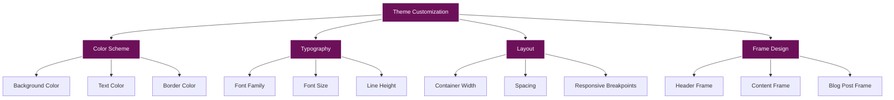
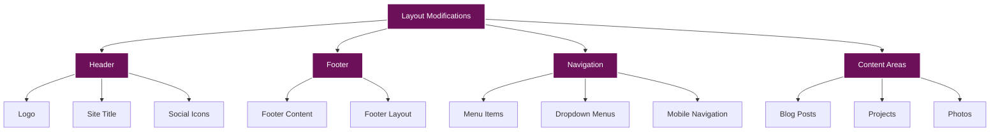
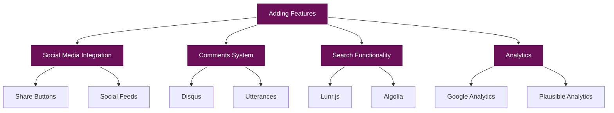
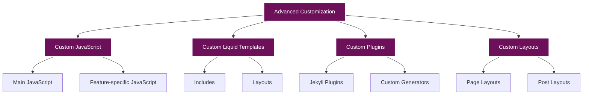

# Customization Guide

This document provides comprehensive instructions for customizing radicalkjax.com's appearance and functionality.

**Last Updated:** September 2025

## Table of Contents

- [Theme Customization](#theme-customization)
  - [Color Scheme](#color-scheme)
  - [Typography](#typography)
  - [Layout](#layout)
  - [Frame Design](#frame-design)
- [Layout Modifications](#layout-modifications)
  - [Header](#header)
  - [Footer](#footer)
  - [Navigation](#navigation)
  - [Content Areas](#content-areas)
- [Adding Features](#adding-features)
  - [Social Media Integration](#social-media-integration)
  - [Comments System](#comments-system)
  - [Search Functionality](#search-functionality)
  - [Analytics](#analytics)
- [Advanced Customization](#advanced-customization)
  - [Custom JavaScript](#custom-javascript)
  - [Custom Liquid Templates](#custom-liquid-templates)
  - [Custom Plugins](#custom-plugins)
  - [Custom Layouts](#custom-layouts)

## Theme Customization

The site's theme can be customized by modifying the CSS files in the `assets/css/` directory.



### Color Scheme

The site's color scheme is defined in `assets/css/main.css`. The primary colors are:

- **Background Color**: `#6d105a` (Deep Purple)
- **Text Color**: `#ffffff` (White)
- **Border Color**: `#ffffff` (White)
- **Accent Color**: `rgba(255, 255, 255, 0.3)` (Semi-transparent White)

To change the color scheme:

```css
/* Main background color */
body {
    background: linear-gradient(135deg, #6d105a 0%, #4a0c3e 100%);
    color: #ffffff;
}

/* Content background color */
.post-card, .connections-section, .photo-item {
    background-color: rgba(122, 1, 119, 0.7);
    border: 1px solid rgba(255, 255, 255, 0.3);
}

/* Link color */
a {
    color: #ffffff;
}

/* Hover color */
a:hover {
    opacity: 0.8;
}
```

### Typography

The site uses the DM Mono font for all text. The font is defined in `assets/css/fonts.css`:

```css
@font-face {
    font-family: 'DM Mono';
    src: url('../fonts/dmmono-regular-webfont.woff2') format('woff2'),
         url('../fonts/dmmono-regular-webfont.woff') format('woff');
    font-weight: normal;
    font-style: normal;
}

body {
    font-family: 'DM Mono', monospace;
    font-size: 16px;
    line-height: 1.6;
}
```

To change the font:

1. **Add New Font Files**: Add your font files to the `assets/fonts/` directory.
2. **Update Font Face**: Update the `@font-face` rule in `assets/css/fonts.css`.
3. **Update Body Font**: Update the `font-family` property in the `body` selector.

### Layout

The site's layout is defined in `assets/css/main.css`. The main layout components are:

- **Container**: Defines the maximum width of the content area.
- **Header**: Defines the header layout.
- **Main Content**: Defines the main content area layout.
- **Footer**: Defines the footer layout.

To change the layout:

```css
/* Container */
.container {
    max-width: 1200px;
    margin: 0 auto;
    padding: 0 20px;
}

/* Header */
header {
    position: relative;
    width: 90vw;
    margin: 20px auto;
    border: 2px solid #ffffff;
    padding: 30px 0;
}

/* Main content */
main {
    margin: 40px 0;
}

/* Footer */
footer {
    margin-top: 40px;
    padding: 20px 0;
    text-align: center;
}
```

### Frame Design

The site uses a distinctive frame design for various elements. The frame design is implemented using CSS pseudo-elements:

```css
/* Header frame design */
header {
    position: relative;
    width: 90vw;
    margin: 20px auto;
    border: 2px solid #ffffff;
    padding: 30px 0;
}

header::after {
    content: '';
    position: absolute;
    top: 10px;
    bottom: -12px;
    right: -10px;
    width: 2px;
    background-color: #ffffff;
}

header::before {
    content: '';
    position: absolute;
    left: 10px;
    right: -10px;
    bottom: -12px;
    height: 2px;
    background-color: #ffffff;
}
```

To customize the frame design:

1. **Adjust Border Width**: Change the `border` property to adjust the border width.
2. **Adjust Border Color**: Change the `border-color` and `background-color` properties to adjust the border color.
3. **Adjust Frame Dimensions**: Change the `top`, `bottom`, `left`, `right`, `width`, and `height` properties to adjust the frame dimensions.

## Layout Modifications

The site's layout can be modified by editing the HTML files and CSS styles.



### Header

The header is defined in `_includes/header.html`. To modify the header:

1. **Logo**: Update the logo by replacing the `sitelogo.png` file in the `assets/images/logo/` directory.

2. **Site Title**: Update the site title by modifying the `site-title` element:

   ```html
   <a href="{{ '/' | relative_url }}" class="site-title">Your Site Title</a>
   ```

3. **Social Icons**: Update the social icons by modifying the `social-icons` element:

   ```html
   <div class="social-icons">
       <a href="https://example.com" aria-label="Platform Name" target="_blank"><i class="fab fa-icon-name"></i></a>
       <!-- Add more social icons as needed -->
   </div>
   ```

### Footer

The footer is defined in `_includes/footer.html`. To modify the footer:

```html
<footer class="container">
    <p>Your custom footer content</p>
</footer>
```

### Navigation

The navigation is defined in `_includes/header.html`. To modify the navigation:

1. **Menu Items**: Update the menu items by modifying the `nav ul` element:

   ```html
   <nav>
       <ul>
           <li><a href="{{ '/page1.html' | relative_url }}">Page 1</a></li>
           <li class="dropdown">
               <a href="{{ '/page2.html' | relative_url }}" class="dropdown-toggle">Page 2</a>
               <ul class="dropdown-menu">
                   <li><a href="{{ '/page2/subpage1.html' | relative_url }}">Subpage 1</a></li>
                   <li><a href="{{ '/page2/subpage2.html' | relative_url }}">Subpage 2</a></li>
               </ul>
           </li>
           <!-- Add more menu items as needed -->
       </ul>
   </nav>
   ```

2. **Dropdown Menus**: Add or remove dropdown menus by adding or removing the `dropdown` class and `dropdown-menu` element.

3. **Mobile Navigation**: Customize the mobile navigation by modifying the CSS in `assets/css/main.css`:

   ```css
   @media (max-width: 768px) {
       nav ul {
           flex-direction: column;
           align-items: center;
       }
       
       .dropdown-menu {
           position: static;
           width: 100%;
       }
   }
   ```

### Content Areas

The content areas are defined in the HTML files for each page. To modify the content areas:

1. **Blog Posts**: Update the blog post layout by modifying `_layouts/post.html`.

2. **Projects**: Update the project page layout by modifying the project HTML files in the `projects/` directory.

3. **Photos**: Update the photo gallery layout by modifying the photo gallery HTML files in the `art/` directory.

## Adding Features

You can add various features to enhance the site's functionality.



### Social Media Integration

#### Share Buttons

Add share buttons to blog posts by adding the following code to `_layouts/post.html`:

```html
<div class="share-buttons">
    <a href="https://twitter.com/intent/tweet?text={{ page.title }}&url={{ site.url }}{{ page.url }}" target="_blank" aria-label="Share on Twitter"><i class="fab fa-twitter"></i></a>
    <a href="https://www.facebook.com/sharer/sharer.php?u={{ site.url }}{{ page.url }}" target="_blank" aria-label="Share on Facebook"><i class="fab fa-facebook-f"></i></a>
    <a href="https://www.linkedin.com/shareArticle?mini=true&url={{ site.url }}{{ page.url }}&title={{ page.title }}" target="_blank" aria-label="Share on LinkedIn"><i class="fab fa-linkedin-in"></i></a>
</div>
```

Add the following CSS to `assets/css/main.css`:

```css
.share-buttons {
    display: flex;
    gap: 10px;
    margin-top: 20px;
}

.share-buttons a {
    display: inline-flex;
    align-items: center;
    justify-content: center;
    width: 40px;
    height: 40px;
    border-radius: 50%;
    background-color: rgba(255, 255, 255, 0.1);
    color: #ffffff;
    transition: background-color 0.3s ease;
}

.share-buttons a:hover {
    background-color: rgba(255, 255, 255, 0.2);
}
```

#### Social Feeds

Add social media feeds by embedding them in your pages. For example, to add a Twitter feed:

```html
<div class="twitter-feed">
    <a class="twitter-timeline" href="https://twitter.com/username" data-height="600">Tweets by username</a>
    <script async src="https://platform.twitter.com/widgets.js" charset="utf-8"></script>
</div>
```

### Comments System

#### Disqus

Add Disqus comments to blog posts by adding the following code to `_layouts/post.html`:

```html

<div id="disqus_thread"></div>
<script>
    var disqus_config = function () {
        this.page.url = "{{ site.url }}{{ page.url }}";
        this.page.identifier = "{{ page.id }}";
    };
    (function() {
        var d = document, s = d.createElement('script');
        s.src = 'https://{{ site.disqus_shortname }}.disqus.com/embed.js';
        s.setAttribute('data-timestamp', +new Date());
        (d.head || d.body).appendChild(s);
    })();
</script>
<noscript>Please enable JavaScript to view the <a href="https://disqus.com/?ref_noscript">comments powered by Disqus.</a></noscript>

```

Add the following to `_config.yml`:

```yaml
disqus_shortname: your-disqus-shortname
```

#### Utterances

Add Utterances comments to blog posts by adding the following code to `_layouts/post.html`:

```html
<script src="https://utteranc.es/client.js"
        repo="username/repo-name"
        issue-term="pathname"
        theme="github-dark"
        crossorigin="anonymous"
        async>
</script>
```

### Search Functionality

#### Lunr.js

Add search functionality using Lunr.js by following these steps:

1. **Create a Search Page**: Create a file named `search.html` in the root directory:

   ```html
   ---
   layout: default
   title: Search
   ---
   <div class="search-container">
       <h1>Search</h1>
       <div class="search-form">
           <input type="text" id="search-input" placeholder="Search...">
           <button id="search-button">Search</button>
       </div>
       <div id="search-results"></div>
   </div>

   <script src="https://unpkg.com/lunr/lunr.js"></script>
   <script src="{{ '/assets/js/search.js' | relative_url }}"></script>
   ```

2. **Create a Search Index**: Create a file named `search.json` in the root directory:

   ```liquid
   ---
   layout: null
   ---
   [
     
       {
         "title"    : "{{ post.title | escape }}",
         "category" : "{{ post.category }}",
         "tags"     : "{{ post.tags | join: ', ' }}",
         "url"      : "{{ site.baseurl }}{{ post.url }}",
         "date"     : "{{ post.date | date: '%B %d, %Y' }}",
         "content"  : "{{ post.content | strip_html | strip_newlines | escape }}"
       } ,
     
   ]
   ```

3. **Create a Search Script**: Create a file named `search.js` in the `assets/js/` directory:

   ```javascript
   document.addEventListener('DOMContentLoaded', function() {
       // Fetch search index
       fetch('/search.json')
           .then(response => response.json())
           .then(data => {
               // Build Lunr index
               const idx = lunr(function() {
                   this.ref('url');
                   this.field('title');
                   this.field('content');
                   this.field('tags');
                   
                   data.forEach(function(doc) {
                       this.add(doc);
                   }, this);
               });
               
               // Handle search
               const searchInput = document.getElementById('search-input');
               const searchButton = document.getElementById('search-button');
               const searchResults = document.getElementById('search-results');
               
               searchButton.addEventListener('click', function() {
                   const query = searchInput.value;
                   const results = idx.search(query);
                   
                   // Display results
                   searchResults.innerHTML = '';
                   
                   if (results.length === 0) {
                       searchResults.innerHTML = '<p>No results found.</p>';
                       return;
                   }
                   
                   results.forEach(function(result) {
                       const doc = data.find(d => d.url === result.ref);
                       
                       const resultElement = document.createElement('div');
                       resultElement.classList.add('search-result');
                       
                       const titleElement = document.createElement('h2');
                       const titleLink = document.createElement('a');
                       titleLink.href = doc.url;
                       titleLink.textContent = doc.title;
                       titleElement.appendChild(titleLink);
                       
                       const dateElement = document.createElement('p');
                       dateElement.classList.add('search-result-date');
                       dateElement.textContent = doc.date;
                       
                       const contentElement = document.createElement('p');
                       contentElement.classList.add('search-result-content');
                       contentElement.textContent = doc.content.substring(0, 200) + '...';
                       
                       resultElement.appendChild(titleElement);
                       resultElement.appendChild(dateElement);
                       resultElement.appendChild(contentElement);
                       
                       searchResults.appendChild(resultElement);
                   });
               });
               
               // Handle enter key
               searchInput.addEventListener('keypress', function(e) {
                   if (e.key === 'Enter') {
                       searchButton.click();
                   }
               });
           });
   });
   ```

4. **Add Search Link**: Add a link to the search page in the navigation:

   ```html
   <li><a href="{{ '/search.html' | relative_url }}">Search</a></li>
   ```

### Analytics

#### Google Analytics

Add Google Analytics by adding the following code to `_layouts/default.html` before the closing `</head>` tag:

```html

<!-- Global site tag (gtag.js) - Google Analytics -->
<script async src="https://www.googletagmanager.com/gtag/js?id={{ site.google_analytics }}"></script>
<script>
  window.dataLayer = window.dataLayer || [];
  function gtag(){dataLayer.push(arguments);}
  gtag('js', new Date());

  gtag('config', '{{ site.google_analytics }}');
</script>

```

Add the following to `_config.yml`:

```yaml
google_analytics: UA-XXXXXXXXX-X
```

#### Plausible Analytics

Add Plausible Analytics by adding the following code to `_layouts/default.html` before the closing `</head>` tag:

```html

<script defer data-domain="{{ site.plausible_domain }}" src="https://plausible.io/js/plausible.js"></script>

```

Add the following to `_config.yml`:

```yaml
plausible_domain: yourdomain.com
```

## Advanced Customization

For advanced customization, you can modify the site's JavaScript, Liquid templates, and layouts.



### Custom JavaScript

You can add custom JavaScript to enhance the site's functionality:

1. **Create a JavaScript File**: Create a new JavaScript file in the `assets/js/` directory.

2. **Include the JavaScript File**: Include the JavaScript file in `_layouts/default.html`:

   ```html
   <script src="{{ '/assets/js/your-script.js' | relative_url }}" defer></script>
   ```

3. **Example Custom JavaScript**: Here's an example of custom JavaScript to add a "Back to Top" button:

   ```javascript
   document.addEventListener('DOMContentLoaded', function() {
       // Create the button
       const backToTopButton = document.createElement('button');
       backToTopButton.id = 'back-to-top';
       backToTopButton.innerHTML = '<i class="fas fa-arrow-up"></i>';
       document.body.appendChild(backToTopButton);
       
       // Show/hide the button based on scroll position
       window.addEventListener('scroll', function() {
           if (window.pageYOffset > 300) {
               backToTopButton.classList.add('show');
           } else {
               backToTopButton.classList.remove('show');
           }
       });
       
       // Scroll to top when the button is clicked
       backToTopButton.addEventListener('click', function() {
           window.scrollTo({
               top: 0,
               behavior: 'smooth'
           });
       });
   });
   ```

   Add the following CSS to `assets/css/main.css`:

   ```css
   #back-to-top {
       position: fixed;
       bottom: 20px;
       right: 20px;
       width: 50px;
       height: 50px;
       border-radius: 50%;
       background-color: rgba(122, 1, 119, 0.7);
       color: #ffffff;
       border: 1px solid rgba(255, 255, 255, 0.3);
       cursor: pointer;
       display: none;
       align-items: center;
       justify-content: center;
       font-size: 1.2rem;
       transition: background-color 0.3s ease;
       z-index: 9999;
   }
   
   #back-to-top.show {
       display: flex;
   }
   
   #back-to-top:hover {
       background-color: rgba(122, 1, 119, 0.9);
   }
   ```

### Custom Liquid Templates

You can create custom Liquid templates to reuse code across multiple pages:

1. **Create an Include File**: Create a new include file in the `_includes/` directory.

2. **Use the Include File**: Use the include file in your pages:

   ```liquid
   
   ```

3. **Example Custom Include**: Here's an example of a custom include for a call-to-action section:

   ```html
   <!-- _includes/cta.html -->
   <div class="cta-section">
       <h2>{{ include.title }}</h2>
       <p>{{ include.description }}</p>
       <a href="{{ include.button_url }}" class="cta-button">{{ include.button_text }}</a>
   </div>
   ```

   Use the include in your pages:

   ```liquid
   
   ```

   Add the following CSS to `assets/css/main.css`:

   ```css
   .cta-section {
       background-color: rgba(122, 1, 119, 0.7);
       border: 1px solid rgba(255, 255, 255, 0.3);
       padding: 30px;
       margin: 40px 0;
       text-align: center;
       border-radius: 0;
       box-shadow: 0 2px 5px rgba(0, 0, 0, 0.2);
   }
   
   .cta-section h2 {
       margin-top: 0;
   }
   
   .cta-button {
       display: inline-block;
       background-color: rgba(255, 255, 255, 0.1);
       color: #ffffff;
       padding: 10px 20px;
       margin-top: 20px;
       border: 1px solid rgba(255, 255, 255, 0.3);
       text-decoration: none;
       transition: background-color 0.3s ease;
   }
   
   .cta-button:hover {
       background-color: rgba(255, 255, 255, 0.2);
   }
   ```

### Custom Plugins

You can create custom Jekyll plugins to extend the site's functionality:

1. **Create a Plugin File**: Create a new Ruby file in the `_plugins/` directory.

2. **Example Custom Plugin**: Here's an example of a custom plugin to generate a sitemap:

   ```ruby
   # _plugins/sitemap_generator.rb
   require 'jekyll'
   
   module Jekyll
     class SitemapGenerator < Jekyll::Generator
       safe true
       priority :low
       
       def generate(site)
         sitemap_content = "<?xml version=\"1.0\" encoding=\"UTF-8\"?>\n"
         sitemap_content += "<urlset xmlns=\"http://www.sitemaps.org/schemas/sitemap/0.9\">\n"
         
         site.pages.each do |page|
           next if page.data['sitemap'] == false
           
           sitemap_content += "  <url>\n"
           sitemap_content += "    <loc>#{site.config['url']}#{page.url}</loc>\n"
           sitemap_content += "    <lastmod>#{Time.now.strftime('%Y-%m-%d')}</lastmod>\n"
           sitemap_content += "    <changefreq>monthly</changefreq>\n"
           sitemap_content += "    <priority>0.5</priority>\n"
           sitemap_content += "  </url>\n"
         end
         
         site.posts.docs.each do |post|
           next if post.data['sitemap'] == false
           
           sitemap_content += "  <url>\n"
           sitemap_content += "    <loc>#{site.config['url']}#{post.url}</loc>\n"
           sitemap_content += "    <lastmod>#{post.date.strftime('%Y-%m-%d')}</lastmod>\n"
           sitemap_content += "    <changefreq>monthly</changefreq>\n"
           sitemap_content += "    <priority>0.5</priority>\n"
           sitemap_content += "  </url>\n"
         end
         
         sitemap_content += "</urlset>"
         
         sitemap_path = File.join(site.dest, "sitemap.xml")
         File.open(sitemap_path, "w") { |f| f.write(sitemap_content) }
         
         site.static_files << Jekyll::StaticFile.new(site, site.dest, "/", "sitemap.xml")
       end
     end
   end
   ```

### Custom Layouts

You can create custom layouts for different types of pages:

1. **Create a Layout File**: Create a new layout file in the `_layouts/` directory.

2. **Example Custom Layout**: Here's an example of a custom layout for a landing page:

   ```html
   <!-- _layouts/landing.html -->
   <!DOCTYPE html>
   <html lang="en">
   <head>
       <meta charset="UTF-8">
       <meta name="viewport" content="width=device-width, initial-scale=1.0">
       <title>{{ page.title }} - [SITE OWNER] (@USERNAME)</title>
       <link rel="icon" href="data:image/svg+xml,<svg xmlns=%22http://www.w3.org/2000/svg%22 viewBox=%220 0 100 100%22><text y=%22.9em%22 font-size=%2290%22>K</text></svg>">
       <link rel="stylesheet" href="{{ '/assets/css/fonts.css' | relative_url }}">
       <link rel="stylesheet" href="{{ '/assets/css/main.css' | relative_url }}">
       <link rel="stylesheet" href="{{ '/assets/css/landing.css' | relative_url }}">
       <!-- Font Awesome for social icons -->
       <link rel="stylesheet" href="https://cdnjs.cloudflare.com/ajax/libs/font-awesome/6.4.0/css/all.min.css">
       <!-- Main JavaScript -->
       <script src="{{ '/assets/js/main.js' | relative_url }}" defer></script>
       
       <style>
           {{ page.custom_css }}
       </style>
       
   </head>
   <body class="landing-page">
       <div class="landing-hero">
           <div class="landing-hero-content">
               <h1>{{ page.hero_title }}</h1>
               <p>{{ page.hero_description }}</p>
               <a href="{{ page.hero_button_url }}" class="landing-hero-button">{{ page.hero_button_text }}</a>
           </div>
       </div>

       <main class="container">
           {{ content }}
       </main>

       
   </body>
   </html>
   ```

   Create a CSS file for the landing page layout:

   ```css
   /* assets/css/landing.css */
   .landing-page {
       padding-top: 0;
   }
   
   .landing-hero {
       height: 100vh;
       display: flex;
       align-items: center;
       justify-content: center;
       background: linear-gradient(135deg, #6d105a 0%, #4a0c3e 100%);
       text-align: center;
