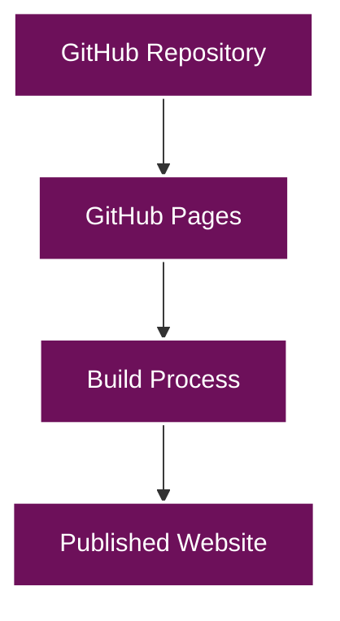
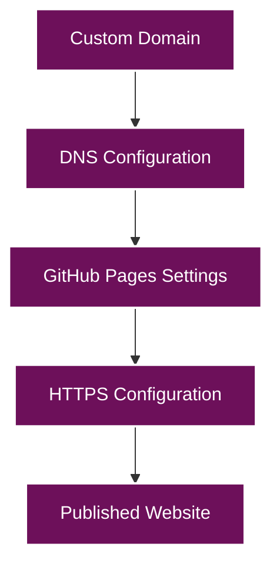

# Deployment Guide

This document provides comprehensive instructions for deploying radicalkjax.com to GitHub Pages and setting up a custom domain.

**Last Updated:** September 2025

## Table of Contents

- [GitHub Pages Deployment](#github-pages-deployment)
  - [Repository Setup](#repository-setup)
  - [Branch Configuration](#branch-configuration)
  - [GitHub Actions](#github-actions)
  - [Deployment Process](#deployment-process)
- [Custom Domain Setup](#custom-domain-setup)
  - [Domain Registration](#domain-registration)
  - [DNS Configuration](#dns-configuration)
  - [HTTPS Configuration](#https-configuration)
- [Troubleshooting](#troubleshooting)
  - [Common Issues](#common-issues)
  - [Build Failures](#build-failures)
  - [DNS Issues](#dns-issues)
- [Maintenance](#maintenance)
  - [Regular Updates](#regular-updates)
  - [Performance Monitoring](#performance-monitoring)
  - [Security Considerations](#security-considerations)

## GitHub Pages Deployment

GitHub Pages is a static site hosting service that takes HTML, CSS, and JavaScript files directly from a repository on GitHub, optionally runs the files through a build process, and publishes a website.



### Repository Setup

1. **Create a GitHub Repository**:

   - For a user or organization site, create a repository named `username.github.io` (where `username` is your GitHub username or organization name).
   - For a project site, create a repository with any name.

2. **Initialize the Repository**:

   ```bash
   git init
   git add .
   git commit -m "Initial commit"
   git branch -M main
   git remote add origin https://github.com/username/repository-name.git
   git push -u origin main
   ```

### Branch Configuration

1. **Configure GitHub Pages**:

   - Go to your repository on GitHub.
   - Click on "Settings".
   - Scroll down to the "GitHub Pages" section.
   - Select the branch you want to deploy from (usually `main` or `gh-pages`).
   - Click "Save".

2. **Configure Jekyll**:

   - Ensure your repository contains a `_config.yml` file with the following settings:

     ```yaml
     # Site settings
     title: [SITE OWNER] (@USERNAME)
     description: Software Engineer, Security Researcher, AI Expert
     url: "https://yourdomain.com"  # Replace with your domain or GitHub Pages URL
     baseurl: ""  # Leave empty for user/organization sites, or use "/repository-name" for project sites

     # Build settings
     markdown: kramdown
     permalink: /:year/:month/:day/:title.html

     # GitHub Pages settings
     github: [metadata]
     encoding: UTF-8
     kramdown:
       input: GFM
       hard_wrap: false
     future: true
     jailed: false
     theme: jekyll-theme-primer
     gfm_quirks: paragraph_end
     ```

### GitHub Actions

GitHub Actions can be used to automate the build and deployment process. Create a workflow file at `.github/workflows/github-pages.yml`:

```yaml
name: Build and Deploy to GitHub Pages

on:
  push:
    branches: [ main ]
  pull_request:
    branches: [ main ]

jobs:
  build-and-deploy:
    runs-on: ubuntu-latest
    steps:
      - name: Checkout 🛎️
        uses: actions/checkout@v2

      - name: Setup Ruby 💎
        uses: ruby/setup-ruby@v1
        with:
          ruby-version: '3.0'
          bundler-cache: true

      - name: Install and Build 🔧
        run: |
          gem install bundler
          bundle install
          bundle exec jekyll build

      - name: Deploy 🚀
        uses: JamesIves/github-pages-deploy-action@4.1.4
        with:
          branch: gh-pages
          folder: _site
          clean: true
```

### Deployment Process

The deployment process follows these steps:


1. **Push Changes**: Push your changes to the configured branch.
2. **Build Process**: GitHub Pages (or GitHub Actions) will build your Jekyll site.
3. **Deployment**: The built site is deployed to GitHub Pages.
4. **Publication**: The site is published at `https://username.github.io` or your custom domain.

## Custom Domain Setup

You can use a custom domain with GitHub Pages to make your site available at a domain you own.



### Domain Registration

1. **Register a Domain**: Register a domain with a domain registrar of your choice (e.g., Namecheap, GoDaddy, Google Domains).

2. **Access DNS Settings**: Access the DNS settings for your domain through your registrar's control panel.

### DNS Configuration

#### For an Apex Domain (e.g., `example.com`)

Configure A records to point to GitHub Pages' IP addresses:

```
185.199.108.153
185.199.109.153
185.199.110.153
185.199.111.153
```

Example DNS configuration:

| Type | Name | Value | TTL |
|------|------|-------|-----|
| A | @ | 185.199.108.153 | 3600 |
| A | @ | 185.199.109.153 | 3600 |
| A | @ | 185.199.110.153 | 3600 |
| A | @ | 185.199.111.153 | 3600 |

#### For a Subdomain (e.g., `www.example.com`)

Configure a CNAME record to point to your GitHub Pages site:

| Type | Name | Value | TTL |
|------|------|-------|-----|
| CNAME | www | username.github.io | 3600 |

### GitHub Pages Configuration

1. **Add a CNAME File**: Create a file named `CNAME` in the root of your repository with your custom domain:

   ```
   example.com
   ```

2. **Configure GitHub Pages Settings**:

   - Go to your repository on GitHub.
   - Click on "Settings".
   - Scroll down to the "GitHub Pages" section.
   - Enter your custom domain in the "Custom domain" field.
   - Click "Save".

### HTTPS Configuration

GitHub Pages automatically secures custom domains with HTTPS. To enable HTTPS:

1. **Wait for DNS Propagation**: After configuring your DNS settings, wait for the changes to propagate (can take up to 24 hours).

2. **Enable HTTPS**:
   - Go to your repository on GitHub.
   - Click on "Settings".
   - Scroll down to the "GitHub Pages" section.
   - Check the "Enforce HTTPS" checkbox.
   - If the checkbox is grayed out, wait for GitHub to provision your SSL certificate (can take up to 24 hours).

## Troubleshooting

### Common Issues

#### Site Not Building

1. **Check Build Logs**: Review the GitHub Pages build logs for errors.
2. **Validate Jekyll Configuration**: Ensure your `_config.yml` file is valid.
3. **Check for Syntax Errors**: Validate your Markdown and HTML files for syntax errors.

#### Custom Domain Not Working

1. **Verify DNS Configuration**: Ensure your DNS records are correctly configured.
2. **Check CNAME File**: Verify that your `CNAME` file contains only your domain name.
3. **Wait for DNS Propagation**: DNS changes can take up to 24 hours to propagate.

#### HTTPS Not Working

1. **Check Certificate Status**: Verify that GitHub has provisioned an SSL certificate for your domain.
2. **Enforce HTTPS**: Ensure the "Enforce HTTPS" checkbox is checked in your GitHub Pages settings.
3. **Check for Mixed Content**: Ensure all resources (images, scripts, etc.) are loaded over HTTPS.

### Build Failures

Common build failures and their solutions:

#### Dependency Errors

```
Error: Missing dependency: X
```

Solution: Add the missing dependency to your `Gemfile` and run `bundle install`.

#### Liquid Syntax Errors

```
Liquid Exception: Invalid syntax in file X
```

Solution: Check the Liquid syntax in the specified file and fix any errors.

#### Front Matter Errors

```
Error: Invalid front matter in file X
```

Solution: Ensure the front matter in the specified file is valid YAML.

### DNS Issues

#### DNS Propagation

DNS changes can take up to 24 hours to propagate. To check if your DNS changes have propagated:

```bash
dig example.com +noall +answer
```

#### DNS Verification

To verify that your DNS records are correctly configured:

```bash
dig example.com A +noall +answer
dig www.example.com CNAME +noall +answer
```

## Maintenance

### Regular Updates

1. **Update Dependencies**: Regularly update your Jekyll and gem dependencies:

   ```bash
   bundle update
   ```

2. **Check for GitHub Pages Updates**: Stay informed about GitHub Pages updates and adjust your site accordingly.

3. **Content Updates**: Regularly update your content to keep your site fresh and relevant.

### Performance Monitoring

1. **Google PageSpeed Insights**: Use Google PageSpeed Insights to monitor your site's performance.

2. **Google Analytics**: Set up Google Analytics to track user behavior and site performance.

3. **GitHub Pages Status**: Monitor the GitHub Pages status page for any service disruptions.

### Security Considerations

1. **Keep Dependencies Updated**: Regularly update your dependencies to patch security vulnerabilities.

2. **Use HTTPS**: Always use HTTPS to secure your site.

3. **Content Security Policy**: Consider implementing a Content Security Policy to protect against XSS attacks.

4. **Minimize Third-Party Scripts**: Minimize the use of third-party scripts to reduce security risks.

## Next Steps

- [Customization Guide](../customization/README.md)
