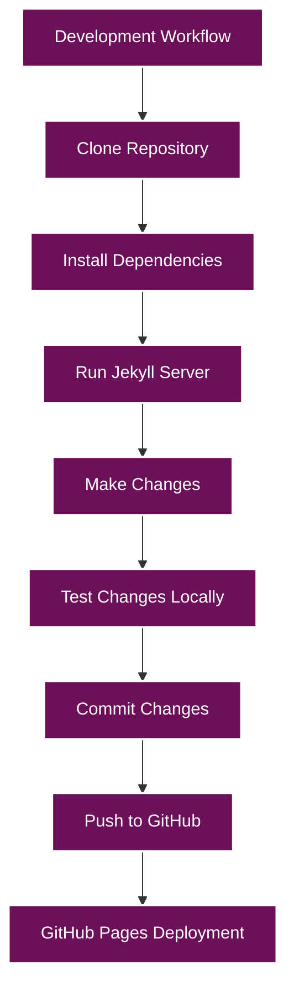
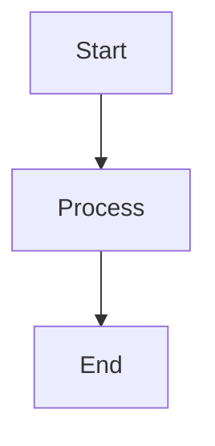

# Development Guide

This document provides comprehensive instructions for local development, content creation, and testing for the site.

## Table of Contents

- [Local Development Setup](#local-development-setup)
  - [Prerequisites](#prerequisites)
  - [Installation](#installation)
  - [Running the Site Locally](#running-the-site-locally)
  - [Development Workflow](#development-workflow)
- [Content Creation](#content-creation)
  - [Blog Posts](#blog-posts)
  - [Pages](#pages)
  - [Projects](#projects)
  - [Photos](#photos)
- [Testing](#testing)
  - [Local Testing](#local-testing)
  - [Cross-Browser Testing](#cross-browser-testing)
  - [Mobile Testing](#mobile-testing)
- [Best Practices](#best-practices)
  - [Code Style](#code-style)
  - [Performance Optimization](#performance-optimization)
  - [Accessibility](#accessibility)

## Local Development Setup

### Prerequisites

Before you begin, ensure you have the following installed:

- **Ruby**: Jekyll is built on Ruby. Install Ruby 2.7.0 or higher.
- **RubyGems**: The package manager for Ruby.
- **GCC and Make**: Required for building native extensions.
- **Jekyll**: The static site generator.
- **Bundler**: Manages Ruby gem dependencies.
- **Git**: Version control system.

### Installation

1. **Clone the Repository**:

   ```bash
   git clone https://github.com/radicalkjax/radicalkjax.github.io.git
   cd radicalkjax.github.io
   ```

2. **Install Jekyll and Bundler**:

   ```bash
   gem install jekyll bundler
   ```

3. **Install Dependencies**:

   ```bash
   bundle install
   ```

### Running the Site Locally

1. **Start the Jekyll Server**:

   ```bash
   bundle exec jekyll serve
   ```

2. **Access the Site**:

   Open your browser and navigate to `http://localhost:4000`.

3. **Live Reload**:

   Jekyll includes live reload by default. Changes to files will automatically trigger a rebuild and refresh your browser.

### Development Workflow



1. **Make Changes**: Edit files in your local repository.
2. **Test Changes Locally**: View changes at `http://localhost:4000`.
3. **Commit Changes**: Commit your changes to Git.
4. **Push to GitHub**: Push your changes to GitHub.
5. **GitHub Pages Deployment**: GitHub Pages will automatically build and deploy your site.

## Content Creation

### Blog Posts

Blog posts are written in Markdown and stored in the `_posts` directory. Each post should follow the naming convention `YYYY-MM-DD-title.md`.

#### Blog Post Front Matter

```yaml
---
layout: post
title: Your Post Title
date: YYYY-MM-DD
tags: [tag1, tag2, tag3]
---
```

#### Blog Post Structure

```markdown
---
layout: post
title: Example Blog Post
date: 2025-05-15
tags: [blog, example, tutorial]
---

## Introduction

This is an example blog post. You can write your content here using Markdown syntax.

## Section 1

This is the first section of your blog post.

### Subsection

This is a subsection of Section 1.

## Section 2

This is the second section of your blog post.

### Code Example

```javascript
function example() {
  console.log("This is an example code block");
}
```

## Conclusion

This is the conclusion of your blog post.
```

#### Adding Images to Blog Posts

1. **Save the Image**: Save your image to the `assets/images/blog/` directory.
2. **Reference the Image**: Use the following Markdown syntax to include the image in your post:

   ```markdown
   
   ```

#### Adding Mermaid Diagrams

Mermaid diagrams are supported in blog posts. Use the following syntax:

````markdown

````

### Pages

Pages are written in HTML with Liquid templating and stored in the root directory or subdirectories.

#### Page Front Matter

```yaml
---
layout: default
title: Your Page Title
custom_css: |
  .custom-class {
    property: value;
  }
---
```

#### Page Structure

```html
---
layout: default
title: Example Page
custom_css: |
  .example-container {
    max-width: 800px;
    margin: 0 auto;
  }
---

<div class="example-container">
  <h1>Example Page</h1>
  <p>This is an example page. You can write your content here using HTML.</p>
  
  <section>
    <h2>Section 1</h2>
    <p>This is the first section of your page.</p>
  </section>
  
  <section>
    <h2>Section 2</h2>
    <p>This is the second section of your page.</p>
  </section>
</div>
```

### Projects

Project pages are stored in the `projects` directory and follow a similar structure to regular pages.

#### Project Page Front Matter

```yaml
---
layout: default
title: Your Project Title
custom_css: |
  .project-container {
    max-width: 800px;
    margin: 0 auto;
  }
---
```

#### Project Page Structure

```html
---
layout: default
title: Example Project
custom_css: |
  .connections-container {
    max-width: 800px;
    margin: 0 auto;
  }
---

<div class="connections-container">
  <section class="connections-section">
    <h1 style="margin-bottom: 30px;">Example Project</h1>
    
    <div class="connections-intro">
      <p>This is an example project page. You can write your project description here.</p>
      <p>Include details about the project, technologies used, and your role.</p>
    </div>
    
    <div class="project-tags" style="margin-top: 20px;">
      <a href="#">tag1</a>
      <a href="#">tag2</a>
      <a href="#">tag3</a>
    </div>
    
    <div class="project-links" style="margin-top: 20px;">
      <a href="#"><i class="fab fa-github"></i> GitHub</a>
      <a href="#"><i class="fas fa-external-link-alt"></i> Project Page</a>
    </div>
  </section>
</div>
```

### Photos

Photo galleries are stored in the `art/photos.html` file and reference images in the `assets/images/photos/` directory.

#### Adding Photos

1. **Save the Photo**: Save your photo to the appropriate subdirectory in `assets/images/photos/`.
2. **Update the Photo Gallery**: Edit the `art/photos.html` file to include your new photo:

   ```html
   <div class="photo-item">
     
     <div class="photo-info">
       <h3 class="photo-title">Photo Title</h3>
       <p class="photo-description">Photo description goes here.</p>
       <div class="photo-tags">
         <a href="#">tag1</a>
         <a href="#">tag2</a>
       </div>
     </div>
   </div>
   ```

## Testing

### Local Testing

1. **Visual Testing**: View your changes at `http://localhost:4000` to ensure they appear as expected.
2. **Link Testing**: Click through all links to ensure they work correctly.
3. **Form Testing**: Test any forms to ensure they submit correctly.
4. **JavaScript Testing**: Test any JavaScript functionality to ensure it works as expected.

### Cross-Browser Testing

Test your site in multiple browsers to ensure compatibility:

- **Chrome**: Latest version
- **Firefox**: Latest version
- **Safari**: Latest version
- **Edge**: Latest version

### Mobile Testing

Test your site on multiple devices and screen sizes:

1. **Chrome DevTools**: Use Chrome DevTools to simulate different devices.
2. **Physical Devices**: Test on physical devices when possible.
3. **Responsive Design Testing**: Resize your browser window to test responsive breakpoints.

## Best Practices

### Code Style

- **HTML**: Use semantic HTML elements and proper indentation.
- **CSS**: Use consistent naming conventions and organize properties logically.
- **JavaScript**: Follow modern JavaScript best practices and use comments for complex logic.
- **Markdown**: Use proper Markdown syntax and structure.

### Performance Optimization

- **Image Optimization**: Optimize images for web use (compress, resize).
- **CSS Minification**: Consider minifying CSS for production.
- **JavaScript Minification**: Consider minifying JavaScript for production.
- **Lazy Loading**: Use lazy loading for images when appropriate.

### Accessibility

- **Semantic HTML**: Use semantic HTML elements for better accessibility.
- **Alt Text**: Always include alt text for images.
- **ARIA Attributes**: Use ARIA attributes when necessary.
- **Keyboard Navigation**: Ensure the site is navigable using only a keyboard.
- **Color Contrast**: Ensure sufficient color contrast for text readability.

## Next Steps

- [Deployment Guide](../deployment/README.md)
- [Customization Guide](../customization/README.md)
