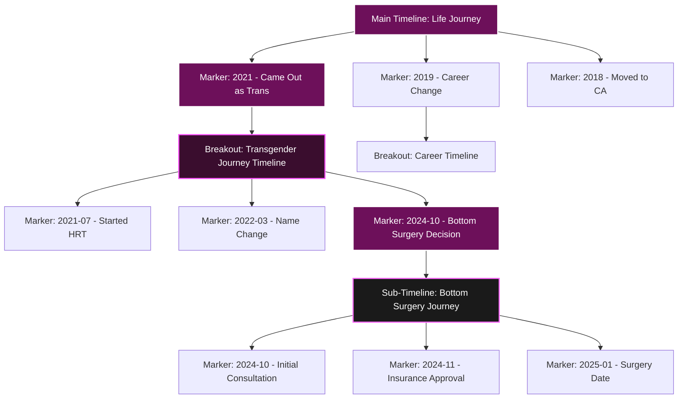
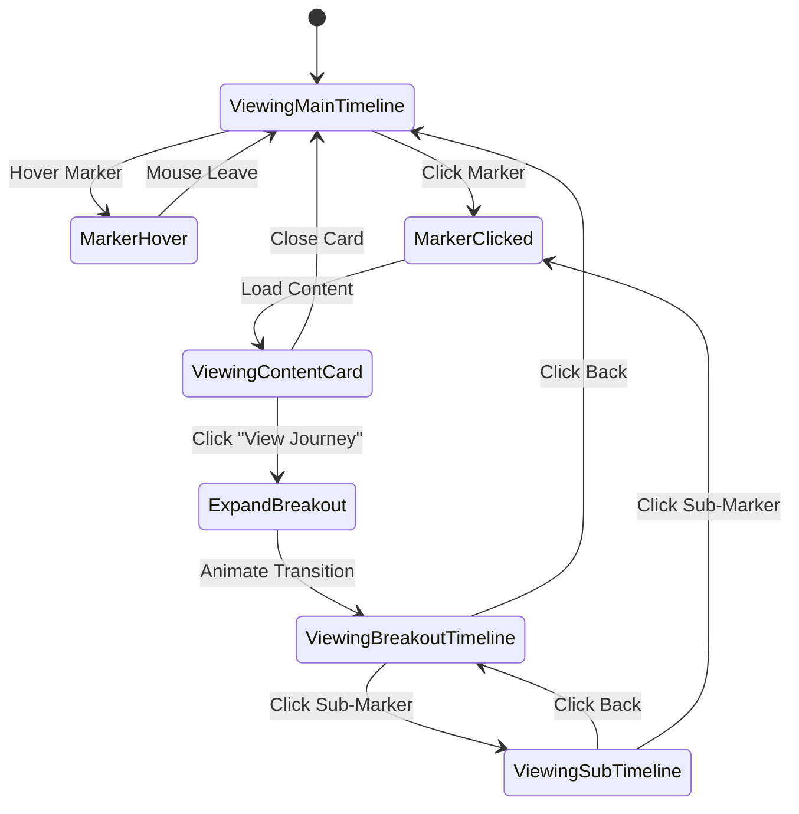
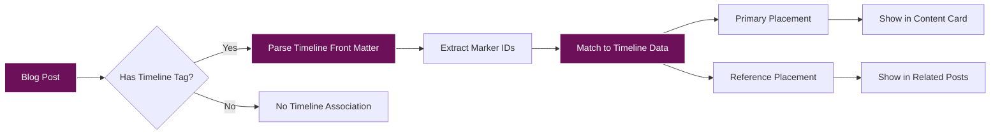

# Interactive Life Journey Timeline - Implementation Plan

**Project:** Interactive Timeline System for Personal Journey Page
**Created:** October 2025
**Status:** Planning Phase

---

## Table of Contents

- [Overview](#overview)
- [Visual Concept](#visual-concept)
- [Architecture](#architecture)
- [Data Structure](#data-structure)
- [Component Design](#component-design)
- [Interaction Patterns](#interaction-patterns)
- [Blog Post Integration](#blog-post-integration)
- [Implementation Roadmap](#implementation-roadmap)
- [Technical Specifications](#technical-specifications)

---

## Overview

Create an interactive, hierarchical timeline system that allows readers to explore your life journey through:

- **Main Timeline**: High-level life journey
- **Breakout Timelines**: Specific journey categories (e.g., transgender journey, career path)
- **Sub-Timelines**: Detailed sub-journeys (e.g., bottom surgery journey within transgender journey)
- **Interactive Markers**: Clickable points with photos, links, resources, and blog post connections
- **Blog Post Tagging**: Tag posts to timeline markers with custom date placement

### Key Features

✅ Vertical timeline on left side (similar to TOC/Navigator pattern)
✅ Hierarchical structure (main → breakout → sub-timeline)
✅ Interactive markers with rich content (photos, links, previews)
✅ Blog post integration with custom date tagging
✅ Smooth animations and transitions
✅ Mobile responsive with overlay pattern
✅ Follows existing design system (purple/pink theme)

---

## Visual Concept

### Desktop Layout (>992px)

```
┌──────────────────────────────────────────────────────────────────┐
│                        HEADER                                     │
└──────────────────────────────────────────────────────────────────┘

┌────────────────┐  ┌───────────────────────────────────────────┐
│                │  │                                            │
│   TIMELINE     │  │         MAIN CONTENT                      │
│   (Fixed Left) │  │                                            │
│                │  │    Introduction to Personal Journey        │
│   ● 2023       │  │                                            │
│   │            │  │    Selected Timeline Content Shows Here   │
│   │            │  │                                            │
│   ● 2022       │  │    ┌──────────────────────────────┐       │
│   │            │  │    │  Marker Content Card         │       │
│   │            │  │    │  • Photo                     │       │
│   ◉ 2021 ◄─────┼──┼────┤  • Description              │       │
│   │  Active    │  │    │  • Links                     │       │
│   │            │  │    │  • Blog Posts                │       │
│   ● 2020       │  │    └──────────────────────────────┘       │
│   │            │  │                                            │
│   [Expand]     │  │                                            │
│   │            │  │                                            │
│   ● 2019       │  │                                            │
│                │  │                                            │
└────────────────┘  └───────────────────────────────────────────┘
```

### Hierarchical Timeline Structure



### Timeline Marker States

```
┌─────────────────────────────────────┐
│  Timeline Marker Visual States      │
└─────────────────────────────────────┘

Default Marker:
    ●  2023-05-15
    │  Started New Role
    │

Active/Selected Marker:
    ◉  2023-05-15  ◄─── Glowing
    ┃  Started New Role
    ┃  ┌──────────────┐
    ┃  │ Content Card │
    ┃  └──────────────┘

Expandable Marker (has breakout):
    ⊕  2021-08-01
    │  Transgender Journey
    │  [Click to expand →]
    │

Expanded Marker:
    ⊖  2021-08-01
    ┃  Transgender Journey
    ┃  ├─ ● 2021-08-15 - Started HRT
    ┃  ├─ ● 2022-03-20 - Name Change
    ┃  └─ ⊕ 2024-10-30 - Bottom Surgery
    │      └─ [Has sub-timeline]
```

---

## Architecture

### System Components

```mermaid
graph TD
    A[Timeline System] --> B[Data Layer]
    A --> C[UI Components]
    A --> D[Interaction Layer]
    A --> E[Blog Integration]

    B --> B1[timeline-data.json]
    B --> B2[Front Matter Tags]
    B --> B3[Date/Event Mapping]

    C --> C1[Timeline Container]
    C --> C2[Timeline Markers]
    C --> C3[Content Cards]
    C --> C4[Navigation Controls]

    D --> D1[Click Handlers]
    D --> D2[Expand/Collapse]
    D --> D3[Scroll Sync]
    D --> D4[Filter/Search]

    E --> E1[Post Discovery]
    E --> E2[Tag Matching]
    E --> E3[Content Preview]

    style A fill:#6d105a,stroke:#fff,stroke-width:2px,color:#fff
    style B fill:#6d105a,stroke:#fff,stroke-width:2px,color:#fff
    style C fill:#6d105a,stroke:#fff,stroke-width:2px,color:#fff
    style D fill:#6d105a,stroke:#fff,stroke-width:2px,color:#fff
    style E fill:#6d105a,stroke:#fff,stroke-width:2px,color:#fff
```



### File Structure

```
/Users/kali/blog/
├── about/
│   └── trans-journey.html          # Will become timeline-based
├── _data/
│   └── timeline.json               # Timeline data structure
├── assets/
│   ├── css/
│   │   └── timeline.css           # Timeline component styles
│   ├── js/
│   │   ├── timeline.js            # Main timeline logic
│   │   ├── timeline-renderer.js   # Visual rendering
│   │   └── timeline-blog-integration.js  # Blog post connections
│   └── images/
│       └── timeline/              # Timeline-specific images
├── _posts/
│   └── *.md                       # Blog posts with timeline tags
└── pages/
    └── personal-journey.html      # New landing page with timeline
```

---

## Data Structure

### Timeline Data Schema

```json
{
  "timeline": {
    "id": "main-life-journey",
    "title": "Life Journey",
    "description": "My personal journey through life",
    "type": "main",
    "markers": [
      {
        "id": "marker-2021-coming-out",
        "date": "2021-08-01",
        "title": "Coming Out as Transgender",
        "description": "A pivotal moment in my life where I publicly came out as a transgender woman.",
        "icon": "butterfly",
        "color": "#f84ef8",
        "image": "/assets/images/timeline/2021-coming-out.jpg",
        "links": [
          {
            "title": "Read My Coming Out Post",
            "url": "/2021/08/01/coming-out-story.html",
            "type": "blog"
          },
          {
            "title": "LGBTQ+ Resources",
            "url": "https://www.glaad.org/transgender/resources",
            "type": "external"
          }
        ],
        "blogTags": ["transgender", "coming-out"],
        "hasBreakout": true,
        "breakoutTimeline": {
          "id": "transgender-journey",
          "title": "Transgender Journey",
          "description": "My journey as a transgender woman",
          "type": "breakout",
          "markers": [
            {
              "id": "marker-2021-hrt-start",
              "date": "2021-08-15",
              "title": "Started HRT",
              "description": "Beginning hormone replacement therapy.",
              "icon": "prescription-bottle",
              "image": "/assets/images/timeline/hrt-start.jpg",
              "links": [
                {
                  "title": "My HRT Journey",
                  "url": "/2021/08/15/starting-hrt.html",
                  "type": "blog"
                }
              ],
              "blogTags": ["transgender", "hrt"],
              "hasBreakout": false
            },
            {
              "id": "marker-2024-bottom-surgery",
              "date": "2024-10-30",
              "title": "Bottom Surgery Decision",
              "description": "Made the decision to pursue gender confirmation surgery.",
              "icon": "hospital",
              "image": "/assets/images/timeline/surgery-decision.jpg",
              "links": [
                {
                  "title": "Bottom Surgery: Hurdles, Prep, and Joy",
                  "url": "/2024/10/30/bottom-surgery-hurdles-prep-and-joy.html",
                  "type": "blog"
                }
              ],
              "blogTags": ["transgender", "bottom-surgery"],
              "hasBreakout": true,
              "breakoutTimeline": {
                "id": "bottom-surgery-journey",
                "title": "Bottom Surgery Journey",
                "description": "The detailed journey through gender confirmation surgery",
                "type": "sub-timeline",
                "markers": [
                  {
                    "id": "marker-2024-consultation",
                    "date": "2024-10-30",
                    "title": "Initial Consultation",
                    "description": "First meeting with surgeon.",
                    "icon": "user-md",
                    "blogTags": ["transgender", "bottom-surgery", "consultation"]
                  },
                  {
                    "id": "marker-2024-insurance",
                    "date": "2024-11-15",
                    "title": "Insurance Approval",
                    "description": "Received insurance approval for surgery.",
                    "icon": "file-contract",
                    "blogTags": ["transgender", "bottom-surgery", "insurance"]
                  }
                ]
              }
            }
          ]
        }
      },
      {
        "id": "marker-2019-career-change",
        "date": "2019-05-01",
        "title": "Career Transition to Tech",
        "description": "Started my career as a Technical Solutions Specialist.",
        "icon": "laptop-code",
        "image": "/assets/images/timeline/career-start.jpg",
        "links": [
          {
            "title": "My Career Journey",
            "url": "/projects.html",
            "type": "internal"
          }
        ],
        "blogTags": ["career", "professional"],
        "hasBreakout": true,
        "breakoutTimeline": {
          "id": "career-timeline",
          "title": "Professional Career",
          "description": "My professional journey in technology",
          "type": "breakout",
          "markers": []
        }
      }
    ]
  }
}
```

### Blog Post Front Matter Integration

```yaml
---
layout: post
title: "Bottom Surgery: Hurdles, Prep, and Joy"
date: 2024-10-30
tags:
  - transgender
  - bottom-surgery
  - personal
timeline:
  - id: "marker-2024-bottom-surgery"
    date: "2024-10-30"
    placement: "primary"  # or "reference"
  - id: "marker-2024-consultation"
    date: "2024-10-30"
    placement: "reference"
---
```

---

## Component Design

### Timeline Container Component

```html
<div id="timeline-container" class="timeline-container" role="navigation" aria-label="Life Journey Timeline">
  <!-- Timeline Header -->
  <div class="timeline-header">
    <h2 class="timeline-title">Life Journey</h2>
    <button class="timeline-collapse" aria-label="Collapse Timeline">−</button>
  </div>

  <!-- Timeline Navigation -->
  <nav class="timeline-nav">
    <!-- Search/Filter -->
    <div class="timeline-search">
      <input type="text" placeholder="Search journey..." aria-label="Search timeline">
      <button class="timeline-filter" aria-label="Filter timeline">
        <i class="fas fa-filter"></i>
      </button>
    </div>

    <!-- Timeline Content -->
    <div class="timeline-content">
      <!-- Timeline Line -->
      <div class="timeline-line"></div>

      <!-- Timeline Markers -->
      <div class="timeline-markers">
        <!-- Generated dynamically from JSON -->
      </div>
    </div>
  </nav>

  <!-- Mobile Toggle -->
  <button class="timeline-mobile-toggle" aria-label="Toggle Timeline">
    ⏱️
  </button>
</div>
```

### Timeline Marker Component

```html
<!-- Standard Marker -->
<div class="timeline-marker"
     data-marker-id="marker-2021-coming-out"
     data-date="2021-08-01"
     data-has-breakout="true"
     role="button"
     aria-expanded="false"
     tabindex="0">

  <!-- Marker Dot -->
  <div class="marker-dot">
    <i class="fas fa-butterfly"></i>
  </div>

  <!-- Marker Content -->
  <div class="marker-content">
    <time class="marker-date" datetime="2021-08-01">August 2021</time>
    <h3 class="marker-title">Coming Out as Transgender</h3>
    <p class="marker-description">A pivotal moment in my life...</p>

    <!-- Expand Button (if has breakout) -->
    <button class="marker-expand" aria-label="Expand timeline">
      <span class="expand-text">View Journey</span>
      <i class="fas fa-chevron-right"></i>
    </button>
  </div>

  <!-- Connector to Breakout -->
  <div class="marker-connector" aria-hidden="true"></div>
</div>

<!-- Breakout Timeline (Hidden by default) -->
<div class="timeline-breakout"
     id="breakout-transgender-journey"
     data-parent-marker="marker-2021-coming-out"
     hidden>

  <div class="breakout-header">
    <button class="breakout-back" aria-label="Back to main timeline">
      <i class="fas fa-arrow-left"></i>
    </button>
    <h3 class="breakout-title">Transgender Journey</h3>
  </div>

  <div class="breakout-content">
    <!-- Nested markers -->
  </div>
</div>
```

### Content Card Component

```html
<!-- Appears in main content area when marker is clicked -->
<article class="timeline-content-card"
         data-marker-id="marker-2021-coming-out"
         role="article">

  <!-- Card Header -->
  <header class="content-card-header">
    <time datetime="2021-08-01">August 1, 2021</time>
    <h2>Coming Out as Transgender</h2>
  </header>

  <!-- Card Image -->
  <div class="content-card-image">
    
  </div>

  <!-- Card Body -->
  <div class="content-card-body">
    <p class="content-card-description">
      A pivotal moment in my life where I publicly came out as a transgender woman.
      This marked the beginning of my authentic journey...
    </p>

    <!-- Resources -->
    <div class="content-card-links">
      <h3>Resources</h3>
      <ul>
        <li>
          <a href="/2021/08/01/coming-out-story.html">
            <i class="fas fa-blog"></i>
            Read My Coming Out Post
          </a>
        </li>
        <li>
          <a href="https://www.glaad.org/transgender/resources" target="_blank">
            <i class="fas fa-external-link-alt"></i>
            LGBTQ+ Resources
          </a>
        </li>
      </ul>
    </div>

    <!-- Related Blog Posts -->
    <div class="content-card-posts">
      <h3>Related Posts</h3>
      <div class="post-previews">
        <!-- Dynamically loaded based on tags -->
      </div>
    </div>
  </div>

  <!-- Card Footer -->
  <footer class="content-card-footer">
    <button class="btn-view-breakout">
      <i class="fas fa-sitemap"></i>
      View Transgender Journey Timeline
    </button>
  </footer>
</article>
```

---

## Interaction Patterns

### User Flow Diagram



### Interaction States

#### 1. Default State
- Timeline visible on left side
- Main timeline markers displayed
- No content card shown
- Scroll position saved

#### 2. Marker Hover State
```css
.timeline-marker:hover {
  transform: translateX(5px);
  .marker-dot {
    box-shadow: 0 0 20px var(--color-accent);
    transform: scale(1.2);
  }
}
```

#### 3. Marker Active State
- Marker dot glows with pink accent
- Connected line thickens
- Content card slides into main area
- URL updates with marker hash
- Scroll position locks

#### 4. Breakout Expanded State
- Main timeline slides left
- Breakout timeline slides in from right
- Visual connector animates
- Back button appears
- Breadcrumb shows hierarchy

#### 5. Mobile State
- Timeline becomes overlay (like TOC)
- Hamburger icon shows timeline emoji ⏱️
- Full-screen takeover with dark backdrop
- Swipe gestures for navigation

---

## Blog Post Integration

### Tag System



### Blog Post Discovery Logic

```javascript
// Pseudo-code for blog post integration
class TimelineBlogIntegration {

  // Find all posts tagged to a specific marker
  async getPostsForMarker(markerId) {
    const posts = await this.getAllPosts();
    return posts.filter(post => {
      return post.timeline?.some(t => t.id === markerId);
    });
  }

  // Get primary post for marker (featured content)
  async getPrimaryPost(markerId) {
    const posts = await this.getPostsForMarker(markerId);
    return posts.find(post => {
      return post.timeline?.some(t =>
        t.id === markerId && t.placement === 'primary'
      );
    });
  }

  // Get reference posts (related content)
  async getReferencePost(markerId) {
    const posts = await this.getPostsForMarker(markerId);
    return posts.filter(post => {
      return post.timeline?.some(t =>
        t.id === markerId && t.placement === 'reference'
      );
    });
  }

  // Generate post preview card
  generatePostPreview(post) {
    return `
      <div class="post-preview">
        <time>${post.date}</time>
        <h4><a href="${post.url}">${post.title}</a></h4>
        <p>${post.excerpt}</p>
      </div>
    `;
  }
}
```

---

## Implementation Roadmap

### Phase 1: Foundation (Week 1)
- [ ] Create `_data/timeline.json` structure
- [ ] Design timeline CSS following design system
- [ ] Build basic timeline container component
- [ ] Implement timeline renderer from JSON
- [ ] Create static markers (no interaction)

### Phase 2: Interactivity (Week 2)
- [ ] Add click handlers for markers
- [ ] Implement content card display
- [ ] Add expand/collapse animations
- [ ] Implement breakout timeline transitions
- [ ] Add keyboard navigation support

### Phase 3: Blog Integration (Week 3)
- [ ] Create blog post tag system
- [ ] Build post discovery logic
- [ ] Implement post preview cards
- [ ] Add dynamic content loading
- [ ] Test with existing blog posts

### Phase 4: Advanced Features (Week 4)
- [ ] Add search/filter functionality
- [ ] Implement URL routing with hash
- [ ] Add share buttons for markers
- [ ] Create timeline export feature
- [ ] Add timeline analytics tracking

### Phase 5: Polish & Launch (Week 5)
- [ ] Mobile responsive refinements
- [ ] Accessibility audit (ARIA, keyboard nav)
- [ ] Performance optimization
- [ ] Cross-browser testing
- [ ] Documentation and launch

---

## Technical Specifications

### CSS Architecture

```css
/* Timeline Container */
.timeline-container {
  position: fixed;
  left: 20px;
  top: 150px;
  width: 320px;
  max-height: calc(100vh - 200px);
  background-color: #1a1a1a;
  border: 2px solid #6d105a;
  border-radius: 4px;
  box-shadow: 0 4px 8px rgba(0, 0, 0, 0.5);
  z-index: 1000;
  overflow: hidden;
  display: flex;
  flex-direction: column;
}

/* Timeline Line */
.timeline-line {
  position: absolute;
  left: 30px;
  top: 0;
  bottom: 0;
  width: 3px;
  background: linear-gradient(
    to bottom,
    transparent 0%,
    #6d105a 10%,
    #f84ef8 50%,
    #6d105a 90%,
    transparent 100%
  );
}

/* Marker Dot */
.marker-dot {
  width: 20px;
  height: 20px;
  border-radius: 50%;
  background: #6d105a;
  border: 3px solid #fff;
  position: relative;
  z-index: 2;
  display: flex;
  align-items: center;
  justify-content: center;
  transition: all 0.3s ease;
  cursor: pointer;
}

.marker-dot:hover {
  transform: scale(1.3);
  box-shadow: 0 0 20px #f84ef8;
  background: #f84ef8;
}

.marker-dot.active {
  background: #f84ef8;
  box-shadow: 0 0 30px #f84ef8;
  animation: pulse 2s infinite;
}

@keyframes pulse {
  0%, 100% {
    box-shadow: 0 0 30px #f84ef8;
  }
  50% {
    box-shadow: 0 0 50px #ff6bff;
  }
}

/* Content Card */
.timeline-content-card {
  background-color: rgba(109, 16, 90, 0.7);
  border: 2px solid #fff;
  padding: 30px;
  margin: 20px 0;
  position: relative;
  animation: slideIn 0.4s ease;
}

@keyframes slideIn {
  from {
    opacity: 0;
    transform: translateY(20px);
  }
  to {
    opacity: 1;
    transform: translateY(0);
  }
}

/* Breakout Transition */
.timeline-breakout {
  position: absolute;
  left: 100%;
  top: 0;
  width: 100%;
  height: 100%;
  background: #1a1a1a;
  transition: transform 0.5s cubic-bezier(0.4, 0, 0.2, 1);
  transform: translateX(0);
}

.timeline-breakout.active {
  transform: translateX(-100%);
}
```

### JavaScript API

```javascript
class TimelineSystem {
  constructor(options = {}) {
    this.container = options.container;
    this.dataUrl = options.dataUrl || '/_data/timeline.json';
    this.contentArea = options.contentArea;
    this.currentMarker = null;
    this.currentTimeline = 'main';
    this.history = [];
  }

  async init() {
    await this.loadData();
    this.render();
    this.attachEventListeners();
    this.restoreStateFromURL();
  }

  async loadData() {
    const response = await fetch(this.dataUrl);
    this.data = await response.json();
  }

  render(timeline = 'main') {
    // Render timeline markers
  }

  selectMarker(markerId) {
    // Handle marker selection
    this.currentMarker = markerId;
    this.updateActiveStates();
    this.loadContentCard(markerId);
    this.updateURL(markerId);
  }

  expandBreakout(markerId) {
    // Transition to breakout timeline
    this.history.push({
      timeline: this.currentTimeline,
      marker: this.currentMarker
    });
    this.currentTimeline = markerId;
    this.animateBreakout();
  }

  goBack() {
    // Return to previous timeline level
    const previous = this.history.pop();
    this.currentTimeline = previous.timeline;
    this.animateBack();
  }

  async loadContentCard(markerId) {
    // Load and display content card
    const marker = this.findMarker(markerId);
    const posts = await this.findRelatedPosts(markerId);
    this.renderContentCard(marker, posts);
  }
}

// Initialize timeline
const timeline = new TimelineSystem({
  container: document.getElementById('timeline-container'),
  contentArea: document.getElementById('timeline-content-area'),
  dataUrl: '/_data/timeline.json'
});

timeline.init();
```

### Responsive Breakpoints

```css
/* Desktop: Fixed sidebar */
@media (min-width: 993px) {
  .timeline-container {
    position: fixed;
    left: 20px;
    width: 320px;
  }
}

/* Tablet: Narrower sidebar */
@media (max-width: 992px) and (min-width: 769px) {
  .timeline-container {
    width: 280px;
    left: 10px;
  }
}

/* Mobile: Overlay */
@media (max-width: 768px) {
  .timeline-container {
    position: fixed;
    left: 0;
    top: 0;
    width: 100%;
    height: 100%;
    max-height: 100vh;
    transform: translateX(-100%);
    transition: transform 0.3s ease;
    z-index: 2000;
  }

  .timeline-container.mobile-open {
    transform: translateX(0);
  }

  .timeline-mobile-toggle {
    display: flex;
    position: fixed;
    bottom: 80px;
    right: 20px;
    width: 60px;
    height: 60px;
    border-radius: 50%;
    background: #6d105a;
    border: 2px solid #fff;
    z-index: 1001;
  }
}
```

---

## Visual Examples

### Marker Icon Library

```
Standard Markers:
● - Default event
⊕ - Expandable (has breakout)
⊖ - Expanded (viewing breakout)
◉ - Active/Selected
★ - Milestone
🏳️‍⚧️ - Transgender related
💼 - Career related
🎓 - Education
🏠 - Life event
```

### Color Coding by Category

```css
/* Timeline Categories */
.marker-transgender { --marker-color: #f84ef8; }
.marker-career { --marker-color: #4ef8f8; }
.marker-education { --marker-color: #f8f84e; }
.marker-personal { --marker-color: #ff6bff; }
.marker-milestone { --marker-color: #ffffff; }
```

### Animation Timeline

```
User clicks marker:
0ms   - Click event
50ms  - Marker scales up
100ms - Glow effect starts
200ms - Content card begins slide in
400ms - Content card fully visible
500ms - Related posts fade in
```

---

## Next Steps

1. **Review & Approve Plan**: Review this comprehensive plan
2. **Data Structure First**: Create initial `timeline.json` with real data
3. **Component Development**: Build HTML/CSS components following design system
4. **JavaScript Implementation**: Implement interaction logic
5. **Blog Integration**: Add timeline tags to existing blog posts
6. **Testing & Iteration**: Test with real content and iterate

---

**Questions to Answer Before Implementation:**

1. What are the top 3-5 main timeline categories? (e.g., Transgender Journey, Career, Education, Personal Milestones)
2. Which existing blog posts should be tagged first?
3. Do you have photos/images ready for key timeline markers?
4. Should we implement the full hierarchy (main → breakout → sub) in Phase 1, or start simpler?
5. Any specific accessibility requirements beyond WCAG AA?

---

**Ready to proceed?** Let me know which phase you'd like to start with, or if you'd like me to refine any part of this plan!
