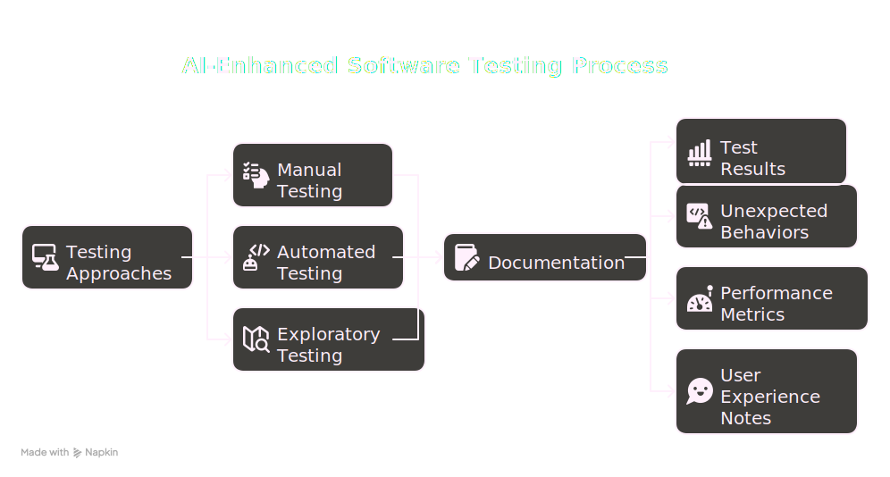
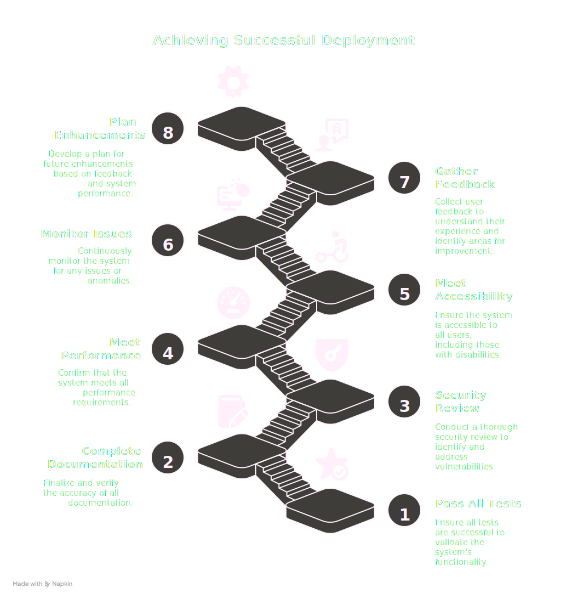

<!-- _class: title _paginate: false _footer: "" -->

# <!-- fit --> <div style="text-align: center;"></div><div style="text-align: center;">Vibe Coding: It's A Legitimate Strategy</div>

## Using AI for Clean, Effective, Up-to-Date, and Secure Code

### A presentation by Kali Jackson
### (@radicalkjax)

<!-- _class: title with-logo -->

# About Kali

<style scoped>
.about-container {
  display: flex;
  justify-content: space-between;
  align-items: center;
  margin-top: 20px;
}

.headshot-container {
  width: 35%;
  display: flex;
  flex-direction: column;
  align-items: center;
  justify-content: center;
}

.headshot-placeholder {
  width: 300px;
  height: 300px;
  border-radius: 50%;
  background-color: rgba(255, 255, 255, 0.2);
  display: flex;
  justify-content: center;
  align-items: center;
  margin-bottom: 15px;
  box-shadow: 0 5px 15px rgba(0, 0, 0, 0.3);
  overflow: hidden;
}

.social-links {
  text-align: center;
  font-size: 0.9em;
  margin-top: 10px;
}

.social-links a {
  color: #ffffff;
  text-decoration: underline;
}

.bio-points {
  width: 60%;
  text-align: left;
  font-size: 1em;
}

.bio-points ul {
  list-style-type: none;
  padding-left: 0;
}

.bio-points li {
  margin-bottom: 10px;
  position: relative;
  padding-left: 25px;
}

.bio-points li:before {
  content: '•';
  position: absolute;
  left: 10px;
  color: rgba(255, 255, 255, 0.8);
  font-size: 1.2em;
}
</style>

<div class="about-container">
  <div class="headshot-container">
    <div class="headshot-placeholder">
      
    </div>
    <div class="social-links">
      <strong>@radicalkjax</strong><br>
      <a href="https://radicalkjax.com">radicalkjax.com</a>
    </div>
  </div>
  
  <div class="bio-points">
    <ul>
      <li>Originally from Merced and grew up on a dairy</li>
      <li>Graduated from CSU Stanislaus</li>
      <li>Worked at Geek Squad while going to school</li>
      <li>I've been doing corpo things for about 6 years</li>
      <li>I've been modding/making/hacking since I was 10</li>
      <li>Enjoy lots of outside time with my gf and puppies</li>
      <li>Huge Pokemon, Sailor Moon and Cowboy Bebop fan</li>
    </ul>
  </div>
</div>

<!-- _class: title overview-slide -->

# <!-- fit --> <h1 style="font-size: 7em; font-weight: bold;">Overview</h1>

<div style="display: flex; flex-direction: column; justify-content: center; align-items: center; height: 60vh; font-size: 1.6em; margin-top: 5px;">

- The AI-Assisted Development Pipeline
- Different Perspectives on the Pipeline
- Documentation Responsibilities
- Impacts to Users
- Addressing Common Concerns
- Conclusion

</div>

<!-- _class: diagram-slide with-logo -->

# <!-- fit --> <span style="margin-left: 120px;">The AI-Assisted Development Pipeline</span>

<div class="diagram-container" style="margin-top: 20px; height: 80vh; text-align: center;">


</div>

# 1. Initial Build

<div class="pipeline-step box-shadow" style="text-align: center;">
Using AI to generate the initial code structure and implementation.
</div>

<div class="columns">
<div class="column compact-list">

## Key Considerations:
- Be specific about requirements
- Provide context about your project
- Specify coding standards and patterns
- Give strong educational and experience background
- Develop strong need to document well
- Give agent artistic style

</div>
<div class="column small-code">

## Effective Prompts:

<div style="font-size: .5em; line-height: 1.6; background-color: rgba(255, 255, 255, 0.1); padding: 15px; border-radius: 5px; margin: 10px 0; font-family: 'DM Mono', monospace; white-space: pre-wrap;">
Hi [agent], my name is [your name]. [Build agent worker profile] [build agent educational background: degrees and certs] [minor technical skills][build agent experience: github] 

[build agent need to document well and visually]
[Initial task][give agent resources for task]
[build agent visual style: give examples such as images, websites or repos]
[build agent art style: give it context such as 'whimsical']

Stop and let me know once you've completed your thorough research and are ready to begin the project.
</div>

</div>
</div>

# 2. AI Surprises? (Decision Making Time)

<div class="pipeline-step box-shadow">
Evaluating unexpected AI suggestions and deciding which to incorporate.
</div>

## Questions to Ask:
- Does this suggestion improve the code?
- Is it aligned with our architecture?
- Does it introduce new dependencies?
- Is it secure and maintainable?

## Action Items:
- Document surprising but useful patterns
- Create standards for AI-suggested code

# 3. Docs Creation

<div class="pipeline-step box-shadow" style="text-align: center;">
Using AI to help generate initial documentation.
</div>

<div class="columns">
<div class="column compact-list">

## Documentation Types:
- Code comments
- README files
- API documentation
- User guides

</div>
<div class="column small-code">

## Effective Prompts:

<div style="font-size: .8em; line-height: 1.6; background-color: rgba(255, 255, 255, 0.1); padding: 15px; border-radius: 5px; margin: 10px 0; font-family: 'DM Mono', monospace; white-space: pre-wrap;">
Create documentation for this [code/function/API].
Include purpose, parameters, return values, examples,
and potential edge cases.

You're also amazing at creating easily digestible deep technical documentation for your projects and favor using mermaid charts for visual representation.
</div>

</div>
</div>

# 4. Refinement & Enhancement Cycling

<div class="pipeline-step box-shadow" style="text-align: center;">
Iteratively improving code with AI assistance.
</div>

<div class="columns">
<div class="column compact-list">

## Best Practices:
- Focus on one improvement at a time
- Verify each change before moving to the next
- Update documentation with each significant change

</div>
<div class="column small-code">

## Example Prompts:

<div style="font-size: .45em; line-height: 1.6; background-color: rgba(255, 255, 255, 0.1); padding: 15px; border-radius: 5px; margin: 10px 0; font-family: 'DM Mono', monospace; white-space: pre-wrap;">
-I'm noticing our mermaid diagrams aren't working. Can you see if you can resolve this?

-Here's a forum where they discuss the issue and resolved it. Take a look to find a solution. Don't just view the webpage. Find a more creative way to scrub the website.
https://github.com/orgs/marp-team/discussions/207#discussioncomment-1594903

-Lets move on past mermaid diagrams. Lets not use them for this presentation

-Instead lets create a blog post along with our presentation so that we can preserve our mermaid diagrams. Look at /blog/_posts/2025-04-21-deep-learning-for-malware-analysis.md for an example of how to write it.

-Great, now lets go back to our presentation and remove the mermaid diagrams and instead generate place holder content. The placeholder content should be a prompt to give napkin.ai so that it can build the diagrams for us.
</div>

</div>
</div>

# 5. Code Review

<div class="pipeline-step box-shadow" style="text-align: center;">
Using AI to assist in code review process.
</div>

<div class="columns">
<div class="column compact-list">

## Benefits:
- Catch issues human reviewers might miss
- Standardize review process
- Educate developers on best practices

</div>
<div class="column small-code">

## Effective Prompts:

<div style="font-size: .6em; line-height: 1.6; background-color: rgba(255, 255, 255, 0.1); padding: 15px; border-radius: 5px; margin: 10px 0; font-family: 'DM Mono', monospace; white-space: pre-wrap;">
-Hi [agent], my name is [your name]. [Principle Engineer] [Masters in Software Engineering] [CSM Cert] [minor technical skills] [build agent experience: github] [build agent need to document well and visually]

Stop and let me know once you’ve completed your thorough research and are ready to begin the project.

-Review this code for potential issues, bugs, or improvements.
Check if this code follows [specific standards].
</div>

</div>
</div>

# 6. Security Review

<div class="pipeline-step box-shadow" style="text-align: center;">
Leveraging AI to identify and address security concerns.
</div>

<div class="columns">
<div class="column compact-list">

## Security Checks:
- Input validation
- Authentication/authorization issues
- Data exposure risks
- Dependency vulnerabilities

</div>
<div class="column small-code">

## Effective Prompts:

<div style="font-size: .6em; line-height: 1.6; background-color: rgba(255, 255, 255, 0.1); padding: 15px; border-radius: 5px; margin: 10px 0; font-family: 'DM Mono', monospace; white-space: pre-wrap;">
-Hi [agent], my name is [your name]. [Security Engineer] [Masters is Software Engineering] [CSSLP, CompTIA Security+ & CISSP Certs] [minor technical skills] [build agent experience: github] [build agent need to document well and visually]

Stop and let me know once you’ve completed your thorough research and are ready to begin the project.

-Analyze this code for security vulnerabilities.
How could this code be exploited?
Suggest security improvements for this implementation.
</div>

</div>
</div>

# 7. Final Doc Updates and Expansion

<div class="pipeline-step box-shadow" style="text-align: center;">
Ensuring documentation is complete and up-to-date.
</div>

<div class="columns">
<div class="column compact-list">

## Documentation Quality Checklist:
- Accuracy
- Completeness
- Clarity
- Examples
- Troubleshooting guidance

</div>
<div class="column small-code">

## Effective Prompts:

<div style="font-size: .6em; line-height: 1.6; background-color: rgba(255, 255, 255, 0.1); padding: 15px; border-radius: 5px; margin: 10px 0; font-family: 'DM Mono', monospace; white-space: pre-wrap;">
-Hi [agent], my name is [your name]. [Technical Writer] [Masters in Software Engineering] [CSM, CISSP, CPCT (Certified Professional Technical Communicator) Certs] [Submitted to pubs like IEEE] [build agent experience: github] [build agent need to document well and visually]

Stop and let me know once you’ve completed your thorough research and are ready to begin the project.

-Update this documentation to reflect the changes made.
Expand this documentation to include [specific aspects].
Create a troubleshooting guide for this component.
</div>

</div>
</div>

# 8. Testing Docs Creation

<div class="pipeline-step box-shadow" style="text-align: center;">
Creating comprehensive test documentation with AI assistance.
</div>

<div class="columns">
<div class="column compact-list">

## Testing Documentation Components:
- Test scenarios
- Expected outcomes
- Edge cases
- Test data requirements
- Testing environment setup

</div>
<div class="column small-code">

## Effective Prompts:

<div style="font-size: .6em; line-height: 1.6; background-color: rgba(255, 255, 255, 0.1); padding: 15px; border-radius: 5px; margin: 10px 0; font-family: 'DM Mono', monospace; white-space: pre-wrap;">
-Hi [agent], my name is [your name]. [Technical Writer] [Masters in Software Engineering] [CSM, CISSP, CPCT (Certified Professional Technical Communicator), CSTE (Certified Software Tester), ISTQB Advanced Test Analyst Certs] [Submitted to pubs like IEEE] [build agent experience: github] [build agent need to document well and visually]

-Create test cases for this [function/component/feature].
Generate unit tests for this code.
What edge cases should be tested for this functionality?
</div>

</div>
</div>

# 9. Click-through Testing

<div class="pipeline-step box-shadow" style="text-align: center;">
Executing tests and documenting results.
</div>

<div style="text-align: center; margin-top: 20px;">

</div>

# 10. Update Testing Docs

<div class="pipeline-step box-shadow" style="text-align: center;">
Refining test documentation based on testing results.
</div>

<div class="columns">
<div class="column compact-list">

## Continuous Improvement:
- Add tests for discovered edge cases
- Refine existing test cases
- Document known limitations

</div>
<div class="column small-code">

## Effective Prompts:

```
Update these test cases based on the issues found.
Generate additional test scenarios for [specific feature].
Create regression tests for the bugs that were fixed.
```

</div>
</div>

# 11. Defects? Back to Refinement

<div class="pipeline-step box-shadow" style="text-align: center;">
Addressing issues discovered during testing.
</div>

<div class="columns">
<div class="column compact-list">

## Defect Resolution Process:
- Understand the root cause
- Implement fixes
- Verify the fix
- Update documentation
- Add regression tests

</div>
<div class="column small-code">

## Effective Prompts:

```
Fix this bug: [description of issue].
Suggest a solution for this problem: [problem details].
Optimize this code that's causing [specific performance issue].
```

</div>
</div>

# 12. Rubber Stamp & Yeet to Prod

<div class="pipeline-step box-shadow" style="text-align: center;">
Final approval and deployment.
</div>

<div style="text-align: center; margin-top: 20px;">

</div>

<!-- _class: with-logo -->
# Different Perspectives

<style scoped>
footer {
  font-size: 0.9em;
  text-align: center !important;
  position: absolute;
  bottom: 10px;
  left: 0;
  right: 0;
  width: 100%;
  white-space: nowrap;
  display: flex;
  justify-content: center;
  letter-spacing: 0.2em;
}
.perspective-block {
  background-color: rgba(255, 255, 255, 0.15);
  border-radius: 8px;
  padding: 10px 12px;
  margin: 6px;
  box-shadow: 0 3px 6px rgba(0, 0, 0, 0.2);
}

.perspective-grid {
  display: grid;
  grid-template-columns: 1fr 1fr;
  grid-gap: 12px;
  margin-top: 12px;
}

.perspective-title {
  background-color: rgba(255, 255, 255, 0.25);
  padding: 4px 12px;
  border-radius: 15px;
  display: inline-block;
  margin-bottom: 6px;
  font-weight: bold;
  font-size: 0.95em;
}

.focus-steps {
  font-size: 0.85em;
  font-style: italic;
}

.perspective-list {
  margin-top: 3px;
  padding-left: 16px;
  font-size: 0.9em;
  margin-bottom: 0;
}

.perspective-list li {
  margin-bottom: 3px;
  line-height: 1.25;
}
</style>

<div class="perspective-grid">
  <div class="perspective-block">
    <div class="perspective-title">Developer</div>
    <ul class="perspective-list">
      <li><b>Focus:</b> <span class="focus-steps">Initial Build, AI Surprises, Docs Creation, Refinement, Code Review, Defects, Rubber Stamp & Yeet to Prod</span></li>
      <li><b>Primary concern:</b> Functionality and code quality</li>
      <li><b>Uses AI for:</b> Code generation, debugging, optimization</li>
    </ul>
  </div>
  
  <div class="perspective-block">
    <div class="perspective-title">Security Analyst</div>
    <ul class="perspective-list">
      <li><b>Focus:</b> <span class="focus-steps">Security Review, Defects, Rubber Stamp & Yeet to Prod</span></li>
      <li><b>Primary concern:</b> Identifying vulnerabilities</li>
      <li><b>Uses AI for:</b> Security analysis, threat modeling, compliance checking</li>
    </ul>
  </div>
  
  <div class="perspective-block">
    <div class="perspective-title">Tester</div>
    <ul class="perspective-list">
      <li><b>Focus:</b> <span class="focus-steps">Testing Docs Creation, Click-through Testing, Update Testing Docs, Defects</span></li>
      <li><b>Primary concern:</b> Finding bugs and edge cases</li>
      <li><b>Uses AI for:</b> Test case generation, regression testing</li>
    </ul>
  </div>
  
  <div class="perspective-block">
    <div class="perspective-title">Designer</div>
    <ul class="perspective-list">
      <li><b>Focus:</b> <span class="focus-steps">Initial Build, AI Surprises, Docs Creation, Refinement, Click-through Testing</span></li>
      <li><b>Primary concern:</b> User experience and accessibility</li>
      <li><b>Uses AI for:</b> UI patterns, accessibility compliance</li>
    </ul>
  </div>
</div>

<!-- _class: title with-logo -->

# <!-- fit --> Magic Question

## Who has the responsibility to create and update documentation?

<style scoped>
footer {
  font-size: 0.9em;
  text-align: center !important;
  position: absolute;
  bottom: 10px;
  left: 0;
  right: 0;
  width: 100%;
  white-space: nowrap;
  display: flex;
  justify-content: center;
  letter-spacing: 0.2em;
}
</style>

<!-- _class: title with-logo -->

# <!-- fit --> <span style="font-size: 0.8em; margin-top: 5px; display: block;">Everyone</span>

## <span style="font-size: 0.9em; margin-top: -40px; margin-bottom: 5px; display: block;">Everyone has a role to play in documentation</span>

<style scoped>
footer {
  font-size: 0.9em;
  text-align: center !important;
  position: absolute;
  bottom: 10px;
  left: 0;
  right: 0;
  width: 100%;
  white-space: nowrap;
  display: flex;
  justify-content: center;
  letter-spacing: 0.2em;
}
</style>

<div class="columns" style="margin-top: -10px;">
<div class="column" style="font-size: 0.8em;">

### Documentation Roles
- <span class="highlight">Developers</span>: Code comments, API docs, architectural decisions
- <span class="highlight">Security Analysts</span>: Security guidelines, vulnerability mitigations
- <span class="highlight">Testers</span>: Test cases, bug reports, user scenarios
- <span class="highlight">Designers</span>: UI guidelines, accessibility requirements, user flows

</div>
<div class="column" style="font-size: 0.8em;">

### Benefits of Shared Documentation
- Knowledge transfer between team members
- Building AI knowledge base for future assistance
- Consistent implementation across projects
- Easier onboarding for new team members
- Maintainable codebase with clear context
- Reduced knowledge silos and dependencies

</div>
</div>

# Impacts to the User
<!-- _class: with-logo -->

<style scoped>
footer {
  font-size: 0.9em;
  text-align: center !important;
  position: absolute;
  bottom: 10px;
  left: 0;
  right: 0;
  width: 100%;
  white-space: nowrap;
  display: flex;
  justify-content: center;
  letter-spacing: 0.2em;
}

.impact-block {
  background-color: rgba(255, 255, 255, 0.15);
  border-radius: 8px;
  padding: 10px 12px;
  margin: 6px;
  box-shadow: 0 3px 6px rgba(0, 0, 0, 0.2);
}

.impact-grid {
  display: grid;
  grid-template-columns: 1fr 1fr;
  grid-gap: 20px;
  margin: 40px auto 0;
  max-width: 90%;
  justify-content: center;
}

.impact-title {
  background-color: rgba(255, 255, 255, 0.25);
  padding: 4px 12px;
  border-radius: 15px;
  display: inline-block;
  margin-bottom: 6px;
  font-weight: bold;
  font-size: 0.95em;
}

.impact-block {
  background-color: rgba(255, 255, 255, 0.15);
  border-radius: 10px;
  padding: 18px 20px;
  margin: 10px;
  box-shadow: 0 5px 10px rgba(0, 0, 0, 0.3);
  text-align: center;
  min-height: 180px;
}

.impact-block .impact-list {
  text-align: left;
}

.impact-list {
  margin-top: 5px;
  padding-left: 18px;
  font-size: 0.95em;
  margin-bottom: 0;
}

.impact-list li {
  margin-bottom: 4px;
  line-height: 1.3;
}
</style>

<div class="impact-grid">
  <div class="impact-block">
    <div class="impact-title">Accessibility</div>
    <ul class="impact-list">
      <li>AI can help ensure accessibility standards are met</li>
      <li>Generates accessible code patterns</li>
      <li>Identifies accessibility issues</li>
    </ul>
  </div>
  
  <div class="impact-block">
    <div class="impact-title">Thinking Bigger</div>
    <ul class="impact-list">
      <li>Enables tackling more ambitious projects</li>
      <li>Helps understand complex patterns</li>
      <li>Facilitates learning new technologies</li>
    </ul>
  </div>
  
  <div class="impact-block">
    <div class="impact-title">Freeing Spoons</div>
    <ul class="impact-list">
      <li>Reduces cognitive load on repetitive tasks</li>
      <li>Allows focus on creative problem-solving</li>
      <li>Handles boilerplate code generation</li>
    </ul>
  </div>
  
  <div class="impact-block">
    <div class="impact-title">Effective Communication</div>
    <ul class="impact-list">
      <li>Teaches how to articulate requirements clearly</li>
      <li>Improves technical communication skills</li>
      <li>Encourages precise specification</li>
    </ul>
  </div>
</div>

# Impact to User's Wallet

<div class="columns">
<div class="column">

## API Costs
- Consider cost per token for AI services
- Strategies to optimize costs:
  - Refine prompts to be concise
  - Batch similar requests
  - Cache common responses
  - Use smaller models for simpler tasks

</div>
<div class="column">

## Cost vs. Value
- Time saved × Developer hourly rate
- Reduced bugs and technical debt
- Faster time to market
- Learning and skill development

</div>
</div>

# Addressing Common Concerns

## "But Kali, it's just copying someone else's code! How can I trust it?"

> I know most of you are going to Stack Overflow and GitHub to c&p code. Do you trust that code inherently? We've been teaching that's a no-no for a while. You still have a responsibility to maintain your code. AI as a tool doesn't alleviate you from that responsibility.

<div class="columns">
<div class="column">

## Key Points:
- AI-generated code requires the same scrutiny as any other code
- You remain responsible for understanding and maintaining your codebase

</div>
<div class="column">

- AI is a tool, not a replacement for developer judgment
- Verification and testing are still essential

</div>
</div>

# Best Practices for AI-Assisted Coding
<!-- _class: with-logo -->

<style scoped>
footer {
  font-size: 0.9em;
  text-align: center !important;
  position: absolute;
  bottom: 10px;
  left: 0;
  right: 0;
  width: 100%;
  white-space: nowrap;
  display: flex;
  justify-content: center;
  letter-spacing: 0.2em;
}

.practice-block {
  background-color: rgba(255, 255, 255, 0.15);
  border-radius: 10px;
  padding: 18px 20px;
  margin: 10px;
  box-shadow: 0 5px 10px rgba(0, 0, 0, 0.3);
  text-align: center;
  min-height: 180px;
}

.practice-grid {
  display: grid;
  grid-template-columns: 1fr 1fr;
  grid-gap: 20px;
  margin: 40px auto 0;
  max-width: 90%;
  justify-content: center;
}

.practice-title {
  background-color: rgba(255, 255, 255, 0.25);
  padding: 4px 12px;
  border-radius: 15px;
  display: inline-block;
  margin-bottom: 6px;
  font-weight: bold;
  font-size: 0.95em;
}

.practice-block .practice-list {
  text-align: left;
}

.practice-list {
  margin-top: 5px;
  padding-left: 18px;
  font-size: 0.95em;
  margin-bottom: 0;
}

.practice-list li {
  margin-bottom: 4px;
  line-height: 1.3;
}
</style>

<div class="practice-grid">
  <div class="practice-block">
    <div class="practice-title">Understand Implementation</div>
    <ul class="practice-list">
      <li>Don't blindly copy AI suggestions</li>
      <li>Ask AI to explain complex code</li>
      <li>Review code for security implications</li>
    </ul>
  </div>
  
  <div class="practice-block">
    <div class="practice-title">Verify and Test</div>
    <ul class="practice-list">
      <li>Test all AI-generated code</li>
      <li>Verify edge cases</li>
      <li>Implement automated testing</li>
    </ul>
  </div>
  
  <div class="practice-block">
    <div class="practice-title">Maintain Standards</div>
    <ul class="practice-list">
      <li>Ensure AI output follows your standards</li>
      <li>Refactor as needed</li>
      <li>Keep code consistent with existing patterns</li>
    </ul>
  </div>
  
  <div class="practice-block">
    <div class="practice-title">Continuous Learning</div>
    <ul class="practice-list">
      <li>Use AI as a learning tool</li>
      <li>Understand the patterns it suggests</li>
      <li>Share insights with your team</li>
    </ul>
  </div>
</div>

<!-- _class: diagram-slide security-diagram with-logo -->

# <!-- fit --> <span style="margin-left: 120px;">AI Integration in Security</span>

<div class="diagram-container security-container" style="text-align: center;">


</div>

# Conclusion
<!-- _class: with-logo -->

<style scoped>
footer {
  font-size: 0.9em;
  text-align: center !important;
  position: absolute;
  bottom: 10px;
  left: 0;
  right: 0;
  width: 100%;
  white-space: nowrap;
  display: flex;
  justify-content: center;
  letter-spacing: 0.2em;
}

.conclusion-block {
  background-color: rgba(255, 255, 255, 0.15);
  border-radius: 10px;
  padding: 18px 25px;
  margin: 10px 5px;
  box-shadow: 0 5px 10px rgba(0, 0, 0, 0.3);
  text-align: center;
  min-height: 200px;
  width: 100%;
}

.conclusion-grid {
  display: grid;
  grid-template-columns: 1fr 1fr;
  grid-gap: 70px;
  margin: auto;
  max-width: 90%;
  justify-content: center;
  position: absolute;
  top: 50%;
  left: 50%;
  transform: translate(-50%, -50%);
}

.conclusion-title {
  background-color: rgba(255, 255, 255, 0.25);
  padding: 4px 12px;
  border-radius: 15px;
  display: inline-block;
  margin-bottom: 6px;
  font-weight: bold;
  font-size: 0.95em;
}

.conclusion-block .conclusion-list {
  text-align: left;
}

.conclusion-list {
  margin-top: 5px;
  padding-left: 18px;
  font-size: 0.95em;
  margin-bottom: 0;
}

.conclusion-list li {
  margin-bottom: 4px;
  line-height: 1.3;
}
</style>

<div class="conclusion-grid">
  <div class="conclusion-block">
    <div class="conclusion-title">AI-assisted Development</div>
    <ul class="conclusion-list">
      <li>Streamlines the development process</li>
      <li>Enhances productivity across roles</li>
      <li>Requires responsible use and verification</li>
      <li>Doesn't replace human judgment and expertise</li>
    </ul>
  </div>
  
  <div class="conclusion-block">
    <div class="conclusion-title">Key Takeaways</div>
    <ul class="conclusion-list">
      <li>The quality of AI output depends on your input</li>
      <li>Documentation remains everyone's responsibility</li>
      <li>AI is a tool that amplifies your capabilities</li>
      <li>Vibe coding is legitimate when done responsibly</li>
    </ul>
  </div>
</div>

# Thank You!

<div style="display: flex; justify-content: center; align-items: center; height: 60vh;">
  <span style="font-size: 5.5em; font-weight: bold;">Questions?</span>
</div>
